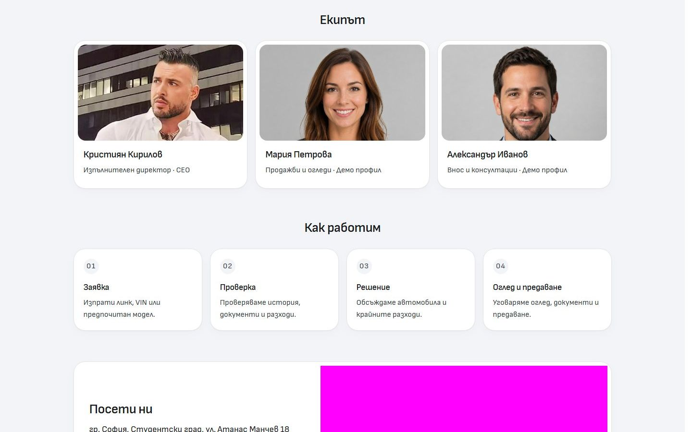
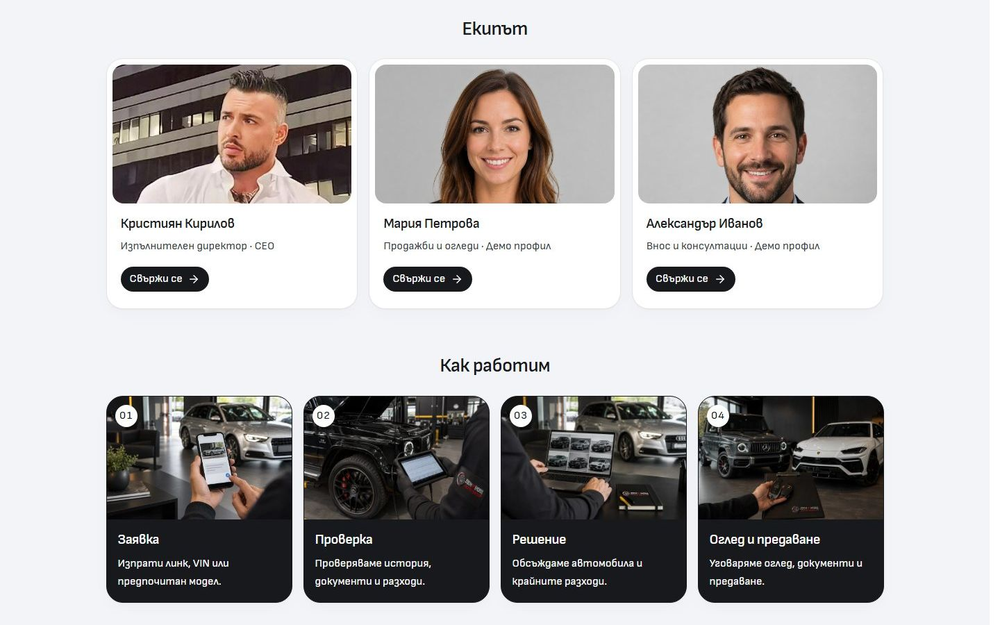

# About team actions and process banners

The three desktop team cards now have visible black pill contact links with white 16px labels, 36px height and aligned positions beneath the existing roles. Labels belong to `content/about-page.ts`; destinations come from the configured About contact action. `TeamMemberCard` composes the shared `Action` and retains its existing portraits and Instagram link.

“How we work” keeps the four ordered steps: request, checks, decision, then viewing and handover. The banners use a new image of sending a listing plus the existing inspection, comparison and key-handover images. Numbered markers and white captions on a charcoal base make the sequence readable. The list uses four columns from 1200px and two at narrower desktop widths. Its artwork sources activate from 768px with the existing transparent fallback below that breakpoint.

The [asset manifest](../assets/ABOUT-PROCESS-2026-10-04.json) contains the complete built-in imagegen prompt, source/reference paths and delivered WebP path. Original photos and generated PNG are preserved. These are illustrative process images.

The [verification receipt](verification.json) records eight desktop layouts in BG/EN at 768/1024/1440/1920px, aligned team actions, four loaded banners and no overflow or page errors. All four BG/EN mobile comparisons at 320/390px have zero changed local pixels and identical visible presentation; external image exclusions remain recorded separately. Two existing About browser checks passed. Native contact navigation and visible keyboard focus work with JavaScript disabled in both languages; the 390px mobile page requests none of the desktop process images and shows no added desktop actions.

Svelte checking reports zero errors and warnings. Scoped ESLint, architecture and image checks passed. The production build passed in isolated QA output, and all six changed source/artwork inputs match its recorded hashes. Source integration, owner visual acceptance, template promotion and dealer deployment are separate; this task changes only the reusable Import master.
