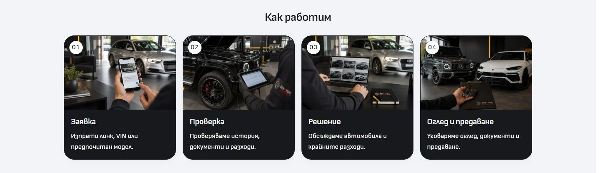
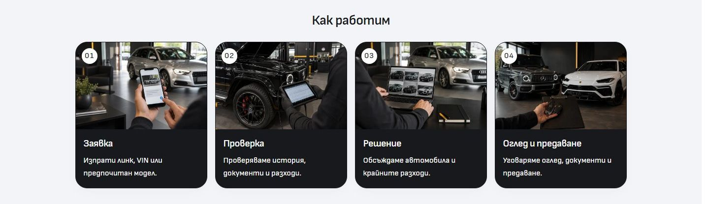
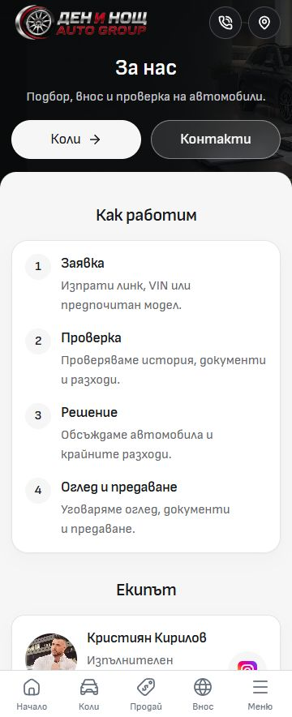
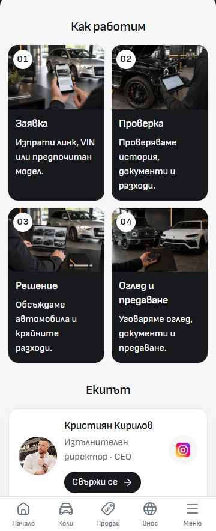

# Neutral About process artwork

About now uses the dealer-neutral family in `static/assets/process/`. Built-in imagegen removed the Day Night dealership branding from the technician's jacket, comparison notebook and handover clipboard. The original automotive scenes, car manufacturer marks and source files are retained. The request image was already free of dealer branding and is copied byte for byte into the same neutral family.

The existing four-step layout, numbers, captions and contact actions are unchanged. [Asset paths and complete edit prompts](../assets/ABOUT-PROCESS-NEUTRAL-2026-10-04.json) record each reference, original generated PNG and final 900 × 600 WebP. This is illustrative template imagery.

The [verification receipt](verification.json) records BG/EN About at 768/1440px: all four neutral images decode, visible presentation matches the previous source-rendered layout exactly, and there are no page errors or overflow. Mobile captures at 320/390px in both languages have zero changed local pixels and identical visible presentation. The previous captures are reused only after matching their recorded source inputs against the unchanged main checkout. Scoped ESLint and image signature checks pass. The production build passed in isolated QA output and retains all four neutral assets under `.vercel/output/static/assets/process/`; the changed source/artwork hashes are recorded.

Original branded files remain available to their existing consumers. Source integration does not promote the template or deploy dealers. Inherited ignore edits and unrelated source/draft work are preserved.

## Source integration handoff

The original neutral-asset integration was blocked by the shared Git index lock. That lock was preserved; a later source integration must recheck main, staging and task-owned hashes.

## Mobile visibility follow-up

The user's existing in-app About tab was 360px wide. The first implementation placed artwork and team contact buttons only in the desktop composition, so that tab still showed the original text-only process panel. About now explicitly opts into `ProcessSteps`' mobile banners: four neutral images in two columns, with numbered markers and charcoal captions. Team contact pills appear on mobile as well. Other process consumers keep their defaults.

These are captures from the user's actual tab, before implementation and after scrolling the complete process section into view:

[The mobile receipt](mobile-verification.json) records BG checks at 320/360/390px and the desktop composition at 1440px, plus English labels and destinations at 320px. All four mobile artwork files decode, all three contact actions have the existing 36px height, and the checked views have no horizontal overflow. The browser viewport override was reset, and the existing tab was returned to `/bg/about` with the banners visible.
