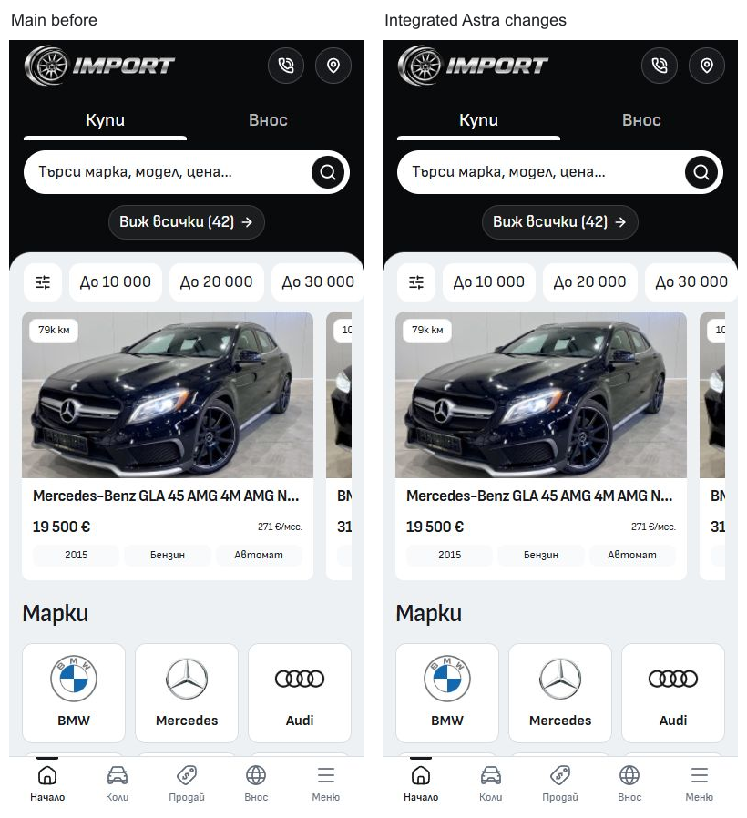

# Astra Import integration review

Reviewed on 8 October 2026 in the canonical Cars main checkout,
`L:\CODEX\cars\templates\import`.

The reviewed standalone commit is `4b37e307680ddc9b4578026e36432a7f8e64d0d2`
on `darkapoparka/cars-template-import:pro`, based on
`e39ca69f0dd3e5bc75ae632a2a26989a73e08856`. The mirror identifies Cars commit
`686d195c33a29554c6f31f90b48b1be7dc96a16e` as its publication source.
Cars main was `6ecac5d1469729ddbd914148685a2d1104d7758a` when this review began;
the workspace doctor fetched origin and confirmed it was neither ahead nor behind.
All 65 existing files in the selected delta matched Astra's base byte for byte;
four added files were absent. There was no overlapping source change to resolve.

## Integrated source

The reusable changes are applied to the canonical main working tree: server-owned
inquiry and sell validators, browser payload types and receipt helpers, authoritative
garage DOM projection after failed persistence, history-driven Compare loading,
application-base-aware garage requests and font preloads, the favicon correction,
two unused dependency removals, and updated browser contracts. No active CSS,
design token, artwork, or vehicle inventory file was changed.

Two adjustments are necessary in the Cars context:

- `src/lib/data/dealers.ts` is retained. Cars' refresh adapter and its Import
  regression test depend on this fixture even though the standalone application
  does not import it. Deleting it reproduced an Import refresh failure; restoring
  it makes that case pass.
- The new history regression buffers the original route response before releasing
  it. Its original synchronization sometimes waited indefinitely for an aborted
  response body after Back. The application assertions and test timeouts are
  preserved; the revised case passes three consecutive runs per viewport.

Forty unused source files are removed. Standalone `.template/recovery` deletions,
publication metadata, mirror-only contributor notes, and the `pro` CI trigger were
not copied into Cars. Canonical AGENTS instructions and all unrelated dirty work
are preserved. The source patch and its 69 task-owned paths are saved in
`runtime/astra-review-2026-10-08/`.

## Verification

Node 24.21.0 and npm 11.19.0 were used. A frozen QA copy was made from the complete
current template, including untracked source, with its own lockfile installation,
build output, synthetic CMS fixtures, and no provider credentials.

- Fresh `npm ci`: passed.
- Svelte check: zero errors and warnings.
- Prettier: passed.
- ESLint: passed with only the existing untracked diagnostic helper
  `docs/final-audit-2026-10-08/source-manifest.mjs` excluded. The unmodified helper
  has two unused imports and stops an unqualified `npm run verify` at ESLint.
- Architecture: 57 native route modules, 261 reachable modules; passed.
- Image signatures: 951 local images; passed.
- Unit tests: 167 tests in 25 files; passed.
- Production build and Vercel asset-retention adapter: passed.
- New resilience cases: nine passes across three repetitions, three existing
  mobile skips for the desktop compatibility projection.
- Cars workflow validation: passed.
- Full Cars workflow suite: 337 of 339 passed. The two remaining failures are
  Modern refresh cases reporting `Missing Modern financing logo anchor`; no
  Modern source was edited by this task. The Import refresh regression passes.
- Full production browser suite: 492 passed, 259 existing skips and one artifact
  failure. The mobile Favorites case passed its page/overflow/error assertions,
  then failed while attaching a screenshot because L: returned `ENOSPC`.
  The unchanged Favorites case passed three targeted reruns with artifacts on C:.
  All 493 exercised cases have passed, but the complete run is not claimed a
  clean single pass; see `runtime/astra-review-2026-10-08/browser-tests.txt` and
  `favorites-reruns.txt` in the same directory.

The Svelte autofixer reported no issues in the three changed Svelte owners.
Its Compare effect suggestions were reviewed: async request loading is an
external effect, its state writes are intentionally untracked, and cleanup
invalidates obsolete responses. It is not a synchronous derived calculation.

## Visual comparison

Matched main/Astra captures cover Home, Inventory and Services at 390px and 320px,
plus desktop captures at 1440px. Integrated Import, Selling, About and Contact
were also inspected at 320px. Captures and layout measurements are retained in
`runtime/astra-review-2026-10-08/`.

The matched 390px Home viewport has the same 3,849px document height and no
horizontal overflow. The inspected before/after views preserve the composition.
The decoded JPEG comparison differs in 2,870 pixels (0.87%); the cause of every
small pixel difference was not isolated, so these are not claimed pixel-identical.

[Original Astra audit](ASTRA-ORIGINAL-AUDIT.md) and
[original measurements](pro-audit-metrics.json) are archived provenance. Their
standalone counts and old checkout/preview locations are not current Cars claims.

## Git and folder cleanup

At the initial review's completion, the canonical changes were uncommitted.
An existing empty shared `L:\CODEX\cars\.git\index.lock` prevented normal Git
integration. It was not deleted or overwritten during the review; the shared
index and main ref were not changed by that review.
The owner subsequently authorized commit and push with the Import card badge
correction. The reviewed Astra changes and that correction are integrated as
separate scoped source commits; the old empty lock and original index are
preserved under `runtime/astra-review-2026-10-08/git-preservation/` after verifying
that no index writer was running. Unrelated dirty work remains untouched.
The reviewed application paths still match the frozen, tested source; their
final hashes are recorded in `runtime/astra-review-2026-10-08/final-source-snapshot.json`.

`L:\CODEX\cars-template-import-pro` remains present. Automatic approval review
rejected recursive deletion with `blocked by policy`; a recoverable Recycle Bin
attempt was denied by Windows. Its two review listeners at 6791 and 6801 were
stopped before cleanup, while canonical dev at 6794 remains running.
The temporary QA preview at 6802 is also stopped. Removal of the task-created
`runtime/astra-review-2026-10-08/verification/` directory was separately rejected
by automatic approval review, so that generated copy remains present too.

The review checkout's Git history, shallow boundary, original before/after captures,
audit material, traces, and deployment binding are preserved in
`runtime/astra-review-2026-10-08/astra-original-history-and-evidence.zip`
(4,273 files; 1,004,614,416 bytes). The archive excludes generated dependencies and
build output, preserves recovery evidence, and was checked for its Git metadata,
before/after captures, and expected entry count. A distinct baseline Vercel binding
was also saved separately.

Template release selection, hosted approval and dealer deployment were not changed.
