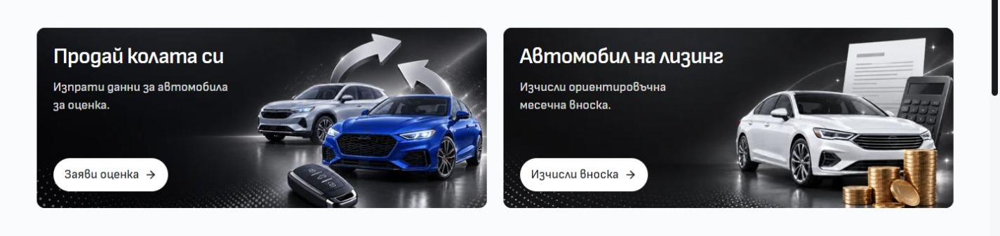
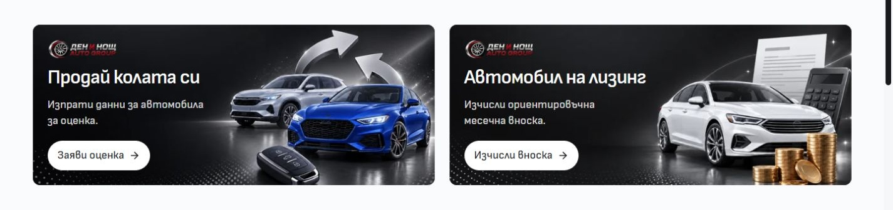

# Compact Home banner logos — 4 October 2026

The desktop Sell and Finance banners now place a 112×32px logo above the heading. `HomeFiveActionBand` passes the configured `site.identity.logoOnDark` to `CommerceBanner`'s optional `logo` prop. The logo retains its aspect ratio and aligns with the copy at the existing 24px inset. The artwork and 260px banner height remain unchanged; at 1440px the copy-to-action gap is approximately 19px.

Background artwork and logo have separate image classes. The logo is decorative inside the same native link, preserving each link's accessible name and destination. The existing desktop commerce test now selects the background image explicitly. The logo appears from 768px on the two ownership banners; the mobile campaign and other Home campaign variants retain their presentation.

Matched BG captures use a 1440×1000 viewport and scroll position 703. The browser returned 1425×990 JPEGs; the previews above are matching 1425×337 crops of those actual pixels. [Full before](before-bg.jpg) and [full after](after-bg.jpg) remain available. The baseline was recaptured from the source with the optional logo absent, retaining the same artwork, typography and layout.

BG/EN at 768/1024/1440/1920px retain 260px cards, 112×32px logo frames, ordered and contained copy/actions, no nested controls and no page overflow. Both BG native destinations were exercised with Enter and Back. Settled mobile campaign geometry, copy and typography match before/after in BG/EN at 320/390px. One initial BG 390px measurement differed transiently; a settled recheck matched every recorded field.

`verification.json` records source hashes and command results. Validation uses the installed frozen QA workspace with Node 24.21.0, separate from the live Vite output on 6790. Source checks are separate from template release selection and dealer publication.
