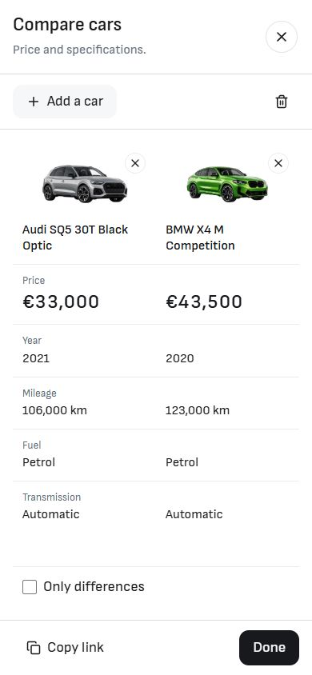
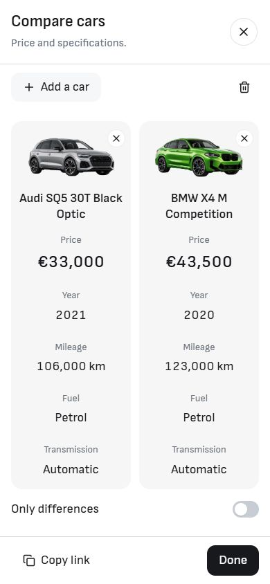
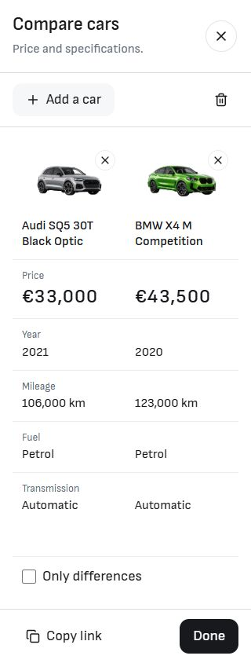
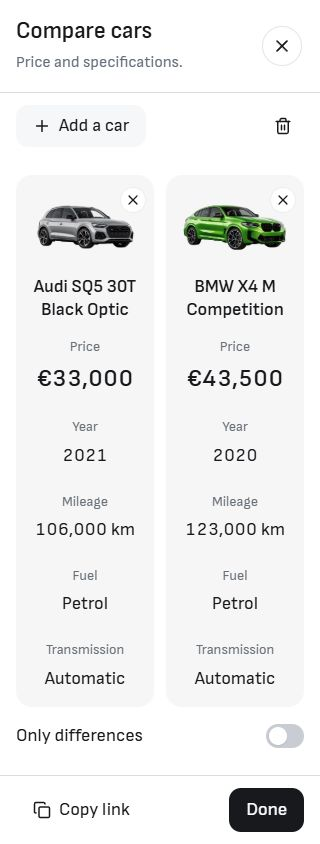

# Compare: Vehicle columns

The owner selected option 2, Vehicle columns. The Compare overlay now groups each car's image, title and specifications in a continuous soft grey column. Only differences appears directly below the comparison as a labeled toggle.

## Implementation

- `src/lib/components/compare/CompareVehicleColumns.svelte`: dialog presentation, sticky car headers, two phone columns, horizontal scrolling for three or four cars, contained titles and values, and accessible removal targets.
- `src/lib/components/compare/CompareTable.svelte`: retains the shared specification/filter logic and native page presentation; delegates the dialog presentation to Vehicle columns.
- `src/lib/components/compare/CompareDialog.svelte`: positions Only differences below the table and retains selection, loading/retry, copy-link, dismissal and focus behavior. Mobile Add a car and removal targets are 42px. Values are 18px and prices are 24px.
- `tests/compare-overlay.e2e.ts`: the short-screen geometry assertion uses a visible price cell because the new presentation retains its row labels for assistive technology.

The overlapping audit chat acknowledged stopping Compare edits. Its media wrappers and native page styling were retained. Other dirty files were left intact. The work remains local on `main`; no commit or deployment was made for this task.

## Matched mobile screenshots

The before/after pairs show the same cars in the same order, on Services, at the same viewport size. After screenshots show the running development app at port 6794.

| Viewport  | Before                             | After                                      |
| --------- | ---------------------------------- | ------------------------------------------ |
| 390 × 844 |  |  |
| 320 × 844 |  |  |

Both normal phone sizes display all five specifications without clipped values or horizontal/vertical table overflow with two cars. The remove targets measure 42 × 42px. Only differences touches the end of the table with 8px of spacing before its 42px label row.

## Additional visual checks

- [Two cars at 1440 × 1000](after-1440.jpg): all five specifications are visible; Only differences sits below the actual table height.
- [Only differences on](after-1440-differences.jpg): the equal Fuel and Transmission facts disappear, leaving Price, Year and Mileage.
- [Four cars at 1440 × 1000](after-1440-four.jpg): all columns fit, including a photo, cutouts and the existing missing-image placeholder; long titles truncate while retaining the full accessible name.
- Four cars at 320 × 844: [first columns](after-320-four-left.jpg), [last columns](after-320-four-right.jpg). Keyboard horizontal scrolling reaches the final car; the dialog does not overflow the page.
- Short screens: [320 × 540, scrolled](after-320-short.jpg) and [768 × 540](after-768-short.jpg). Headers remain sticky and footer actions remain within the viewport.
- Bulgarian: [320 × 844](after-bg-320.jpg) and [390 × 844](after-bg-390.jpg). Localized labels and values fit.

Additional captures use the isolated production build at port 6799. [Browser measurements](browser-verification.json) record the viewport, overflow, loaded images, font sizes, table rows and footer bounds. The attempted desktop baseline `before-1440.jpg` captured only 379 × 1000 and is excluded from matched evidence.

## Verification

Node 24.21.0 was used. Build output was isolated in the ignored runtime directory rather than the live checkout.

- Svelte check: **0 errors, 0 warnings**.
- Scoped ESLint and Prettier: passed for the four changed source/test files.
- Architecture: passed, 57 native route modules and 260 reachable modules.
- Image signatures: passed, 997 local images.
- Production build: passed.
- Existing Compare browser suite: **16 passed**, covering English/Bulgarian, desktop/mobile, 2–4 selection and ordering, removal, clear, copy-link fallback, Only differences, narrow/short scrolling, dismissal/focus, modified links, no-JS/direct routes, loading retry and the phone Menu entry point.

An earlier development-server run encountered hydration failures before the Compare assertions. The final complete suite passed against the frozen production build. The fresh development tab also hydrated successfully and reported no console errors.

[Source hashes](source-manifest.json) were rechecked against both the live files and the built snapshot after visual verification; all four matched. Canonical repository HEAD at closeout was `8829ef5a290f963bea1845c331013657bfffed3a`. These are local implementation checks, not a template release or hosted deployment receipt.

Logs and recovery preimages are retained at `L:/CODEX/cars/runtime/import-compare-vehicle-columns-20261008/`, including `check.log`, `architecture.log`, `assets.log`, `build.log` and `final-compare-tests.log`.
