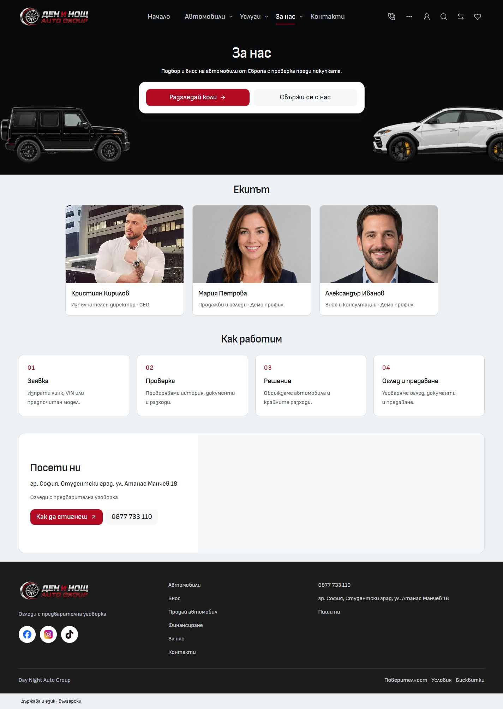
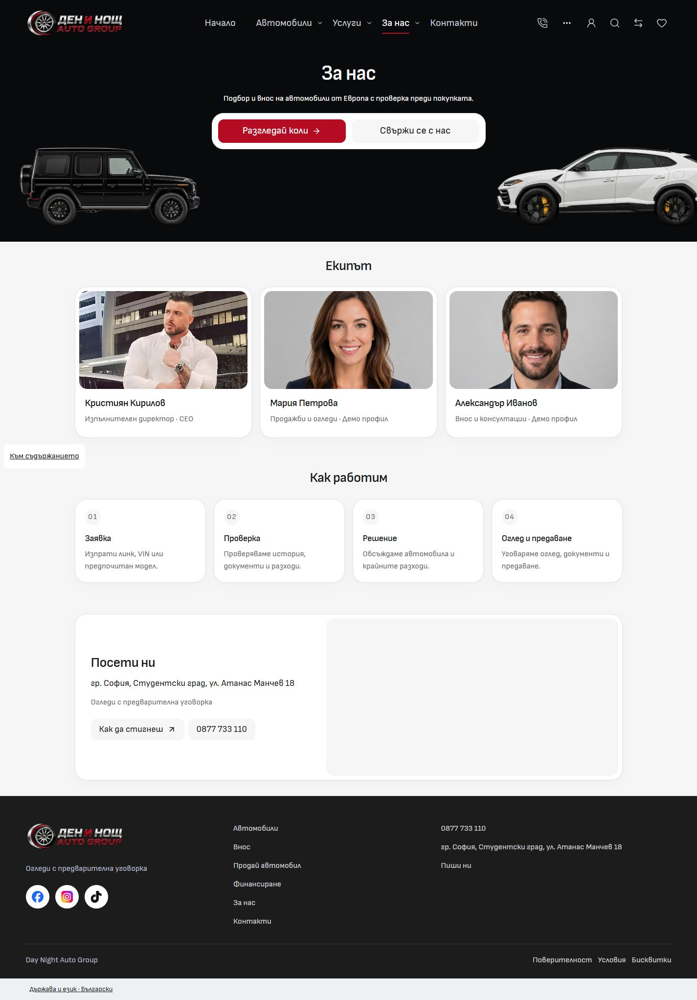

# About Us desktop editorial styling

About adopts the calmer surfaces and hierarchy inspected in the Treido Studio preview at port 6418. The existing centered automotive hero, page order, people, copy, imagery and configured destinations remain. The implementation changes desktop presentation in the Import master, independently of mobile.

## Presentation and ownership

- Team, process and location sections share a 1120px maximum width and consistent desktop gutters and spacing.
- White cards use restrained borders and shadows, with inset team photos and map framing. Editorial values live in `src/lib/styles/tokens.css`; the About route opts into them only from 768px.
- Section headings use the body font at 28px. Names, process titles and supporting copy retain distinct readable roles. Neutral step markers replace the prominent red numbers.
- The hero keeps its common 32px title inset and 400px frame. Its action panel is 560px wide with compact framing; the existing 20px action text and 48px targets remain.
- `TeamMemberCard` and `ContactLocation` expose the framed desktop presentation explicitly. `DesktopDiscoveryPanel` retains its existing defaults for other routes. About's location panel stacks at narrower desktop widths and pairs its information and map at 1024px and above.

## Before and after

Both full-page screenshots use a 1440 × 1000 viewport.

| Before                        | After                       |
| ----------------------------- | --------------------------- |
|  |  |

[Location detail](after-location.jpg). The existing map is lazy loaded: it had not loaded in the initial top-of-page baseline capture. The after capture includes the loaded map; the change is its framing and information layout.

## Verification

- Bulgarian and English About pages checked at 768, 1024, 1440 and 1920px. No horizontal overflow or failed visible images. Team cards share equal heights, all three content sections share their edges, and hero title placement remains unchanged. See [desktop measurements](desktop-matrix.json).
- [Mobile comparison](mobile-comparison.json): all four states at 320/390px in Bulgarian/English exactly match the captured visible text, geometry, fonts, surfaces, links and image sources. No horizontal overflow. [Before](mobile-before.json) and [after](mobile-after.json) retain the measured data.
- Both hero destinations were exercised. Contact retains its default 16px map-card radius and standard 20px red directions action. Inventory retains its 880px panel, 20px radius and 20px padding. See [navigation checks](navigation-checks.json).
- Svelte checking: zero errors and warnings. Scoped ESLint and Prettier passed. Architecture: 57 native route modules and 220 reachable modules passed. The live source asset check passed for 946 images.
- Unit tests: 18 files and 124 tests passed. Production build and Vercel adapter packaging passed using Node 24.21.0 and the retained npm lockfile in the existing temporary QA snapshot on C:. The live dev output was preserved.
- All 1659 application source, configuration, test and asset paths in the [source manifest](source-snapshot.json) matched both the live checkout and tested snapshot after the build. The snapshot also retains two unused earlier editorial illustrations; its asset check therefore reports 948 images. Neither illustration is referenced by this implementation.

The existing unrelated Cars/dealer work, Import ignore-file edits and untracked drafts were preserved. Local implementation and build evidence are separate from owner visual acceptance, template release and dealer deployment. Preview: [About Us](http://127.0.0.1:6790/bg/about).
