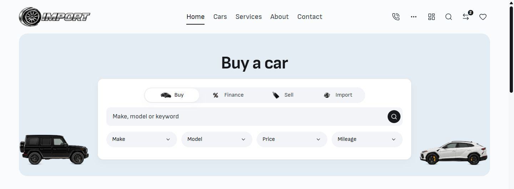
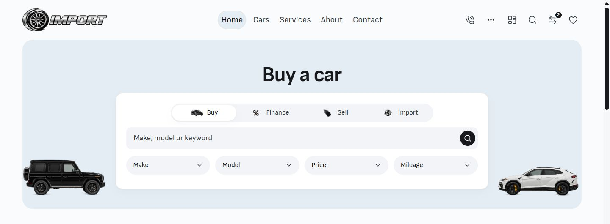

# Desktop active navigation — 8 October 2026

The desktop header's active link now uses a quiet rounded fill and a faint inset border instead of an underline. Home's hero keeps its existing segmented control; mobile keeps its existing underline.

The change uses existing surface, border, radius and focus tokens only at widths of 768px and above. The visible text anchors, navigation row, header and hero bounds stay fixed. Horizontal hit targets grow by 16px without moving the labels or neighboring items. Keyboard focus remains a separate 2px outline.

## Before / after

Matched browser captures at a 1440 × 1000 viewport, cropped to the top 530px to show the navigation and hero together.

| Before                             | After                            |
| ---------------------------------- | -------------------------------- |
|  |  |

## Changed files

- `src/lib/components/layout/NavigationMenu.svelte`: desktop active fill/border, neutral hover, keyboard focus and underline removal, with unchanged mobile defaults.
- `tests/desktop-page-patterns.e2e.ts`: updates the existing active-navigation expectations to the new filled state while retaining 44px targets and the hero geometry checks.

Work remains local on `main`, with baseline HEAD `ccf73e6df5f19b434091c7601c08e6b5c006ebcb`. Existing dirty work in other files was preserved. No commit, release promotion or deployment was performed.

## Verification

- Svelte check on the isolated current-source QA capture: 0 errors, 0 warnings.
- Scoped ESLint, Prettier and `git diff --check` passed. Svelte autofixer reviewed the component; existing custom URL-helper suggestions do not concern this CSS-only change.
- Both existing EN/BG desktop hero-pattern tests passed against the live local preview: eight routes at 768/1440/1920px, including the updated active-navigation checks and stable mode switching. The tests ran from the isolated QA workspace; its output did not touch the live source.
- Native browser review: 768/1024/1440/1920px, EN/BG labels, active Home/Cars, visible keyboard focus and Enter navigation. No horizontal overflow. Desktop links remain 44px high.
- Header, navigation row and Home hero bounding boxes match the before capture exactly. The captured desktop region below the header has zero changed pixels above a 16/255 channel threshold.
- Matched mobile captures at 390px have zero changed pixels. At 320px there is one pixel above that threshold across 270,080 pixels; mobile layout and its 5px underline remain unchanged.

See [browser-verification.json](browser-verification.json) and [preservation.json](preservation.json) for measurements. This is local visual/source verification, not full release or hosted acceptance.

Additional captures: [Cars at 768px](after-cars-768.jpg), [BG at 768px](after-bg-768.jpg), [BG at 1440px](after-bg-1440.jpg), [mobile at 320px](after-mobile-320.jpg), [mobile at 390px](after-mobile-390.jpg).
