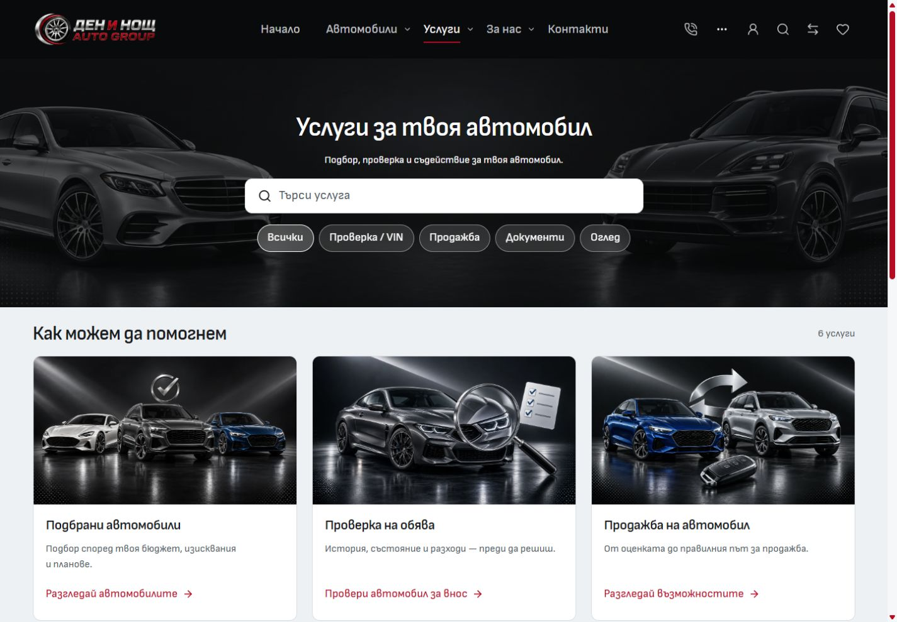
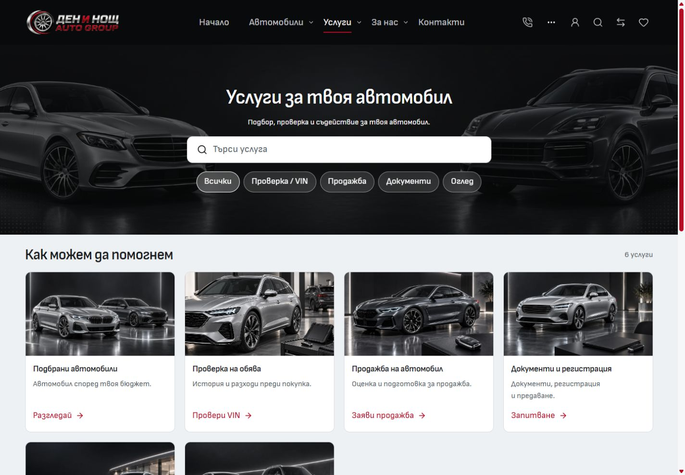
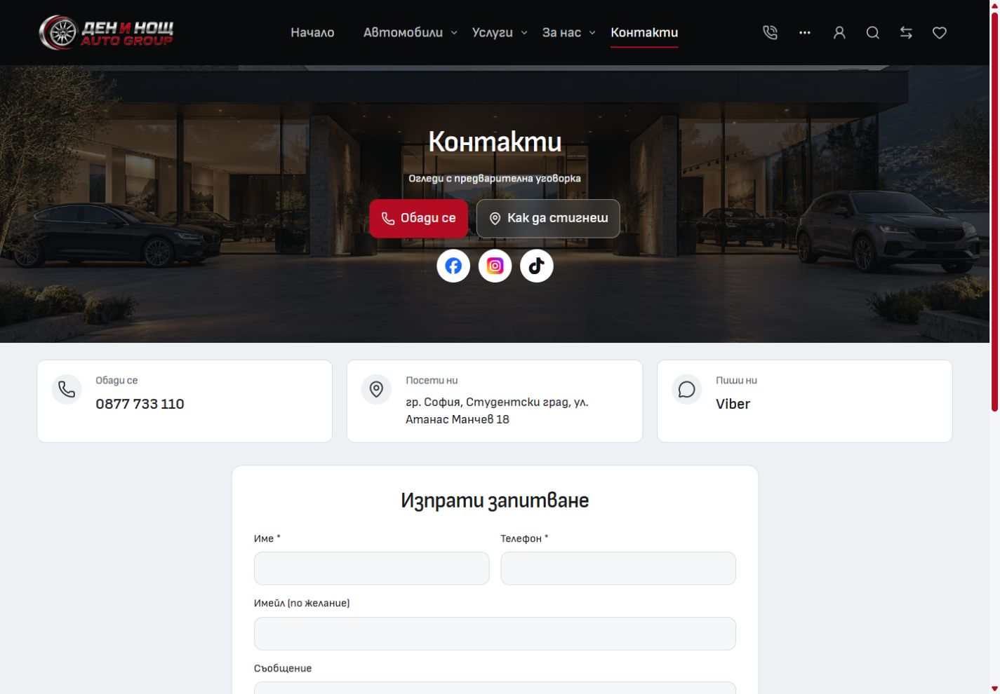
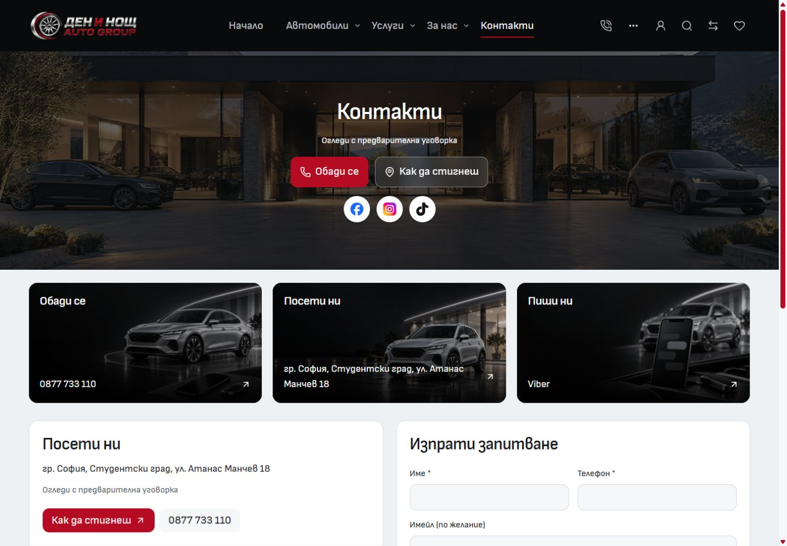
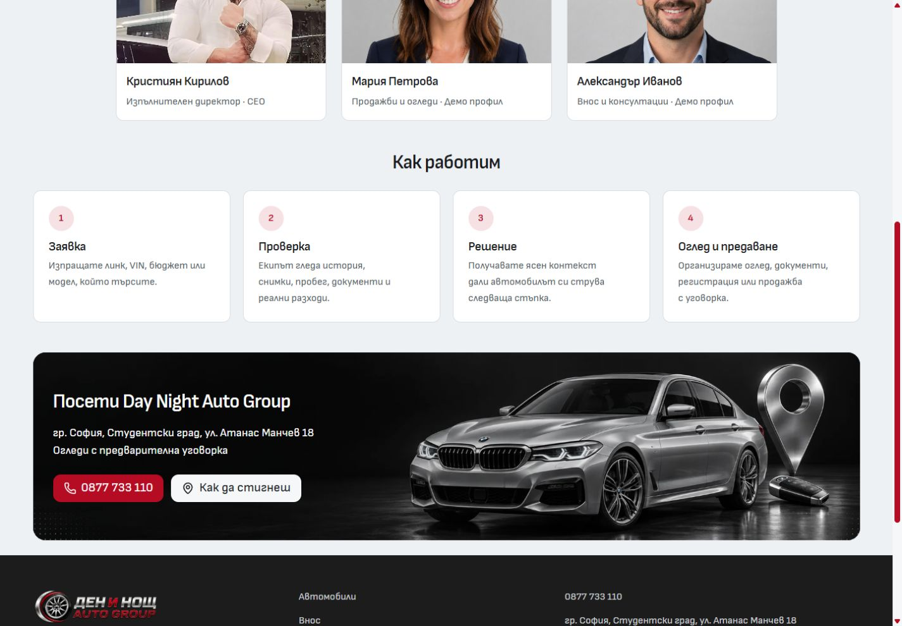
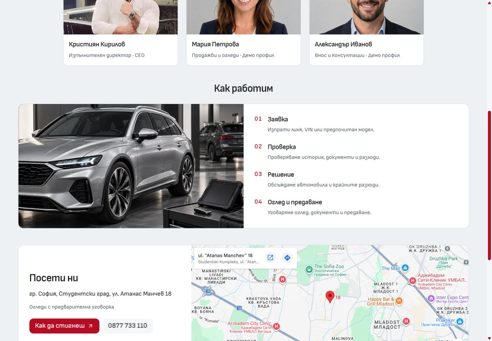
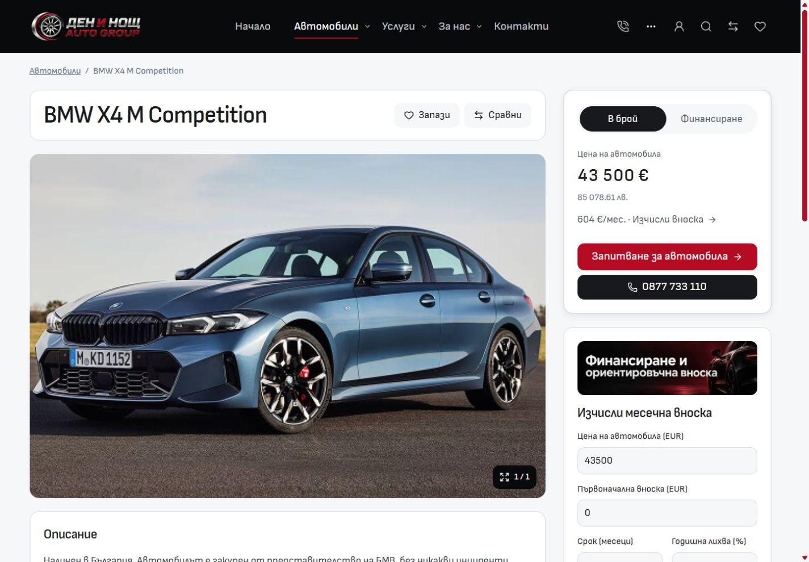
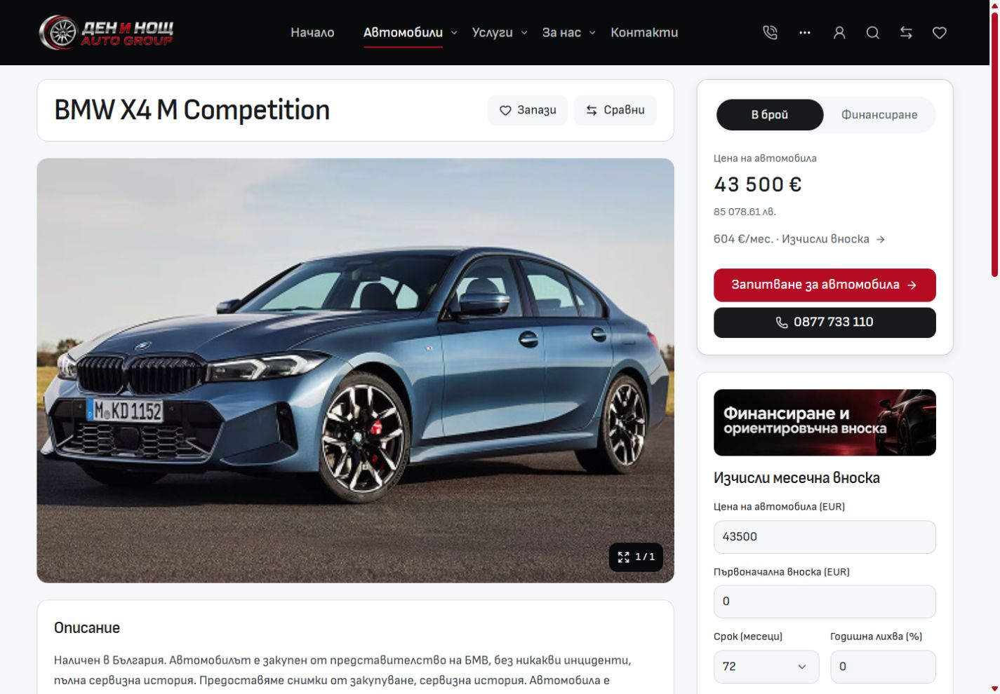

# Import desktop: Services, Contact, About and vehicle seller

Implemented on 2 October 2026 in the reusable Import master. The dev preview remains at <http://127.0.0.1:6790/bg/services>.

## Changes

- Services uses four equal columns at 1024px and above, two on narrower desktop screens, and the inventory grid's 20px gap. Compact padding, one-line titles and short descriptions align the action links. All six services have photographic artwork; eight new images serve Services, Contact, About and the seller banner.
- Contact's three channel cards share a reusable image banner. The configured map and existing enquiry form sit in equally tall adjacent panels.
- About pairs its four concise process steps with a new editorial image and includes the configured Sofia map.
- The vehicle page has no desktop breadcrumb. Its existing title/actions and purchase column retain their alignment. The seller banner shares Contact's Visit image and has no map-pin icon.
- Contact labels, links and artwork live in content/configuration boundaries. Shared banner, process and location components own their layout and spacing.

Generated assets are illustrative automotive campaign scenes. Original PNG paths, WebP destinations, reference artwork and complete prompts are recorded in [asset provenance](../assets/DESKTOP-CONTACT-ABOUT-2026-10-02.json).

## Before and after

All desktop screenshots use a 1440 × 1000 viewport. About's comparison uses the same 700px scroll position.

| Page           | Before                                  | After                                 |
| -------------- | --------------------------------------- | ------------------------------------- |
| Services       |  |  |
| Contact        |    |    |
| About process  |        |        |
| Vehicle header |        |        |

Additional views: [Contact map and form](after/contact-location.jpg), [About map](after/about-location.jpg), [vehicle seller banner](after/pdp-seller.jpg).

## Verification

- Retained runtime: Node 24.21.0 with npm 11.19.0 and the existing npm lockfile.
- SvelteKit sync and Svelte-check: zero errors and zero warnings.
- Scoped ESLint and Prettier: passed for the changed sources and documentation.
- Architecture check: 57 native routes and 219 reachable modules passed.
- Asset signature check: 940 local images passed.
- Vitest: 18 files, 124 tests passed.
- Production build: passed in the frozen QA copy at `C:/Users/radev/AppData/Local/Temp/cars-import-desktop-contact-about-services-2026-10-02`, including the Vercel adapter and Cars public-asset packaging. A source hash manifest for the 21 copied source/asset paths and build logs remain in the ignored task runtime folder. The initial L-drive build ran out of disk space; its task-owned snapshot was moved intact to C before the successful build. The live dev server and its output were preserved.
- Browser: Contact, About, Services and vehicle detail checked at 768, 1024, 1440 and 1920px with no horizontal overflow. Four service columns appear at 1024px and above. Contact banners have equal heights. The configured Google map visibly loads at Atanas Manchev 18. Bulgarian and English pages were inspected.
- Services interactions: the VIN quick filter returns one service; the search for `документи` preserves its query in the URL and returns three relevant services.
- Mobile comparison: all four pages retain their visible text, artwork and image geometry at 320 × 900 and 390 × 900. New desktop artwork and map iframes are absent. The browser selected a smaller responsive version of the unchanged mobile contact banner in two 320px captures; this source-selection difference is retained in the [comparison data](mobile-preservation.json).

Detailed browser measurements: [desktop widths](desktop-widths.json), [English pages](english-pages.json), [mobile preservation](mobile-preservation.json).

The existing mobile/account/upload edits and their architecture notes are separate work. Only the desktop breadcrumb deletion is included from the already-dirty vehicle page; its inherited hydration changes are preserved. Other repository changes, lockfiles and runtimes remain untouched.

These checks cover the local template and frozen build. No template release, dealer deployment, hosted verification, real enquiry delivery or native phone/Viber handoff was performed.
