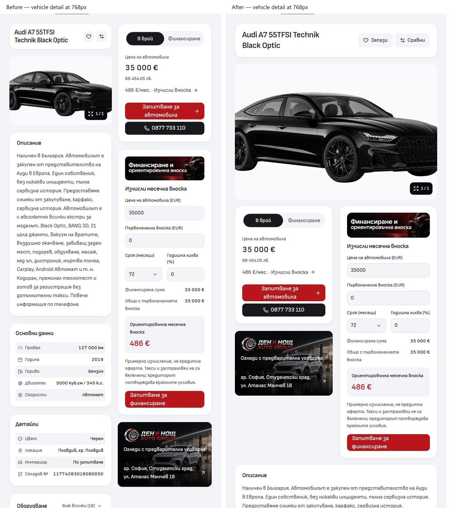
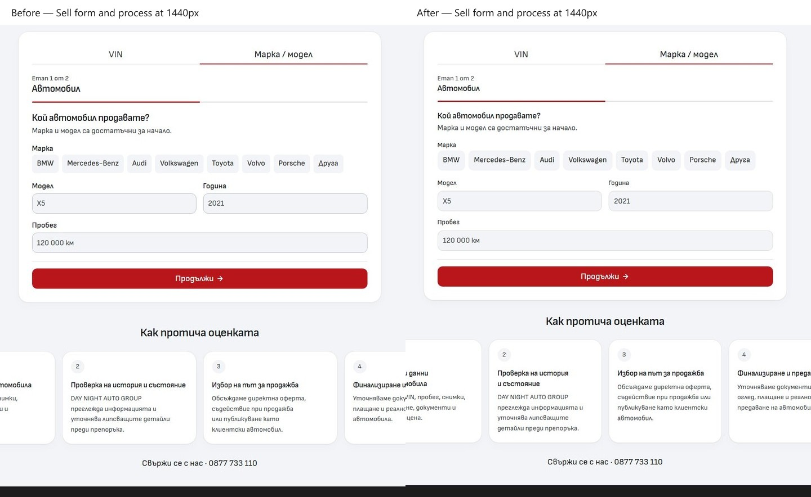

# Import desktop continuation — 4 October 2026

**Integration pending:** the Cars index is blocked by the existing empty `L:/CODEX/cars/.git/index.lock` dated 03:08:06 Europe/Sofia. No commit or push has been made for this pass. The lock remains untouched while owner approval to preserve it in recovery is pending. Repository: `L:/CODEX/cars`; branch: `main`; base/HEAD: `6c92fdc2758d5d5b985a9c8a9004c7bb969d313a`. The complete task-owned recovery patch and hashed path manifest are retained at `runtime/desktop-continuation/owned-final.patch` and `integration-manifest.json`; the patch passes `git apply --cached --check`. Next action: resolve the shared lock through owner coordination, verify the manifest and staged ownership, then commit/push only these Import paths and verify remote integration.

Implemented on Cars `main` from `6c92fdc2758d5d5b985a9c8a9004c7bb969d313a`. This pass retains the accepted cool off-white canvas, white panels, centered automotive heroes and settled Home/About composition. It changes reusable public desktop owners rather than personalizing a dealer.

Inventory Sort/View now share 48px rows, inset-control corners, restrained disclosure framing and distinct hover/selected/focus states. The optional sidebar has the common white frame, body-font heading, native disclosure chevrons and concise selected summaries; canonical GET queries, sorting, layout and searched-out selections remain intact.

Vehicle details use a 28px body-font title and 48px Save/Compare targets. At 768–1023px the gallery now spans the page, followed by a purchase/finance/dealer row and then information. Wide desktop retains the right summary column. DOM reading and keyboard order follow these regions. Typed payment/UI copy joins its existing content owners; the finance domain, values, gallery, enquiry and equipment contracts are retained.

Import/Sell share `ServiceIntakeFrame` and one desktop embedded-wizard treatment in `forms.css`, removing duplicated route composition and styling. Panel headings, labels, values, choices and actions use the established roles. Native public fields have consistent borders/focus, and Financing label/control tracks align through subgrid. Compare has a framed selector group, compact label column, inset photos and emphasized prices. Services empty results reuse the common empty-state frame; FAQ disclosures have clear desktop hover/focus.

The composites are crops of real captures at the labeled viewport, with the same crop applied to each side. Before captures came from the saved source preview; after captures came from the frozen production build without injected styles. Complete screenshots are linked below.

| Routes / states                                                | Result and evidence                                                                                                                                                                                                                                                                                                                                                                                                                                                            |
| -------------------------------------------------------------- | ------------------------------------------------------------------------------------------------------------------------------------------------------------------------------------------------------------------------------------------------------------------------------------------------------------------------------------------------------------------------------------------------------------------------------------------------------------------------------ |
| Inventory                                                      | Sort/View GET and keyboard dismissal, sidebar selections/clear, dependent models, invalid ranges, empty recovery and history passed. [Sort before](before/inventory-sort.jpg) / [after](after/inventory-sort.jpg); [View before](before/inventory-view.jpg) / [after](after/inventory-view.jpg); [sidebar before](before/inventory-sidebar.jpg) / [after](after/inventory-sidebar.jpg); [filters before](before/inventory-filters.jpg) / [after](after/inventory-filters.jpg). |
| Vehicle details                                                | Audi A7 plus long Mercedes-Benz GLA and BMW 850 titles checked in BG/EN at 768/1440px; the Audi also checked at 1024/1920px. Gallery, payment tabs, finance, enquiry and equipment journeys passed. [768px before](before/vehicle-narrow.jpg) / [after](after/vehicle-narrow.jpg); [finance before](before/vehicle-finance.jpg) / [after](after/vehicle-finance.jpg).                                                                                                          |
| Import / Sell                                                  | Both entry modes, validation focus, selected choices, criteria, contact step and Back retention passed in BG/EN at 768/1440px. Process remains below the form. [Import before](before/import-source.jpg) / [after](after/import-source.jpg); [Sell before](before/sell-manual.jpg) / [after](after/sell-manual.jpg).                                                                                                                                                           |
| Services                                                       | Normal/search/empty results, native service destinations and no-JavaScript search passed. [Empty before](before/services-empty.jpg) / [after](after/services-empty.jpg).                                                                                                                                                                                                                                                                                                       |
| Financing / Contact                                            | Paired native fields and responsive Contact layout checked; native enquiry saving/delivery distinction passed. [Financing before](before/financing-bg-1440.jpg) / [after](after/financing-bg-1440.jpg); [Contact before](before/contact-bg-1440.jpg) / [after](after/contact-bg-1440.jpg).                                                                                                                                                                                     |
| Favorites / Compare                                            | Native Save leads to populated Favorites; Compare add/remove/clear passed in both locales at 768/1440px. Empty states checked. [Compare before](before/compare-populated.jpg) / [after](after/compare-populated.jpg).                                                                                                                                                                                                                                                          |
| FAQ                                                            | Native open/closed disclosures, hover/focus and responsive overflow checked. [Before](before/faq-open.jpg) / [after](after/faq-open.jpg).                                                                                                                                                                                                                                                                                                                                      |
| Home / About                                                   | Settled design retained. Home browse destinations, modes, tab keys, selected labels, Contact/social actions and About layout passed existing suites. [Home before](before/home-bg-1440.jpg) / [after](after/home-bg-1440.jpg); [About before](before/about-bg-1440.jpg) / [after](after/about-bg-1440.jpg).                                                                                                                                                                    |
| Reviews / Blog / article / locale / privacy / 404 / calculator | Complete desktop route scan: expected status, no page errors, failed visible images or horizontal overflow. Existing avatars, article native links, hero frames and recovery destinations retained. No new styling mismatch required an edit.                                                                                                                                                                                                                                  |
| Account / legacy / admin                                       | Existing compatibility ownership and transitive architecture gate retained. Private/live admin and provider qualification were outside this public styling pass.                                                                                                                                                                                                                                                                                                               |

The affected seven-route matrix covers BG/EN at 768/1024/1440/1920px (56 cases); the default public scan covers 20 routes and the state captures cover 11 additional states. These are local source/build checks, separate from mounted dealer output.

## Verification

The subsequent [Sofia banner alignment follow-up](../hero-alignment-2026-10-04/README.md) changes only the desktop PDP composition. Its source hash, checks and screenshots qualify that later change; this receipt's frozen-build digest and broad browser results describe the preceding source snapshot. The previous QA PDP source is preserved under ignored `runtime/hero-alignment-2026-10-04/qa-vehicle-before.svelte` before updating the isolated QA input for the follow-up build.

The frozen QA build used Node **24.21.0**, retained lockfile SHA-256 `aa596db7046c3f226ce50b488e283e30121eb49122d5006c60035ef57a952e1c`, and existing lock-compatible dependencies. Separate output and synthetic fixtures were used with database, AI and live provider bindings disabled. No install changed the dependency graph. The build-source snapshot digest is `129faa4d58142806e7f61ad888d0490bde6e5a57827d12b327323c292b2d5dcd`; all 1,683 unchanged snapshot files match current source. The one subsequent test-only correction and its hashes are recorded in [verification.json](verification.json).

- Svelte: **0 errors, 0 warnings**; scoped source formatting and ESLint pass.
- Architecture and local asset signatures pass; **124 unit tests across 18 files pass**.
- Production Vercel-adapter build passes. Existing Lightning CSS `@reference` warnings remain in the build log.
- Relevant desktop browser suites: **57 unique tests pass**, 10 desktop-project skips. The corrected filter suite additionally passes all 11 tests; it retains 20px checks for inputs/choices and explicitly checks the documented compact footer action at 18px with a 48px target. The old blanket 20px assertion also failed against the baseline source.
- Relevant mobile browser suites: **17 pass**, 11 mobile-project skips. Additional desktop probes pass 12 Import/Sell/Compare journeys and 12 long-title/Favorites checks.
- Mobile preservation: **52/52 exact pixel and complete-page presentation matches**, comparing frozen production baseline/current source in BG/EN at 320/390px across Home, About, Inventory/empty, PDP, Services, Import, Sell, Financing, Contact, Compare, FAQ and calculator. The actual Latin/Cyrillic fonts were loaded before capture. Foreign-host image rectangles and external map iframe pixels were excluded consistently; all local images, text, geometry and computed styles remain included. Earlier dev/production rounding and font-loading probes are retained as recovery evidence and superseded by this comparison.

The unchanged `public-assets.policy.json`, `scripts/public-asset-retention.mjs` and `svelte.config.js` still fail the repository-wide Prettier check. This receipt does **not** claim full `npm run verify`. Four existing remote Home listing image URLs did not load in either mobile input; empty decorative responsive-image fallbacks are not broken stock images. External map pixels, real devices and live enquiry/provider delivery were not qualified.

Maintained contracts were updated in [Desktop styling](../DESKTOP-STYLING.md), [Typography](../TYPOGRAPHY.md), [Architecture](../ARCHITECTURE.md) and [QA](../QA.md). Raw captures, source manifests and complete logs are retained under ignored `runtime/desktop-continuation/` and the two isolated QA directories. Import's inherited ignore edits, untracked artwork/older evidence and unrelated Cars work remain preserved. No palette/mobile sources, lockfile, asset files, template lock or dealer source were changed. Owner visual acceptance, immutable template promotion, dealer deployment and outreach remain separate; none were performed.
