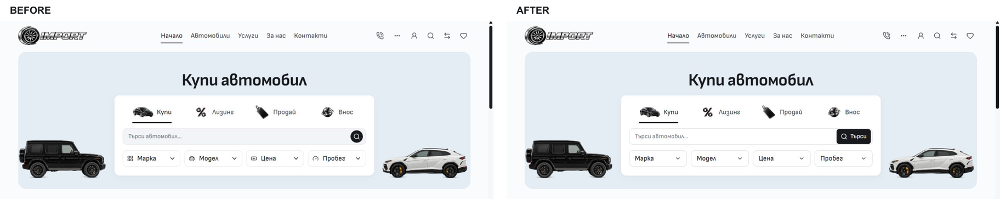
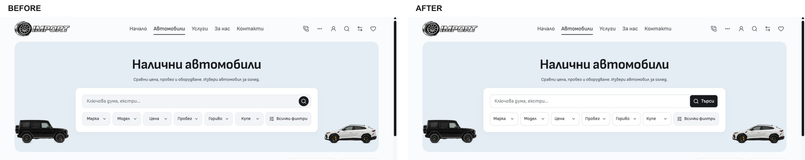

# Desktop search and filter refinement — 4 October 2026

Home's Make, Model, Price and Mileage fields now use text and a chevron without the small category icons. Their padding and border match the outlined intake fields more closely. Home, Inventory and Services share a white bordered search control with a visible localized Search action. Inventory's empty quick fields are white and align their labels to the start. Selected black fields, modal contents, dependent models and native query destinations retain their existing owners and behavior.

All new presentation rules are scoped from 768px. The removed category-icon props belong to `DesktopHomeHero`; the mobile Home composition retains its own props and styles. No dependency, artwork, identity, dealer source or release selection changed.

## Before and after

Before captures came from the source preview at `http://127.0.0.1:6790`; after desktop captures came from the isolated production preview at `http://127.0.0.1:6791`, without injected styles. Both used the same 1440×1000 viewport. The browser exported 1425×990 image pixels on both sides. The composites apply the same 520px crop and scale to each capture.

| State       | Before                                   | After                                   |
| ----------- | ---------------------------------------- | --------------------------------------- |
| Home Buy    | [Capture](before/home-bg-1440.jpg)       | [Capture](after/home-bg-1440.jpg)       |
| Inventory   | [Capture](before/inventory-bg-1440.jpg)  | [Capture](after/inventory-bg-1440.jpg)  |
| Services    | [Capture](before/services-bg-1440.jpg)   | [Capture](after/services-bg-1440.jpg)   |
| Make dialog | [Capture](before/make-modal-bg-1440.jpg) | [Capture](after/make-modal-bg-1440.jpg) |

[Selected BMW on Home](after/home-selected-bg-1440.jpg) retains its black field and `/bg/inventory?brand=BMW` destination.

## Checks

- Node 24.21.0 and the retained npm lockfile. The frozen QA input contains 1,767 files with digest `e4e54f1e1e83338119417b7c3d3301f35915293bd45804e1a423c4d8204d8348`. Its dependency directory is reused from the prior QA snapshot after verifying the identical lockfile hash. Output is independent of the live preview.
- Svelte: zero errors and zero warnings. Production build passed, including the retained asset adapter. Existing compatibility `@reference` minifier warnings remain in the build output.
- Scoped Prettier, ESLint and Git whitespace checks passed for all four changed Svelte files. Architecture passed for 57 native routes and 230 reachable modules. Image signatures passed for 976 local images.
- `desktop-search.e2e.ts`, `style-parity.e2e.ts` and `storefront-controls.e2e.ts`: **17 passed** against production. These cover dependent and nested selection, native search/query preservation, empty/unavailable results, keyboard focus and dismissal, filter-footer accessibility, and desktop reflow.
- Home, Inventory and Services in BG/EN at 768/1024/1440/1920px: **24 views without horizontal overflow**, with 48px fields. The production browser reported no console errors. Measurements are in [desktop-matrix.json](desktop-matrix.json).
- Matched mobile Home, Inventory and Services in BG/EN at 320/390px: **10/12 viewport captures exactly equal**. The two 390px Inventory differences are confined to the partially covered next-card image/badge at x=8–167, y=768–791, above the fixed bottom navigation. All pixels outside that fragment match. Raw counts and bounds are in [mobile-pixels.json](mobile-pixels.json), with the complete before/after mobile captures alongside the desktop captures.

Initial complete-page DOM probes contain hidden desktop-label text changes, responsive-label settlement, a transient 1px browser node and one 10px Inventory document-height difference. They are preserved under ignored `runtime/desktop-controls-2026-10-04/presentation/` and are not claimed as exact complete-page mobile evidence. Mobile styles and compositions were left unchanged; the viewport comparison is the visual evidence for this scoped refinement.

The Cars workspace doctor fetched the current tracking refs before integration. Unrelated Cars/dealer work, Import's existing ignore edits and earlier untracked assets/evidence were preserved. This receipt qualifies local source refinement and its isolated production check; owner visual acceptance, template promotion and hosted dealer release remain separate.

## Initial integration state

At this initial checkpoint, commit and push were blocked by the pre-existing `L:/CODEX/cars/.git/index.lock`, preserved intact. Staging failed on that lock and a later check confirmed it remained. No task-owned files were staged or committed.

Repository: `L:/CODEX/cars`, branch `main`, observed HEAD `2925a6c8ad71c246179bf12213c3bcb3525b2af6`. The four implementation files still match the frozen production build hashes saved in `runtime/desktop-controls-2026-10-04/frozen-inputs.json`.

Task-owned source paths beneath `templates/import/`: `src/lib/components/common/DesktopSearchControl.svelte`, `src/lib/components/home/DesktopHomeHero.svelte`, `src/lib/components/home/HeroFilterDialog.svelte`, and `src/lib/components/inventory/InventoryFilter.svelte`. Task-owned documentation: `docs/ARCHITECTURE.md`, `docs/DESKTOP-STYLING.md`, and this `docs/desktop-controls-2026-10-04/` directory.

Next action: let the lock's owner reconcile its operation, recheck main/status and the recorded source hashes, then stage only those paths, make the scoped commit, push main without force and verify remote ancestry. The independent QA build is preserved at `C:/Users/radev/.codex/tmp/cars-import-desktop-controls-2026-10-04-qa`; the original live preview remains on port 6790.

The search presentation in this first iteration was subsequently revised at the owner's request. See [the final desktop search and type shortcuts receipt](../desktop-search-types-2026-10-04/README.md) for the current source and integration evidence. Original captures are retained here as the matched baseline.
