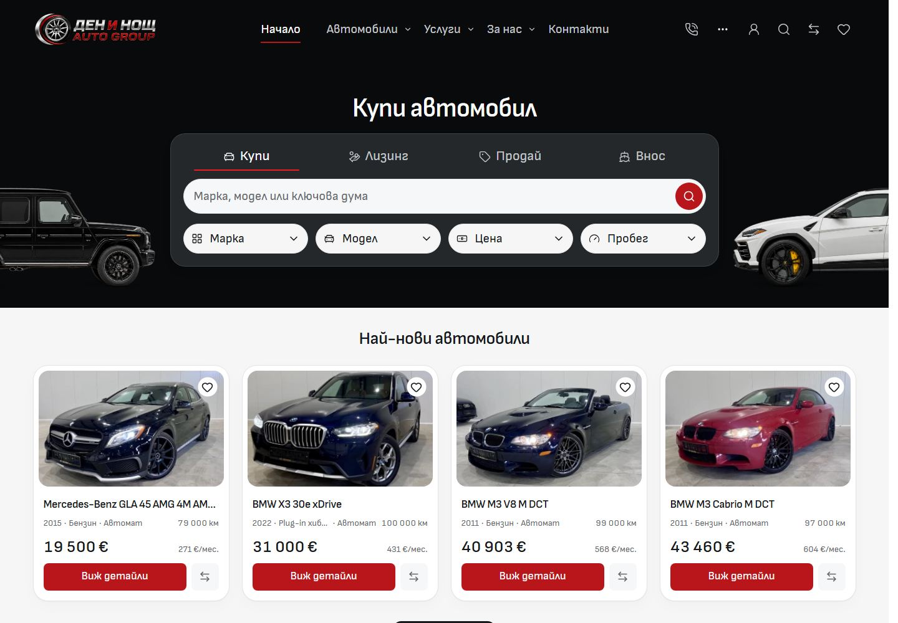
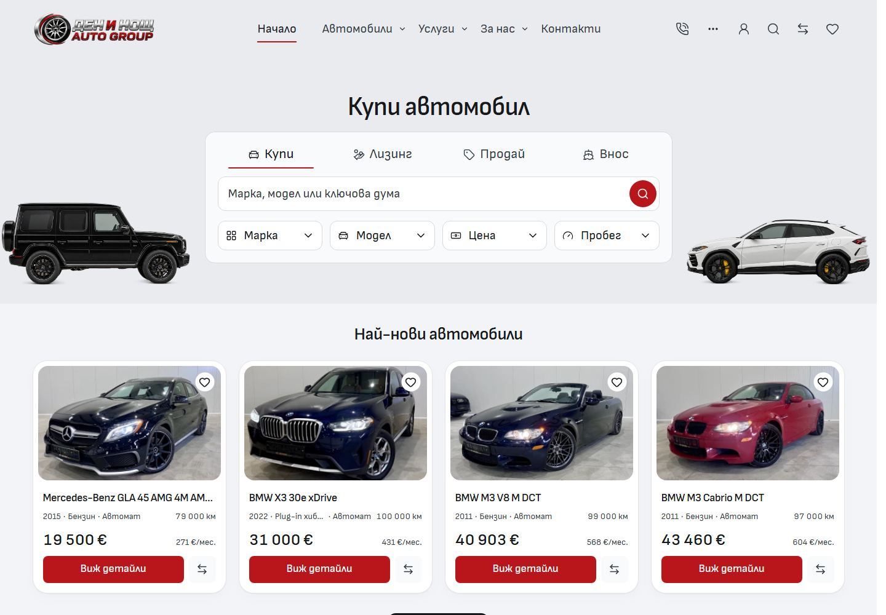

# Implemented cool off-white desktop — 3 October 2026

The owner requested applying the cool off-white hero-rhythm study to the actual Import master. This receipt follows the completed full desktop audit and subsequent Home/About/Contact refinements. The live app uses shared desktop tokens; browser-only colour studies remain historical comparisons. Owner visual acceptance, immutable template selection and dealer deployment remain separate.

## Result and ownership

`tokens.css` owns the cool `#f2f4f7` canvas. Hero/header and discovery surfaces derive from existing white/ink values; white cards and inputs, quiet borders and readable dark text share public desktop aliases. The theme applies from 768px to `.site-shell` and public `.site-dialog` portals. Retained `--bc-editorial-*` values preserve the mobile About trial.

`PageIntro` and `PublicHeader` use the shared hero palette. Home, Inventory, Services, About, Contact, Import, Sell and Financing retain centered headings and automotive artwork, red primary actions and their existing routes. Conversion/mobile photos keep their independent owners. `HeroCars` uses the actual container width and available side space to keep both cars clear of the controls. Existing assets, alpha bounds, shadows and provenance are unchanged.

`DesktopDiscoveryPanel` owns the soft frame and white controls; `DesktopSearchControl`, `InventoryFilter` and Home's panel tabs consume shared control roles. Home and Services use the existing narrow container width; Inventory keeps its wider panel. About/Contact actions share a plain row with red/black buttons, configured socials and contact shortcuts. Home's brand/type tiles use quieter 18px control labels and 16px framing. Newest vehicles, campaign images, vehicle/purchase layouts and the dark footer retain their composition. No localized copy, dealer identity, URLs or filter logic was duplicated.

The current contracts are [Desktop styling](../DESKTOP-STYLING.md), [Architecture](../ARCHITECTURE.md), [Typography](../TYPOGRAPHY.md) and [QA](../QA.md).

## Before and after

[Live Home](http://127.0.0.1:6790/bg) · [eight-route comparison and full Home](http://127.0.0.1:6795/cool-implemented.html). These local listeners are review surfaces, not hosted deployments. The retained after screenshots come from the frozen production build at 6792, using fresh pages per route.

| Route     | Before                                 | After                                 |
| --------- | -------------------------------------- | ------------------------------------- |
| Home      | [Screenshot](before-home.jpg)          | [Screenshot](after-home.jpg)          |
| Inventory | [Screenshot](before-inventory.jpg)     | [Screenshot](after-inventory.jpg)     |
| Services  | [Screenshot](before-services.jpg)      | [Screenshot](after-services.jpg)      |
| About     | [Screenshot](before-about.jpg)         | [Screenshot](after-about.jpg)         |
| Contact   | [Screenshot](before-contact.jpg)       | [Screenshot](after-contact.jpg)       |
| Import    | [Screenshot](before-import.jpg)        | [Screenshot](after-import.jpg)        |
| Sell      | [Screenshot](before-sell-your-car.jpg) | [Screenshot](after-sell-your-car.jpg) |
| Financing | [Screenshot](before-financing.jpg)     | [Screenshot](after-financing.jpg)     |
| Full Home | [Screenshot](before-home-full.jpg)     | [Screenshot](after-home-full.jpg)     |

Before:

After:

## Verification

The frozen QA source has 1,677 current application, configuration, test and asset paths, including untracked source/assets. [Source snapshot](source-snapshot.json) records each hash. Its digest is `0f4efedb2e10c4bd74a5da162c86476cb0541fdd1739b849bbb552307b1815e4`. Every canonical file still matches the tested copy. The snapshot has its own `npm ci`, build output and synthetic fixtures; it contains no `.env`, Git metadata or deployment binding. Node is 24.21.0 and the retained lockfile hash is `aa596db7046c3f226ce50b488e283e30121eb49122d5006c60035ef57a952e1c`.

- Before: 156 BG/EN route/viewport states at 320, 390 and 1440px. After: 324 states at 320, 390, 768, 1024, 1440 and 1920px. Frozen production: 56 BG/EN states at 1440px. Each matrix has zero page errors, broken visible images or horizontal overflow and expected 200/404 status.
- Coverage includes all four Home modes; selected/empty Inventory; three actual PDPs; Services and its conversion destinations; About/Contact; Import/Sell/Financing; calculators; empty Favorites/Compare; reviews, FAQs, Blog/article, policies, locale settings and native 404 recovery. Services has no separate native detail route: cards lead to the documented conversion destinations.
- All 100 matching mobile screenshots **and computed presentation records** at 320/390px are identical, including About. External Google Maps contents were excluded consistently; its configured frame and destinations were retained and tested separately.
- `npm run check`: zero Svelte errors/warnings. Task formatting, scoped ESLint, full `npm run lint:code`, architecture and asset checks pass. All **124 unit tests** in 18 files pass; `npm run build` passes.
- Twelve existing Playwright suites on the frozen production preview: **89 passed, 53 intentional viewport skips, zero failures/retries/flaky tests**. They cover responsive hero/title alignment, search and nested pickers, selected/invalid/empty filters, canonical GET parameters, sidebar/sort/view, keyboard/focus restoration, history, images, PDP/gallery/enquiry, truthful demo forms, banners, navigation and accessibility.
- Four Home modes, arrow/Home/End tab keys, populated Favorites/Compare add/remove and expanded FAQ were additionally exercised in BG/EN: 16 records, including 14 full-page Axe inspections with zero violations. The selected red indicator exceeds 3:1 contrast against the light panel.

`npm run verify` was run and **does not pass**: after Svelte succeeds, formatting stops on three unchanged files in the frozen application snapshot (`public-assets.policy.json`, `scripts/public-asset-retention.mjs`, `svelte.config.js`). A separate canonical `prettier --check .` reports 54 existing formatting failures, including historical evidence/drafts. All task-owned files pass formatting. The remaining verification steps were run separately; unrelated files were preserved. [Verification](verification.json) records commands, results, log hashes, source changes, routes, screenshot hashes and mobile comparisons.

Complete capture matrices, interaction screenshots and logs remain under `runtime/desktop-cool-off-white-2026-10-03/`. The production snapshot is that folder's `qa/`; the canonical Vite preview continues at 6790. Runtime artifacts are ignored and are not an editable source copy.

## References and integration boundaries

The mobile receipt's old Git handoff was read first. Its final resolved section and the full desktop receipt confirm prior integration; no mobile work was replayed. Treido Studio at 6418 returns 200 and its shell/source was inspected read-only. Its current preview capture shows a loading content area; the documented storefront root now redirects to onboarding. Port 6464 is unavailable. The previously documented reference hierarchy and existing approved assets were used; no reference project or image file was edited and no current upstream Shopify parity is claimed.

Work stayed in `L:/CODEX/cars/templates/import` on Cars `main`. The Cars workspace doctor fetched successfully before writes and again before integration; the repository was synchronized with origin. Other template tasks advanced main while this pass ran, without changing the frozen Import source. Inherited Import ignore edits, untracked drafts and all unrelated Cars/dealer work remain preserved. Only the listed task-owned source, current contracts and this receipt belong to the scoped commit/non-force push. No template promotion, dealer deployment or outreach is included.

Initial scoped staging encountered an empty index lock unchanged since 07:05:27. An exclusive file open succeeded and no Git process was running. The original lock was preserved with its timestamp under `runtime/desktop-cool-off-white-2026-10-03/recovery/index-2026-10-03-070527.lock`, with a recovery receipt, before retrying. No index, staged work or recovery evidence was deleted.
