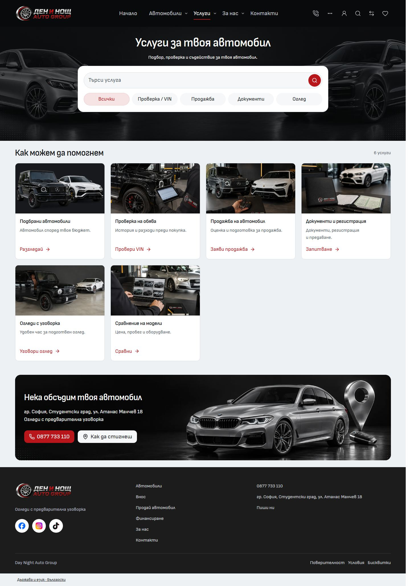
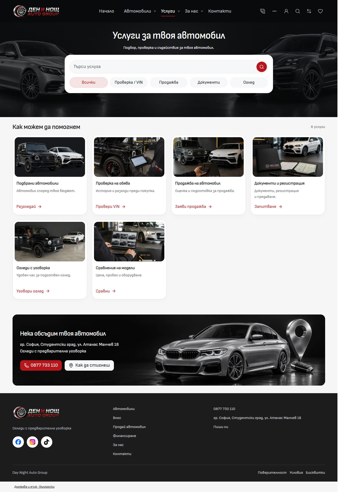
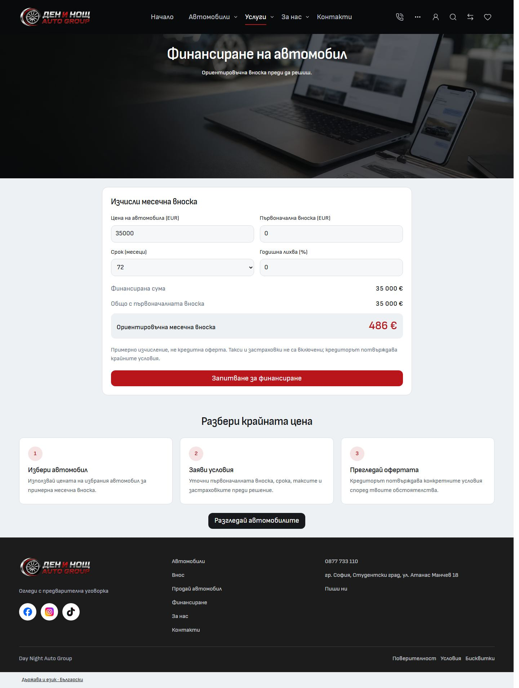
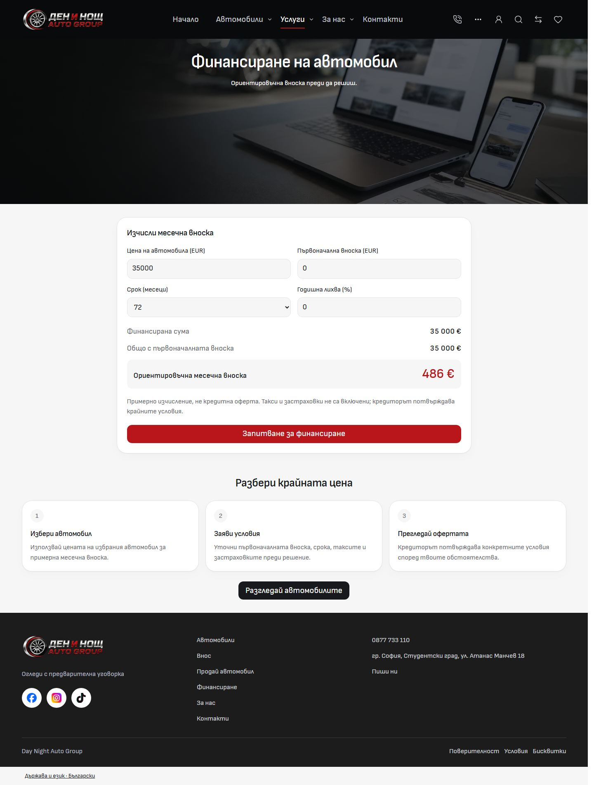

# Import public desktop audit and implementation — 2 October 2026

Implemented in the canonical `L:/CODEX/cars/templates/import` master on Cars `main`. The accepted [About desktop](../desktop-about-studio-2026-10-02/README.md) is the visual anchor. Current mobile, including the [About trial](../mobile-about-editorial-2026-10-02/README.md), is preserved.

[Open the before/after gallery](screenshots.html). It contains 32 matching, full-page BG captures at 1440 × 1000, taken before implementation from the existing dev preview and afterward from the frozen production build. Select a route/state, use linked scrolling, or open the original images. The gallery also links additional production-only states; those have no fabricated before capture.

| Services before                         | Services after                        |
| --------------------------------------- | ------------------------------------- |
|  |  |

| Financing before                          | Financing after                         |
| ----------------------------------------- | --------------------------------------- |
|  |  |

## Theme and implementation owners

`src/lib/styles/tokens.css` owns the desktop theme. At 768px and above, `.site-shell` and public `.site-dialog` portals inherit the accepted neutral canvas, white cards, quiet borders and shadows, 24px card framing and 16px inset media. Existing semantic surface/text/border aliases consume that theme. The root mobile palette and independent legacy/admin shells retain their values. Sofia Sans section headings are 28px; panel/article headings are 20px; process headings and vehicle titles are 18px; reading copy is 16px. Existing automotive hero typography remains Sofia Sans SemiCondensed.

`app.css` and `forms.css` own shared section spacing, panel headings and framed empty states. Components use tokens for presentation and retain route-specific layout geometry. Dark, centered automotive heroes, red actions, edge-car artwork, car photos, discovery panels, four-column stock cards and the PDP gallery/purchase arrangement remain.

| Owner                                                                    | Implemented behavior                                                                                                                                                                                                                                                                                                            |
| ------------------------------------------------------------------------ | ------------------------------------------------------------------------------------------------------------------------------------------------------------------------------------------------------------------------------------------------------------------------------------------------------------------------------- |
| `VehicleCard`, `ServiceCard`, `ArticleCard`, `ReviewCard`                | Consistent white framing, inset photos, calm border/shadow, readable desktop typography and existing card/action variants. Services retain four columns from 1024px and two at narrower desktop widths.                                                                                                                         |
| `VehicleDetailPage`, `VehicleInformationSection`, `VehiclePurchasePanel` | Matching purchase/information surfaces and headings; gallery, finance, enquiry and purchase controls retain their existing owners and behavior.                                                                                                                                                                                 |
| `DesktopHomeHero`, `HomePage`, `DesktopHeroActions`                      | All four discovery modes retain their GET fields and destinations; sections and brand/body tiles use the shared theme; action framing uses About's 560px token.                                                                                                                                                                 |
| `ProcessSteps`, `DesktopProcess`                                         | One process markup owner with an explicit editorial variant preserves About's numbered markers and copy. Desktop Import/Sell/Financing use the same spacing and typography.                                                                                                                                                     |
| `ContactLocation`, Contact route                                         | The configured location and demo form share framed desktop surfaces, align beside one another on wide screens and stack at 768px. The framed location respects the existing stacked layout option.                                                                                                                              |
| Blog/detail, FAQ, `PolicyPage`, locale settings, Compare                 | Body-font reading hierarchy, inset article media, coherent FAQ/reading/settings/table surfaces; mobile accordions and controls retain their existing presentation.                                                                                                                                                              |
| `PublicErrorShell`, `SiteSkipLink`, root layout/error                    | Public desktop errors retain native navigation, footer, theme and keyboard skip/recovery links. Mobile errors retain the legacy mobile shell. Shared skip markup replaces the repeated native layout markup; private/account/admin error routing remains independently owned.                                                   |
| `src/lib/content/`                                                       | Home discovery, estimator, vehicle actions, editorial links, contact labels, shell/navigation/footer actions and error labels have typed BG/EN owners. `desktop-copy.ts` also owns secondary public-page labels, metadata titles and finance process copy. Business phone/address remain in existing dealer/site configuration. |

No runtime/lockfile, inventory data, demo delivery semantics, backend integration, dealer personalization or generated imagery was changed. [Architecture](../ARCHITECTURE.md), [Typography](../TYPOGRAPHY.md), [desktop styling](../DESKTOP-STYLING.md) and [QA](../QA.md) now describe the implemented owners.

## Route and state audit

The [before matrix](before-matrix.json) contains 184 baseline states. The [after matrix](after-matrix.json) contains 384 production states; the [canonical query supplement](supplement-matrix.json) adds 24. Across the 408 post-change states: zero horizontal-overflow failures, broken visible images or page errors after rechecks. One BG 1920px Home hydration timeout is retained and its same-threshold recheck is recorded below. BG/EN desktop widths are 768, 1024, 1440 and 1920px. Mobile widths are 320 and 390px.

| Public family             | Captures and verified states                                                                                                                                                                       |
| ------------------------- | -------------------------------------------------------------------------------------------------------------------------------------------------------------------------------------------------- |
| Home                      | Buy, Sell, Import and Finance modes; search dialog/nested make/model selection, keyboard focus, canonical GET query, calculator and sourcing destinations. Finance is an additional after capture. |
| Inventory                 | Default, BMW selection, zero results, canonical sidebar and lowest-price sorting; filters, dependent make/model, sort/view menus, pagination, keyboard, GET submission and history/Back.           |
| Vehicle detail            | Three actual catalogue vehicles; purchase/finance controls, gallery, saved/compare state, enquiry validation and recovery links.                                                                   |
| Services                  | All services, search selection, zero results, visible card geometry and destinations to Import/Sell/Financing.                                                                                     |
| About                     | Accepted desktop anchor and mobile trial, process/team/location/social destinations and hero actions.                                                                                              |
| Contact                   | General and vehicle-context contact, framed map/form alignment, keyboard, validation, native no-JavaScript form and retained demo receipt semantics.                                               |
| Import / Sell             | Discovery/request modes, retained criteria, vehicle selection, Back/draft recovery, request validation and process presentation.                                                                   |
| Financing / Calculator    | Estimator, changing amount/deposit/term, invalid amounts, form controls and destinations.                                                                                                          |
| Favorites / Compare       | Empty and populated saved state; empty and three-car comparison, picker search, removal, four selections and retained URL/history.                                                                 |
| Reviews / FAQ             | Review cards, FAQ groups/accordions and keyboard interaction.                                                                                                                                      |
| Blog / article            | Listing/card hierarchy, one complete article reading layout and navigation.                                                                                                                        |
| Terms / Privacy / Cookies | All three desktop reading panels and preserved mobile accordions/section links.                                                                                                                    |
| Locale / public errors    | Native preference form/dialog, save/dismiss/restore focus, localized missing-vehicle recovery, desktop native shell and keyboard skip link.                                                        |

Two original baseline queries were discovered to exercise existing fallback behavior: `layout=sidebar` falls back to the default grid, and `sort=price-asc` falls back to default ordering while retaining the valid BMW filter. Their matching before/after images remain labeled as fallbacks. Actual supported states use `layout=dashboard` and `sort=lowest-price&view=3`; the supplement captures both and the existing interaction tests exercise those contracts. There is no before screenshot for those two supported queries.

Additional screenshots in [states/](states/matrix.json) show production search/filter dialogs, populated Favorites, the vehicle gallery/enquiry and header menu. Automated interaction verification is separate from these illustrative captures.

## Mobile and About preservation

[mobile-preservation.json](mobile-preservation.json) compares 120 matching mobile route/locale/width states and both 1440px About states. Measured text, links, image sources, control values, font family/size/weight, colors, borders, radii, padding and gaps match. About's mobile and desktop element geometry matches as well.

The production CSS serializes some 24px line heights as 23.9999px; differences within 0.001px are recorded separately. Three mobile probes contain geometry-only differences: off-screen Home carousel images settle by at most 1.53px, and the BG 320px Sell image and following content differ by 0.39px. These do not represent a mobile styling change. The additional supported-query states bring the post-change mobile matrix to 128 states. The final affected mobile interaction rerun passed 77 cases.

## Checks and build

Pinned runtime: Node `24.21.0`, npm `11.19.0`. Retained `package-lock.json` SHA-256: `aa596db7046c3f226ce50b488e283e30121eb49122d5006c60035ef57a952e1c`.

The existing isolated QA installation at `C:/Users/radev/AppData/Local/Temp/cars-import-desktop-contact-about-services-2026-10-02` was reused with the retained lockfile. Source, scripts, configuration and assets were verified against the canonical checkout. [source-snapshot.json](source-snapshot.json) records all 1667 current paths; its SHA-256 is `24728e7f0424f5785767a16f4aa4c3a46ae273f0029bf0595fda18d39a08449c`. The QA copy retains two unused older illustrations, so its asset scan reports 948 files versus the canonical 946.

| Verification                                | Result                                                                                               |
| ------------------------------------------- | ---------------------------------------------------------------------------------------------------- |
| Svelte / TypeScript                         | Passed, 0 errors and 0 warnings.                                                                     |
| Task-owned Prettier / ESLint                | Passed. Historical evidence/other tasks' draft files were outside scoped formatting.                 |
| Architecture                                | Passed: 57 native route modules, 226 reachable modules, one Tailwind generation entry.               |
| Canonical asset signatures                  | Passed: 946 files.                                                                                   |
| Unit/catalog/negative/security tests        | Passed: 124 tests across 18 files.                                                                   |
| Frozen production build                     | Passed, Vite 8.3.0 and existing Vercel adapter.                                                      |
| Full existing desktop/mobile browser run    | 340 passed, 157 intentional viewport skips, 11 failures investigated below.                          |
| Final desktop recheck                       | 71 passed, 0 failures in one final run after the complete copy consolidation.                        |
| Fresh-fixture account rerun                 | 6 passed, 1 intentional viewport skip, 0 failures; all four originally failing account cases passed. |
| Final affected mobile rerun                 | 77 passed, 6 intentional viewport skips, 0 failures.                                                 |
| Production responsive matrix and supplement | 408 states, 0 failures.                                                                              |

The final copy consolidation moved 91 literal occurrences from the native navigation/footer and eight secondary route files into typed owners, retaining the exact BG/EN strings. Finance steps now consume content directly through ProcessSteps. Svelte, scoped formatting/ESLint, all 124 unit tests, production build, the 71 desktop cases, 77 mobile cases and the responsive matrix were rerun against that final source.

The initial seven desktop failures were obsolete assertions for the approved About actions/section presentation, Services' documented four-column grid, discovery-panel ownership, fractional hero height and Contact's current control/layout owners. Assertions now inspect the actual shared owners, retain minimum geometry/visibility/href checks and tolerate only subpixel height differences. The four account failures came from earlier synthetic submissions changing fixture counts; a new fixture namespace resolved them without account source changes. Earlier failing logs and browser traces remain under ignored runtime for review. An earlier overlapping unit/build attempt hit resource limits; the final serial unit run and bounded-heap build passed.

One BG 1920px Home probe timed out waiting for hydration during the final matrix. The unchanged 15-second threshold passed the complete six-state Home recheck and three additional fresh-context navigations (481–527ms, no page errors). [The recheck record](home-hydration-recheck.json) and [repair matrix](repair-matrix.json) retain this evidence; the original failed log remains in runtime. The intermittent timeout was not reproduced and no timeout gate was relaxed.

Checks use the existing commands: `npm run check`, `npm run check:architecture`, `npm run check:assets`, `npm run test:unit -- --run`, `npm run build`, scoped Prettier/ESLint and Playwright with one worker against a frozen production preview on port 6792. The existing owner dev listener on port 6790 and its build output were preserved. [verification.json](verification.json) records individual log hashes, commands, totals and source evidence. No real request delivery, database, payment or AI provider was enabled.

## References, Git and verification boundaries

The read-only automotive donor on port 6464 was confirmed and its Services and Home inspected. Treido port 6418 was unavailable during the initial audit, then came online before integration. Both Studio (`/admin-preview?lang=bg&store=studio`) and the Shop reference frontend (`/`, through its local preview onboarding) were inspected live, with screenshots/probes retained in ignored runtime. Studio's 28px medium-weight introduction, 24px card frames, 7px media inset and quiet neutral surfaces support the documented direction. The Shop feed confirms neutral framing and clear control hierarchy. Cars retains its self-hosted font, larger automotive content roles, wide catalogue and centered heroes. An upstream Shopify/native parity review is not claimed. Google Maps' external iframe did not render in this browser environment before or after; configured location links/frame geometry were checked, without claiming external map rendering. Existing inventory placeholders are retained where source photos are absent.

The pending mobile Git integration was completed first as scoped commit `f190421c4a2a80630a2170ec5c52a27a3c1df05b` and verified on `origin/main`. Stale/recreated empty index-lock evidence was preserved under ignored runtime after checking active writers. Git operations used the direct installed Git binary; the authorized push used the existing credential manager per command, with no global credential changes. The desktop integration receipt is recorded below after the source commit is created and checked against this manifest. A further stale empty index lock from 16:25 UTC was preserved after checking active Git writers and obtaining an exclusive handle; optional index-refresh locks were disabled per command for read-only Git operations.

Unrelated staged/unstaged/untracked Cars work, Import ignore-file changes, historical recovery artifacts, the untracked About editorial image and the original listener were preserved. Concurrent Carwow commit `6be4023c5`, Mobile commit `ea30a060b` and Auto Best commit `2ea4d1f11` landed on main during this audit; their paths were inspected and Import had no committed drift from the mobile integration baseline. All remain in history. No branch/worktree, alternate editable master or dependency installation was created. Standalone local Chromium production/browser evidence does not verify WebKit, mounted variants, public aliases, dealer deployments or owner visual acceptance. No template promotion, dealer rollout, outreach or deployment was performed.

## Scoped Git completion

Application commit: `3f891e7e59edc607cad0c90d63063252c996a976` (`Polish Import public desktop with shared editorial theme`). Its 143 paths contain 53 task-owned source/test files and 90 documentation/evidence files. The commit used an explicit `--only` path list and preserved the six Auto Best index records that were committed separately during integration. All task-owned source matches the tested frozen candidate.

[git-source-evidence.json](git-source-evidence.json) records the committed-tree comparison: 1623 matching Git blobs out of the 1667 canonical/tested manifest paths. The 44 excluded paths are the inherited `.prettierignore` change, 42 ignored historical preview files and the unused untracked About editorial image. None is an application-source change from this task; the historical previews and unused image have no `src/` reference. The comparison applies Git's existing end-of-line filters; the source manifest records actual canonical/tested SHA-256 bytes. No inherited ignore edit or historical preview was added to the commit.

The application source was verified after committing. The final receipt is committed separately and included in the authorized non-force push to `origin/main`. The user-facing completion message records the verified final pushed ref. The existing dev preview remains on port 6790; the standalone before/after gallery is also available at <http://127.0.0.1:6793/> while its local evidence viewer runs. Gallery route selection, image loading, linked scrolling and 12 artifact links passed.
