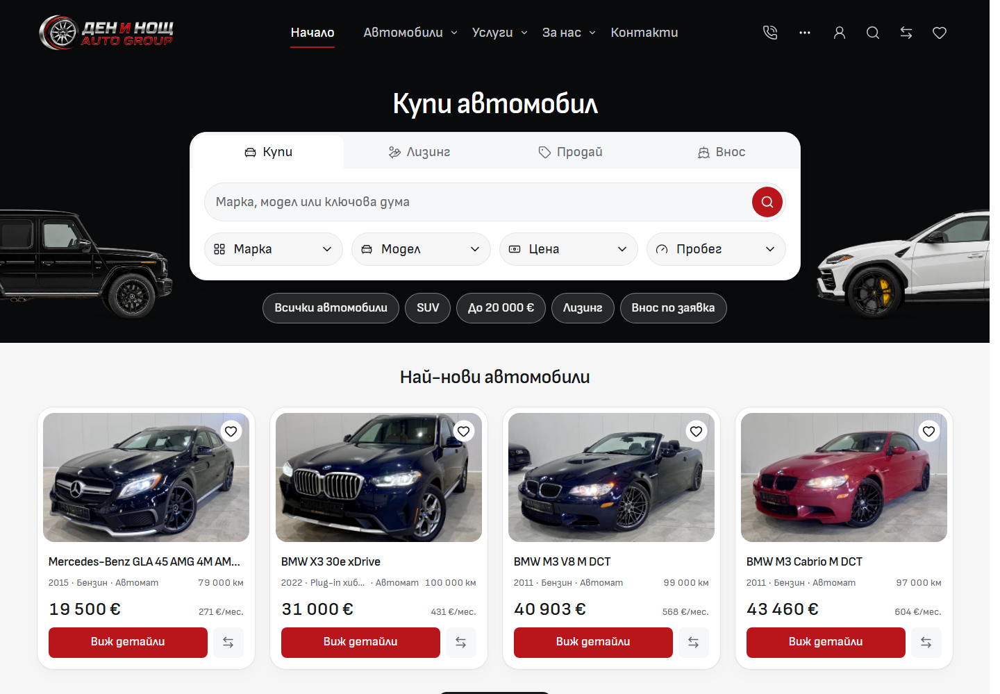

# Charcoal desktop discovery frames and Home mode tabs

The owner accepted the rendered charcoal surface study and requested cleaner Buy / Leasing / Sell / Import choices in Home's buying panel. This implementation changes the shared desktop frame and opts Home into the existing tab component's new segmented appearance.

## Implementation

- Four desktop discovery aliases in `tokens.css` reuse the existing dark/glass palette from 768px. `DesktopDiscoveryPanel` consumes them for Home, Inventory, Services and the compact About/Contact action panels. Search fields and filter pills keep their light surfaces; primary actions keep their red surface.
- Home's mode choices have 48px targets, readable 20px/400 labels, quiet inactive choices and a rounded black selected surface with a visible border. `MobileModeTabs` owns this explicit appearance and retains its existing ARIA and arrow/Home/End keyboard behavior. The old parent-level attached-tab overrides are removed.
- Frame/header spacing keeps the original title, artwork, search-field and hero geometry. Home helper copy and Inventory's clear-filter link use the discovery copy alias for readable contrast. The right About/Contact action remains black; `Action` accepts a subtle strong-button border from its enclosing frame.
- Mode labels, content, queries, destinations, car imagery and dealer configuration keep their existing owners. No new literal brand colours, duplicated tab markup, assets or dependencies were introduced. Existing mobile appearances, including the About trial, are preserved.

## Before and after

[Interactive comparison](screenshots.html) contains all four Home modes, Inventory, Services, About and Contact in BG/EN: 16 matched pairs at 1440 × 1000.

| Before                                  | After                                 |
| --------------------------------------- | ------------------------------------- |
|  |  |

The [before matrix](before-matrix.json) contains 36 states. The [after matrix](after-matrix.json) contains 84 states across BG/EN at 320, 390, 768, 1024, 1440 and 1920px, including all four Home modes on desktop. Every state returned HTTP 200 without page errors, failed visible images or horizontal overflow.

## Verification

- All 16 matched desktop hero/title measurements retain their exact geometry. Existing browser checks additionally verify the common responsive frame and title anchors.
- [Mobile preservation](mobile-preservation.json): 18 complete element probes match exactly. The initial BG Home probes at 320/390 sampled before its existing footer observer restored the five fixed navigation items; all prior nodes match, the restored navigation styles match the corresponding EN baseline, and the retained Home screenshots match. This sampling difference is recorded explicitly, without changing application navigation. All five BG 390px full-page screenshots—Home, Inventory, Services, About and Contact—are byte-identical before/after.
- [Direct interactions](interactions.json): all four Home modes pass arrow/Home/End navigation, selection, focus and keyboard checks in both locales. Search opens its light dialog, focuses the input and restores the opener after Escape. Selected Inventory, Services VIN search and About/Contact heroes retain readable contrast. Sixteen hero accessibility scans report zero WCAG A/AA violations.
- Svelte/TypeScript: zero errors or warnings. Scoped Prettier and ESLint pass. Architecture: 57 native route modules, 227 reachable modules and one Tailwind generation entry. Assets: 946 local image signatures pass. Existing unit suite: 18 files / 124 tests pass.
- Four existing production-preview browser suites (`desktop-page-patterns`, `typography-contact`, `storefront-controls`, `desktop-search`): 29 passed, 19 viewport-specific skips, zero failures/flaky tests/retries. They cover responsive heroes, modes, search/filter persistence, selected controls, useful destinations, dialogs, focus and mobile consumers.
- The frozen production build and Vercel adapter packaging pass on Node 24.21.0 with the retained npm lockfile. Existing CSS `@reference` minifier warnings remain. [Source snapshot](source-snapshot.json) verifies all 1670 current application paths against the reused, exclusively owned QA snapshot. Live dev output was preserved; its listener was restarted after it stopped during verification.

[Verification details](verification.json) retain source, lockfile, screenshot, gate-log and browser-report hashes. Runtime helpers and complete logs remain under ignored `runtime/desktop-charcoal-2026-10-03/` and the existing frozen QA folder.

## Scope and integration

The six source owners are `tokens.css`, `DesktopDiscoveryPanel`, `MobileModeTabs`, `Action`, `DesktopHomeHero` and `InventoryToolbar`. Architecture, desktop styling, typography and QA references are updated with this receipt. Import's inherited ignore edits, old screenshot/refinement drafts, unused About asset and unrelated Cars changes remain outside the scoped commit. This is local template implementation and verification; template promotion, dealer deployment and owner acceptance of the revised tabs retain their separate boundaries.

Source commit [`af6941f1`](https://github.com/darkapoparka/cars/commit/af6941f1e0aeacc29b4c0cd2847883bde4b21405) contains only the six reviewed source owners, four authoritative references and this evidence directory. The non-force source push to Cars `main` was verified against the remote. The [integration receipt](git-integration.json) records committed-source proof and foreign-index preservation. Three empty abandoned index locks were preserved after exclusive-read/no-writer checks, with their original timestamps and unchanged index hashes; all recovery files were retained.
