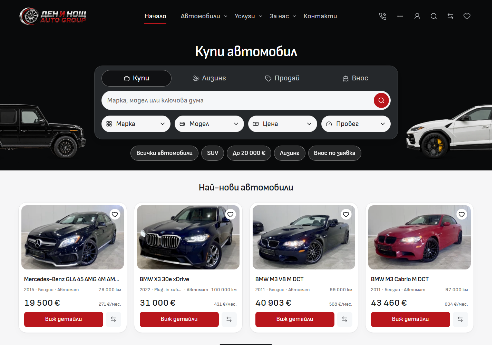
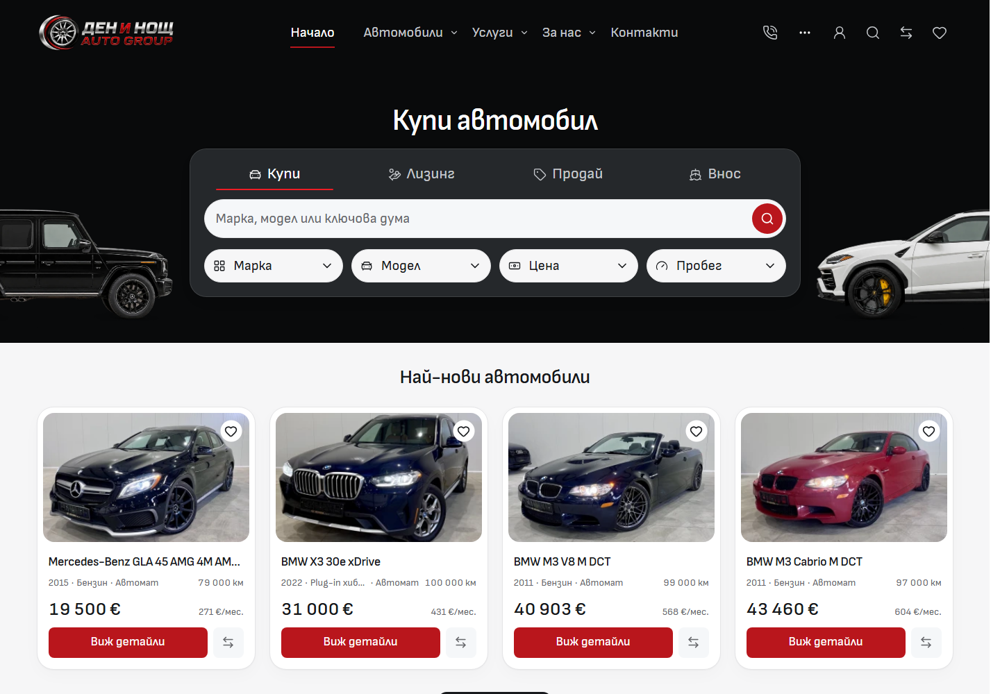

# Import desktop Home entry — 3 October 2026

Home retains the charcoal buy box, its four modes, red actions, side-profile automotive artwork and the Newest vehicles stock section. The repeated quick-link row beneath the box is removed. Four equal tabs use a red selected underline, a modest hover surface and visible keyboard focus. The title and controls move down 24px, giving the hero more breathing room.

[Before/after gallery](screenshots.html) · [Local comparison](http://127.0.0.1:6795/home-entry.html) · [Current Home](http://127.0.0.1:6790/bg)

| Before                                          | After                                         |
| ----------------------------------------------- | --------------------------------------------- |
|  |  |

## Source ownership

- `src/lib/styles/tokens.css`: the shared desktop heading-start token combines existing 32px and 24px spacing values. The 56px anchor is shared across native intro routes; hero frame, title scale, artwork baseline and content growth remain with their existing owners.
- `src/lib/components/common/MobileModeTabs.svelte`: the explicit Home panel appearance replaces the earlier segmented appearance. Existing dark, glass, radius, type and bright accent tokens supply its values. The active underline has measured 3.41:1 contrast against the charcoal frame; 20px/400 labels and 48px targets remain.
- `src/lib/components/home/DesktopHomeHero.svelte`, `HomePage.svelte`, `src/lib/content/home-discovery.ts` and `src/lib/server/home.ts`: remove the unused quick-link snippet, layout rules, prop, localized labels, link generator and server projection. Search, dependent filters, mode destinations, stock cards and browse sections retain their existing contracts.
- `tests/desktop-search.e2e.ts`: retains the BMW selection/search journey, verifies four newest cards and follows the retained View all link into unfiltered inventory. The removed quick-link navigation is absent.
- Architecture, desktop styling, typography and QA references describe the current owners and geometry.

## Verification

- [Before matrix](before-matrix.json): 54 states. [After matrix](after-matrix.json): 120 states across BG/EN and 320/390/768/1024/1440/1920px. All eight automotive hero routes and all four desktop Home modes were checked. No page errors, visible broken images or horizontal overflow were recorded.
- [Geometry comparison](visual-verification.json): all 22 matched 1440px states move the title exactly 24px, retain title dimensions and retain the hero frame. Eight locale/width groups retain a stationary heading across Home modes.
- [Mobile preservation](mobile-preservation.json): 32 matched states. Twelve probes are byte-exact JSON; thirty match after normalizing the 0.0001px line-height rounding from production CSS. The BG 390px Home baseline sampled the unchanged footer observer before its five bottom-nav controls reappeared; all preceding presentation matches. The BG 320px baseline used a placeholder for one stock image, while production loaded the same configured source photo. Both loading-state differences are retained in the raw evidence. Full-page BG 390px Home, About and Contact screenshots are byte-identical before and after, including the About trial.
- [Focused interactions](interactions.json): 18 states, including all modes, Arrow/Home/End navigation, roving focus, search dialog dismissal/focus restoration and affected discovery/action panels. Sixteen hero accessibility scans reported zero WCAG A/AA violations.
- [Checks](verification.json): Svelte zero errors/warnings, scoped ESLint/Prettier, architecture (57 routes, 227 reachable modules, one Tailwind entry), 946 image signatures and all 124 unit tests passed. The frozen production build and Vercel adapter packaging passed with the retained lockfile and Node 24.21.0. Existing legacy `@reference` minifier warnings remain.
- Four existing browser suites passed: desktop page patterns, desktop search, storefront controls and typography/contact. Result: 29 passed, 19 intentional viewport skips, zero failures, retries or flaky results.
- [Source snapshot](source-snapshot.json): all 1670 canonical application/runtime-contract paths match the frozen QA source. Only the existing browser test changed after the production build; application source and lockfile still match the built snapshot.

The first unit worker hit system allocation exhaustion after 122 passing tests; the complete suite subsequently passed with a 512 MiB worker heap limit. The first browser run expected the intentionally removed SUV pill; its existing journey was updated to the retained stock entry, then all four suites passed. Initial logs and the failed browser trace remain in ignored QA runtime. No gate was skipped to obtain a passing result.

## Scope and preservation

The mobile About Git handoff was already resolved by the earlier desktop audit before this continuation. Work remains in the saved Cars Import master on `main`. The Cars workspace doctor fetched tracking refs before editing and integration. Unrelated Cars templates, dealer drafts, inherited Import ignore edits, older QA evidence and unused assets are outside this change.

The independent mobile compositions, mobile tab variants, public query/action contracts, current car imagery and Newest vehicles section are preserved. Source implementation, local Chromium verification, owner visual acceptance, template release and dealer deployment are separate facts. This task makes no template promotion, dealer rollout, outreach or native-device acceptance claim.

The empty Cars index lock last written at 01:28:01 UTC had no active Git writer or file handle and remained unchanged across repeated inspections. It was preserved with SHA-256 verification at ignored runtime/desktop-home-entry-2026-10-03/stale-index-lock-20261003-012801.lock. The index hash was unchanged by that move; recovery metadata is retained beside it. Scoped integration preserves unrelated staged records.
