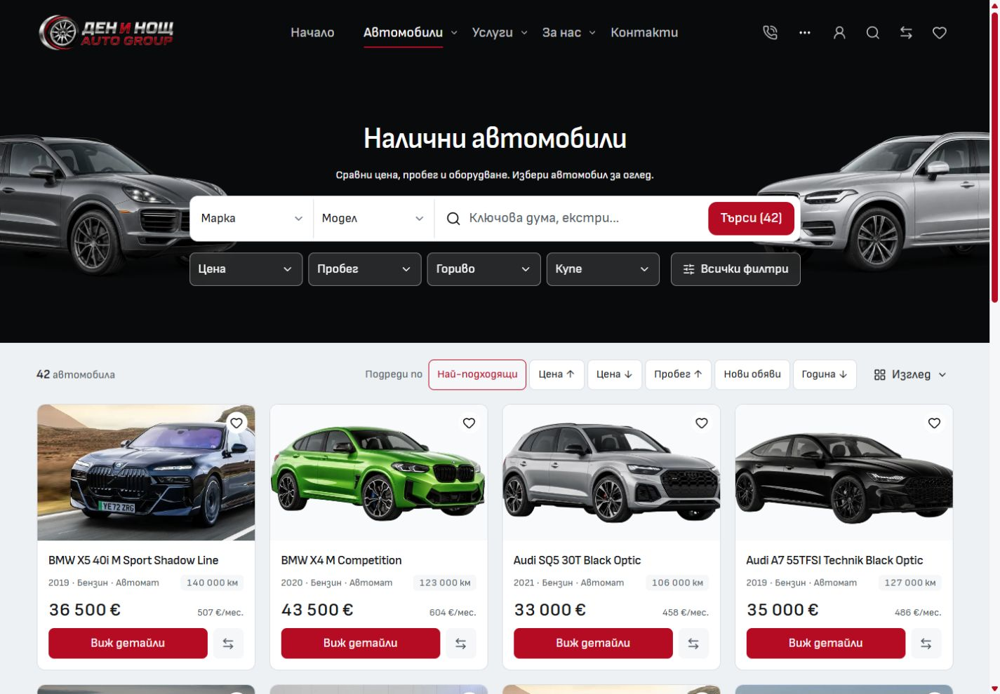
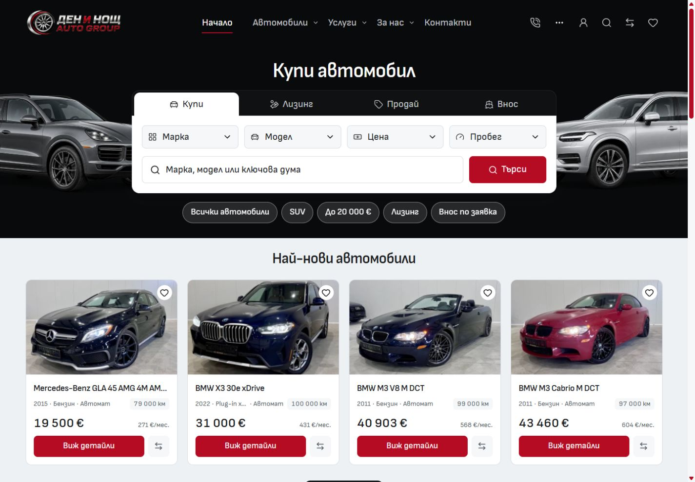

# Import desktop hero, filters and sorting

Inventory keeps Make, Model and keyword search in one row inside the hero. Price, Mileage, Fuel, Body, All filters and applied-filter removal occupy its secondary action slot. The results header contains the total count, six native sort buttons and View. Filtering still uses one shared dialog; sorting preserves the query and works without JavaScript.

Home and Inventory use the same discovery frame and `HeroCars` artwork anchors: 400px on desktop, 450px at 768–900px to accommodate Home's two filter rows. Applied-filter chips can grow the hero when necessary. The frame lives in a shared desktop token, and embedded/glass controls are opt-in. Mobile compositions are unchanged.

| Before, 1440px                       | After, 1440px                      |
| ------------------------------------ | ---------------------------------- |
|  |  |

| Home after, 1440px                 | Inventory after, 1440px            |
| ---------------------------------- | ---------------------------------- |
|  |  |

[1024px before](before-1024.jpg) · [1024px after](after-1024.jpg) · [Applied filters](filtered-after-1440.jpg) · [Sidebar](sidebar-after-1440.jpg) · [View menu](view-menu-1440.jpg)

Verification used Node 24.21.0 and a frozen production preview. The reviewed application passed type checking, scoped formatting/linting, the architecture check and production build. A second snapshot of the complete working source passed with zero errors and warnings after a separate mobile-profile draft's type error was corrected in the shared checkout. The current canonical tests ran against the frozen application: **26 passed, 22 device-specific skips** across inventory, filter-input and desktop-search suites. The final test selector was also checked separately by the formatter/linter and the complete source type check.

Browser measurements cover both languages at 768, 900, 1024, 1280, 1440 and 1920px. All six quick filters are in the hero, default labels are unclipped, controls retain their minimum target sizes, and there is no horizontal overflow. Home and Inventory have identical hero frames and artwork coordinates in all 12 comparisons. Keyboard dialog/menu focus restoration, native sort query preservation, sidebar state and sticky sorting were checked. No browser warnings or errors were recorded.

Mobile Inventory was checked at 320px and 390px. The 320px comparison is pixel-identical. At 390px, 95 pixels differ by at most 2/255 per channel inside the first car photo; text, controls and geometry are unchanged. The 390px capture is not claimed to be pixel-identical.

Exact source hashes, snapshots, checks and screenshot dimensions are in [verification.json](verification.json). Supporting geometry is in [desktop-matrix.json](desktop-matrix.json) and [home-inventory-parity.json](home-inventory-parity.json); [browser results](browser-results.txt), [complete working-source check](full-working-check.txt) and [mobile comparison](mobile-comparison.json) retain the verification evidence. This is local template source verification; no template promotion or dealer deployment was performed.
