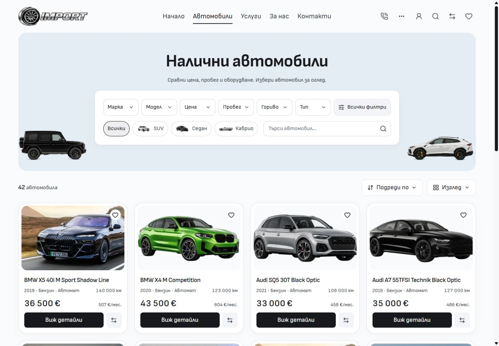
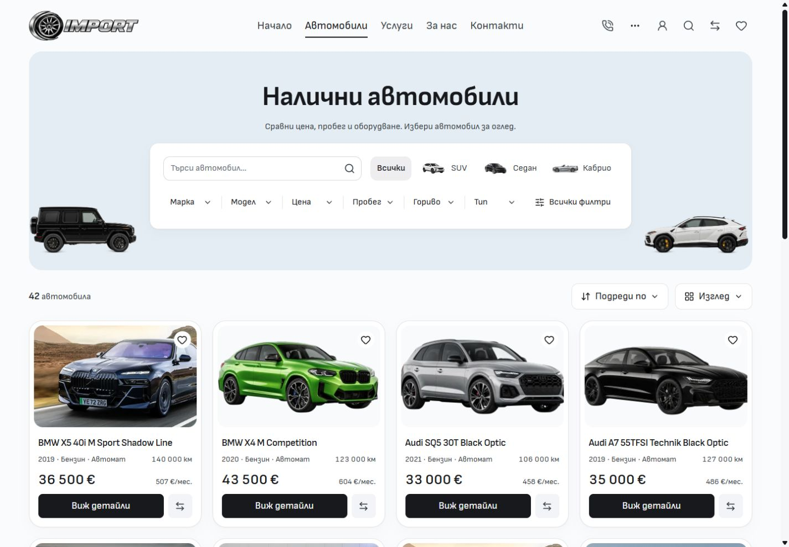

# Revised inventory hierarchy — 5 October 2026

The previous desktop revision added competing outlines and corner shapes. This follow-up uses the cleaner grouped-field idea from the owner's Modern reference while keeping Import's existing hero, artwork and dialogs.

Compact keyword search now leads the panel beside the type shortcuts. Empty Make, Model, Price, Mileage, Fuel and Type fields share the white panel surface with quiet separators; All filters uses the same surface. Selected fields retain their strong fill. Type shortcuts have no individual border or fully rounded pill shape: only the selected choice has a neutral fill and stronger text. Their corner radius matches the fields, and retained artwork uses a 48 × 32px slot.

The native GET search, type links, query preservation, filter dialogs and result controls retain their existing implementations. The input remains 44px high with an integrated icon submit action. No inventory category, filter or interaction was removed. Mobile keeps its separate composition.

## Matched comparison

Before captures are retained from the immediately preceding reviewed source at `fa902e319c2433f1ee8455f92260b0bcdbe13ba3`, with filenames changed only for this comparison. After captures are fresh native-browser images from the frozen production build recorded in [verification inputs](verification-inputs.json). Both use the same default query, locale and zero scroll position. The computed desktop viewport is 1440 × 1000; both native image canvases are 1425 × 990.

Equivalent EN captures are [before](inventory-en-1440-before.jpg) and [after](inventory-en-1440-after.jpg). Additional after views cover BG/EN at 768, 1024 and 1920px. At 768px search and the type choices wrap above the two filter rows. There is no horizontal overflow at any captured width. The 1440px panel remains 158px high, and the first card remains at 586px. Measurements are in [before](metrics-before.json) and [after](metrics-after.json).

## Verification

- Svelte check: zero errors and warnings. Scoped ESLint, Prettier and Git whitespace checks pass.
- Production build from the frozen QA inputs passes, including the retained adapter and public asset packaging. Existing LightningCSS `@reference` warnings remain.
- **Nine focused browser cases pass** across the existing desktop search, style parity and storefront control suites. They cover BG/EN Enter and icon submission, clearing and history, canonical query preservation, native submission without JavaScript, type links, header search, filter dialogs and their accessibility checks.
- Native-browser warning/error logs are empty after the capture matrix.
- BG/EN mobile captures at 320 and 390px retain the previous composition. Three pairs are byte-identical; EN at 390px differs by only 66 pixels, with a maximum channel difference of 1/255. Geometry and overflow measurements match. See [mobile comparison](mobile-comparison.json).

The development preview was slow to load and was stopped. All after evidence and the passing focused browser cases use the production preview. Logs and the frozen QA copy remain in ignored local runtime storage. The final preview is available on the owner's existing port 6790.

## Source boundary

The change is limited to four desktop Inventory components and their architecture/style references. The retained lockfile, query domain, search implementation, mobile composition, dialogs and approved assets are unchanged. Unrelated dirty work remains preserved. This is source polish and local verification; no template promotion or dealer deployment was performed.
