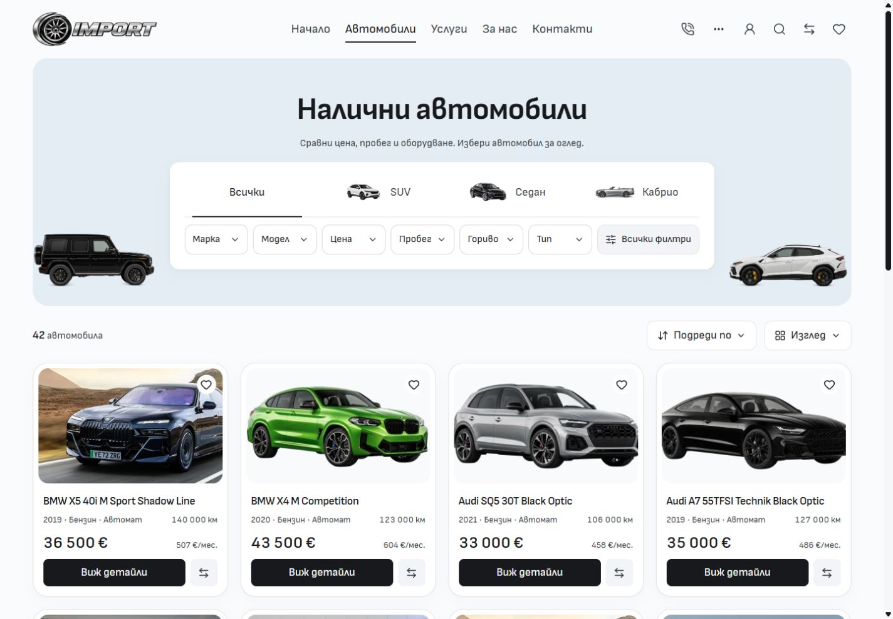

# Compact desktop inventory search — 5 October 2026

Inventory has a visible white outlined keyword field again. The 44px field submits with Enter or its integrated magnifier, without a separate text button. Make, Model, Price and the other quick filters lead the panel; smaller outlined type pills sit alongside search underneath. Their selected state uses a dark border and neutral fill. Existing artwork, inventory categories and filter dialogs retain their owners.

The native GET form preserves the canonical filters, repeated context parameters, sort, view, layout and locale while resetting pagination. Clearing the keyword retains other selections. Back restores the applied keyword. The existing Type picker still supports multiple selections, and header search remains available. The compact shared-control appearance is scoped to desktop; Home and Services keep their existing default appearance.

## Matched comparison

Fresh native-browser captures use the same locale, route, default query, scroll position and viewport. The before page is the saved production baseline at `4a60675574ec1d312c82df8d6caed3cd954a12e8`; after captures use the verified frozen QA rebuild recorded in [verification inputs](verification-inputs.json). Both use Node 24.21.0 and the retained npm lockfile. No browser styles or markup were injected.

| BG, 1440 × 1000        | Before | After |
| ---------------------- | ------ | ----- |
| Discovery panel height | 175px  | 158px |
| Inline search height   | Absent | 44px  |
| First vehicle card top | 586px  | 586px |
| Horizontal overflow    | None   | None  |

Before:

After:

Equivalent EN captures are [before](inventory-en-1440-before.jpg) and [after](inventory-en-1440-after.jpg). Additional BG/EN after captures cover 768, 1024 and 1920px. At 768px the search wraps below the pills with the same 44px field height. No tested width overflowed; measurements are in [before](metrics-before.json) and [after](metrics-after.json).

## Verification

- Svelte check: zero errors and warnings. Scoped ESLint, Prettier and Git whitespace checks pass.
- Canonical production build and frozen QA production build pass, including retained adapter and public asset packaging. Existing LightningCSS `@reference` warnings remain.
- Architecture: 57 native routes, 232 reachable modules, one Tailwind entry. Local asset signatures: 976 images pass.
- Final browser run: **22 passed** across `desktop-search.e2e.ts`, `style-parity.e2e.ts` and `storefront-controls.e2e.ts`, including BG/EN query submission, clearing, history, canonical aliases, repeated parameters, native submission without JavaScript, header search and existing dialogs.
- Native-browser warn/error logs were empty after the capture matrix.
- Mobile BG/EN at 320 and 390px keeps the separate existing composition. Three matched JPEG pairs are byte-identical; EN at 390px differs by only 66 pixels with a maximum channel difference of 1/255. Geometry and overflow measurements match. See [mobile comparison](mobile-comparison.json).

The first cold-preview browser attempt was stopped after navigation timeouts; it is excluded from the passing result. The warmed final preview completed the suite. Build and browser logs, frozen QA copies and the full hash manifest remain in ignored local runtime storage. The source receipt verifies that the canonical runtime inputs match the QA inputs used for final checks.

## Scope

This is reusable Import source polish on Cars main. Unrelated dirty source, existing screenshots and other template changes are preserved. The npm lockfile, mobile composition and inventory query domain are unchanged. Local build and browser checks do not constitute template promotion, dealer deployment or hosted visual acceptance.
