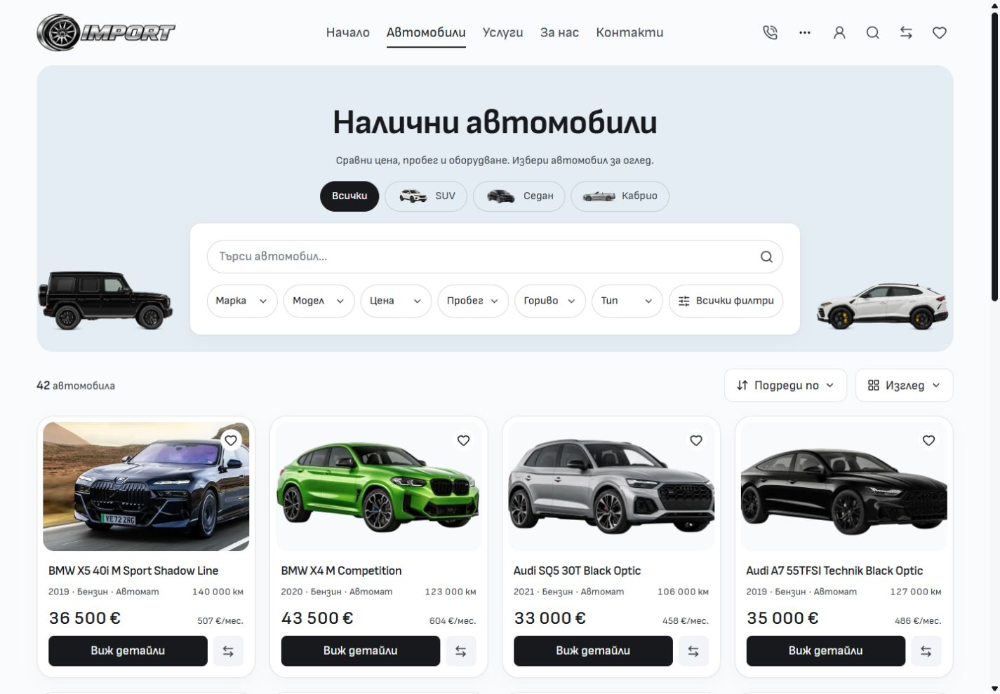
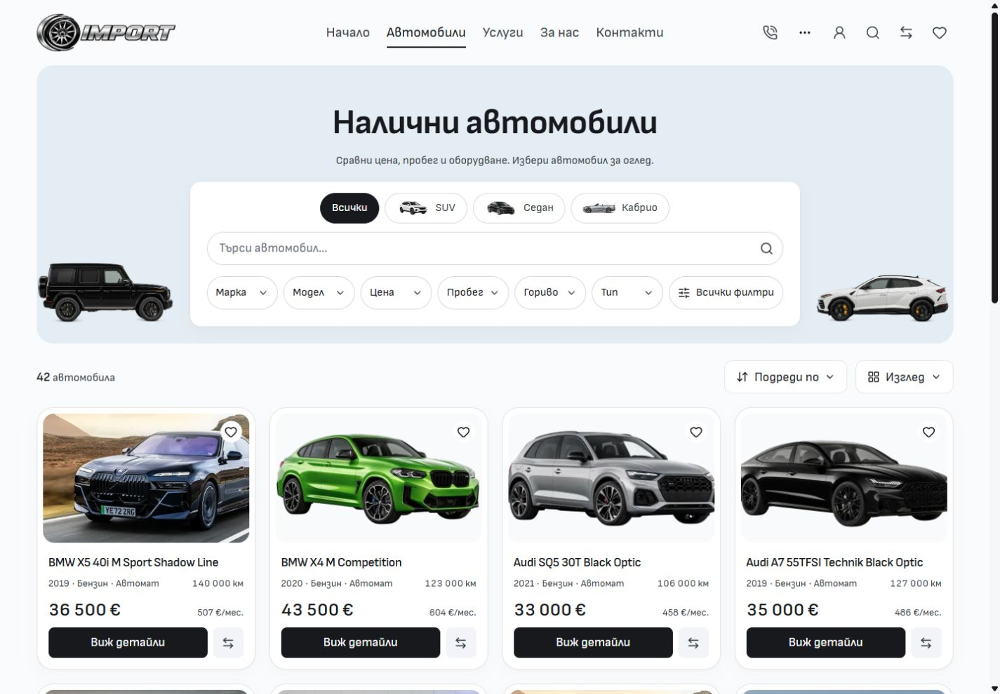

# Inventory categories inside the box — 5 October 2026

Vehicle categories now occupy the shared header of Inventory's white discovery panel, matching Home's placement of its main choices. The categories keep their artwork, faint translucent outlines, transparent inactive backgrounds and black selection. Full-width keyword search follows the categories, then the quick-filter pills. The shared header and body supply the spacing without an extra outer stack or separator lines.

## Matched comparison

Before images are unchanged native after captures from `bc20f2e453dbc9fb625cfc8fad9252504547a93b`. After images come from the frozen production build recorded in [verification inputs](verification-inputs.json). Locale, default query, scroll position and viewport match. The desktop viewport is 1440 × 1000; native image canvases are 1425 × 990.

EN comparisons are [before](inventory-en-1440-before.jpg) and [after](inventory-en-1440-after.jpg). Additional captures cover BG/EN at 768, 1024 and 1920px, plus a [selected SUV](inventory-bg-1440-selected-after.jpg). See [before measurements](metrics-before.json) and [after measurements](metrics-after.json).

## Verification

- Svelte check: zero errors and warnings. Scoped ESLint, Prettier and Git whitespace checks pass.
- Production build passes from frozen QA inputs, including the retained adapter and asset packaging. Existing LightningCSS `@reference` warnings remain.
- Architecture and local image checks pass: 57 native routes, 232 reachable modules and 976 local images.
- Two focused existing browser cases pass: type choices and header search preserve applied filter state; the catalogue retains six readable quick filters, working dialogs and Escape focus restoration.
- BG/EN at 768, 1024, 1440 and 1920px have all categories inside the panel, full-width 48px search, no filter separator lines, no horizontal overflow and loaded visible images. Native SUV selection updates the query and selected pill. Native browser warning/error logs are empty.
- Complete mobile geometry, typography, copy and image sources match at 320 and 390px in both languages, with fonts loaded. See [mobile presentation](mobile-presentation.json). Both 320px screenshots are byte-identical; 390px captures differ in 1121 BG pixels and 1149 EN pixels, with a maximum channel difference of 5, despite identical computed presentation. The [pixel comparison](mobile-comparison.json) records this capture difference.
- Task source hashes match frozen QA inputs. [Finished preview measurements](final-preview.json) verify the same inside-box layout on port 6790.

The source change moves `InventoryTypeShortcuts` into the existing `DesktopDiscoveryPanel` header in `src/lib/components/inventory/InventoryPage.svelte` and removes the superseded outer-stack CSS. `docs/ARCHITECTURE.md`, `docs/DESKTOP-STYLING.md` and this evidence folder describe the current arrangement. Other source work remains preserved. This is local template polish; owner visual acceptance and release or dealer deployment retain their own checks.
