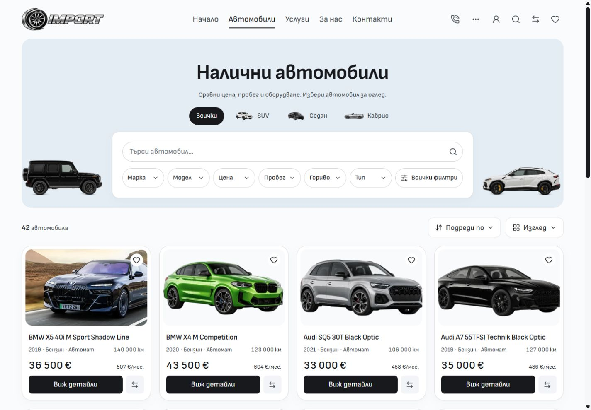

# Faint type outlines — 5 October 2026

Vehicle types stay above the white search/filter panel. Inactive choices now have a faint outline using the existing ink color at 16% opacity over a transparent background. Hover strengthens that border to 30% and keeps the existing neutral fill. The selected choice retains its black fill and white text. Geometry, artwork, links and query behavior are unchanged.

## Matched comparison

Before images are unchanged native after captures from `9772d7ecfbe2ac1a36ef56b8048c10964d027a75`. After images are fresh native captures from the frozen production build in [verification inputs](verification-inputs.json). Locale, default query, scroll position and viewport match. The desktop viewport is 1440 × 1000; native image canvases are 1425 × 990.

EN comparisons are [before](inventory-en-1440-before.jpg) and [after](inventory-en-1440-after.jpg). Additional captures cover BG/EN at 768, 1024 and 1920px, plus a [selected SUV](inventory-bg-1440-selected-after.jpg). The type row remains outside the panel, search fills the available inner width, and no captured width has horizontal overflow or unloaded visible images. See [before measurements](metrics-before.json) and [after measurements](metrics-after.json).

## Verification

- Svelte check: zero errors and warnings. Scoped ESLint, Prettier and Git whitespace checks pass.
- Production build passes from frozen QA inputs, including the retained adapter and asset packaging. Existing LightningCSS `@reference` warnings remain.
- **Two focused existing browser cases pass:** Inventory type links/header search preserve filter state, and the catalogue retains six readable quick filters, a working dialog and keyboard focus restoration.
- Native-browser warning/error logs are empty after the capture matrix and type selection.
- **All four BG/EN mobile comparisons at 320 and 390px are byte-identical.** See [mobile comparison](mobile-comparison.json).
- Task source hashes match frozen QA inputs. [Finished preview measurements](final-preview.json) verify the same layout on port 6790.

The source change adds the default and hover border colors in `InventoryTypeShortcuts.svelte`; architecture/style references and visual evidence are updated. Unrelated dirty work remains preserved. Logs and frozen QA inputs remain in ignored runtime storage. This is local source polish, without template promotion or dealer deployment.
