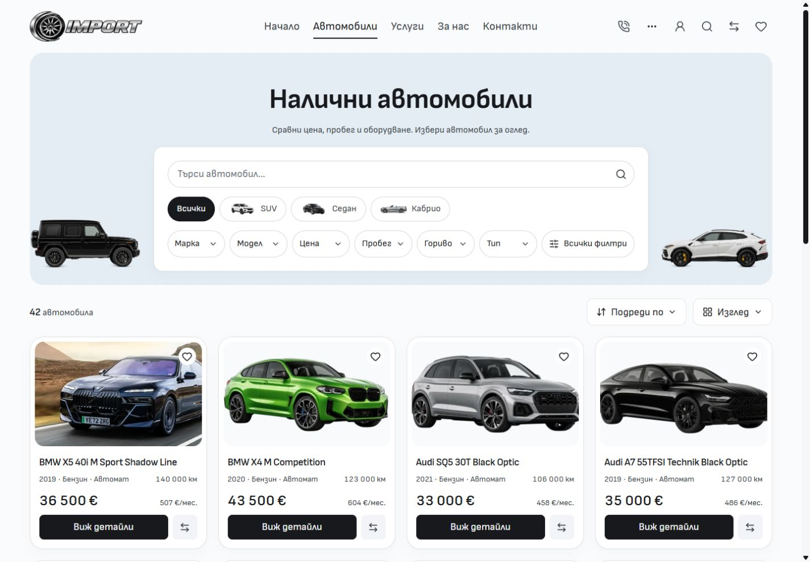

# Separate Inventory type row — 5 October 2026

Vehicle type choices now occupy a centered row above the white discovery panel. Inactive choices retain their artwork and links without individual outlines; the current type keeps its black pill. The smaller white panel contains full-width keyword search and quick-filter pills. Search submission, query preservation, dialogs, approved artwork and the separate mobile composition retain their existing owners.

## Matched comparison

Before images are unchanged native after captures from source `68f7c6005122e4617646cd7bfbb8747ddfec5da7`. After images are fresh native captures from the frozen production build in [verification inputs](verification-inputs.json). Default query, locale, scroll position and viewport match. The desktop viewport is 1440 × 1000; both native image canvases are 1425 × 990.

EN comparisons are [before](inventory-en-1440-before.jpg) and [after](inventory-en-1440-after.jpg). Additional after captures cover BG/EN at 768, 1024 and 1920px, plus a [selected SUV](inventory-bg-1440-selected-after.jpg). The type row sits 16px above the white panel at every captured desktop width. At 1440px, the panel shrinks from 222px to 162px and the first listing remains at 599.23px. Search still fills the panel's inner width. No captured width has horizontal overflow or unloaded visible images. See [before measurements](metrics-before.json) and [after measurements](metrics-after.json).

## Verification

- Svelte check: zero errors and warnings. Scoped ESLint, Prettier, architecture and Git whitespace checks pass. Image signatures pass for 976 retained assets.
- Production build passes from frozen QA inputs, including the retained adapter and public asset packaging. Existing LightningCSS `@reference` warnings remain.
- **Nine focused browser cases pass** across the existing desktop search, style parity and storefront controls suites. They cover BG/EN Enter and icon submission, clearing and history, canonical query preservation, native submission without JavaScript, type links, header search, dialogs and accessibility.
- Native-browser warning/error logs are empty after the capture matrix and SUV selection.
- **All four BG/EN mobile comparisons at 320 and 390px are byte-identical.** See [mobile comparison](mobile-comparison.json).
- Task source hashes match frozen QA inputs. The [finished preview measurements](final-preview.json) verify the layout on the owner's existing port 6790.

The source change is limited to `InventoryPage.svelte` and `InventoryTypeShortcuts.svelte`, with updated architecture/style references and visual evidence. Unrelated dirty work remains preserved. Logs and frozen QA inputs remain in ignored runtime storage. These are local source and browser checks; template release and dealer deployment were not performed.
