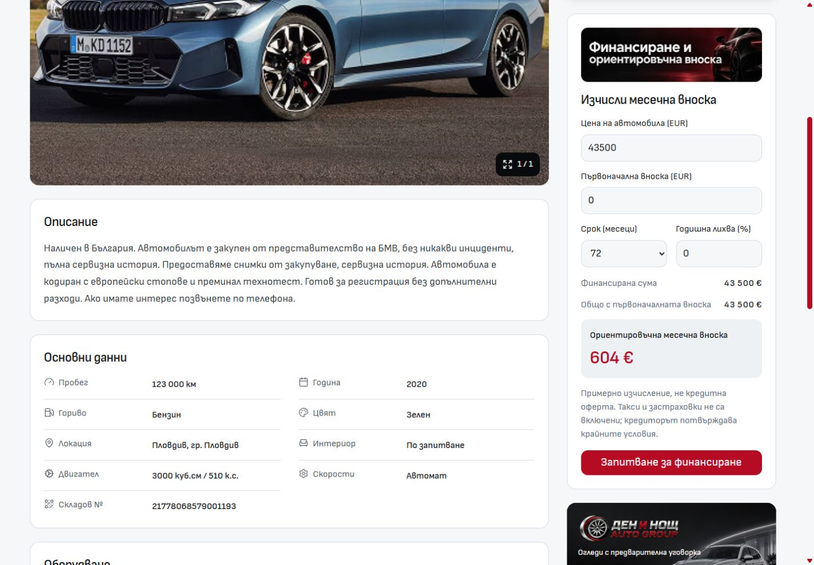
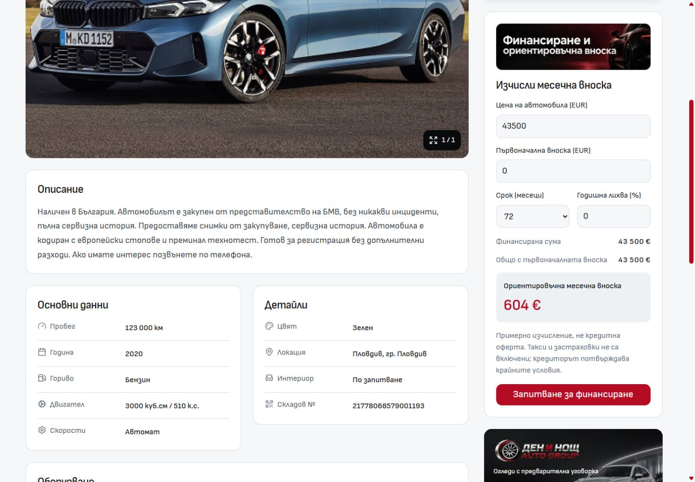

# Desktop PDP facts refinement — 2 October 2026

`VehicleFacts.svelte` now renders two independent cards below Description. Each card retains single-column label/value rows. Core specifications (mileage, year, fuel, engine and transmission) appear in **Основни данни / Vehicle details**; appearance, location, interior and stock reference appear in **Детайли / Details**. Grouping uses the existing stable fact identifiers, preserving the supplied labels and values. Both cards have natural heights.

The cards share a row when the facts container reaches 40rem and stack below that width. Spacing, surfaces, borders, typography and row dimensions reuse the existing design tokens. The purchase/finance column and the separate mobile PDP are unchanged.

## Screenshots

The before/after pair uses the same BMW X4, Bulgarian locale, 1440 × 1000 viewport and finance anchor scroll position. The before source was `c25a2db820404d8b5babccf65fc1c4f290e3cae2`; subsequent unrelated main commits did not change the affected files.

| Before                                      | After                                                            |
| ------------------------------------------- | ---------------------------------------------------------------- |
|  |  |

Additional screenshots cover [768px desktop](after-bg-768.jpg), [1920px desktop](after-bg-1920.jpg), [English desktop](after-en-1440.jpg), and the existing mobile PDP at [320px](mobile-bg-320.jpg) / [390px](mobile-bg-390.jpg).

## Verification

- Node 24.21.0; existing Import Vite server on port 6790 remained running.
- `svelte-check --tsconfig ./tsconfig.json --fail-on-warnings`: 0 errors, 0 warnings.
- Scoped ESLint and Prettier checks passed; scoped `git diff --check` passed.
- Bulgarian PDP `/bg/inventory/21778068579001193`: 768, 1024, 1440 and 1920px. Nine facts appear once; cards stack at 768/1024 and sit side by side at 1440/1920. No horizontal page overflow.
- English PDP `/en/inventory/21778068579001193`: 1440px; localized headings/labels and all nine values fit.
- Bulgarian mobile PDP: 320 and 390px; existing mobile branch rendered, with no desktop facts component or horizontal overflow.
- Browser warning/error log was empty after the inspected states. Measurements are saved in `browser-measurements.json`.
- Root `workspace-doctor.mjs --fetch --json` completed successfully; Cars main and origin/main matched at its snapshot. Unrelated dirty work was preserved.

This is local dev verification of the facts component. No production build, template promotion or dealer deployment was performed.
