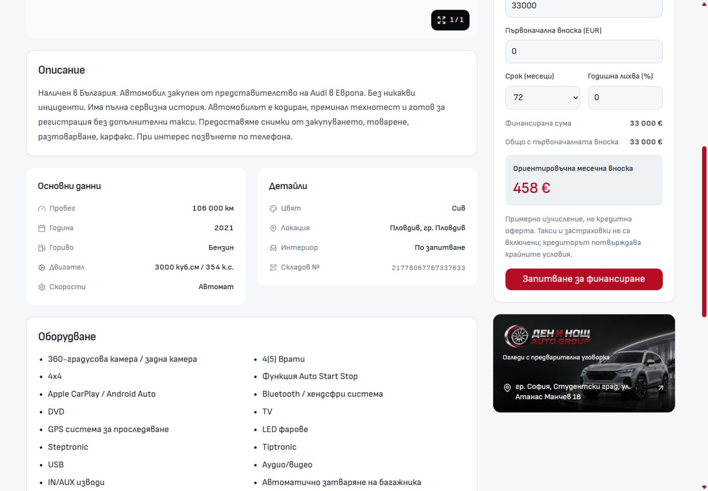
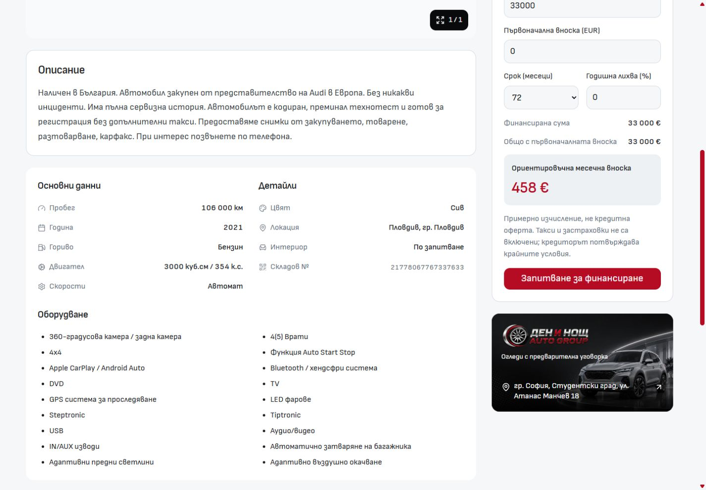

# Desktop vehicle information grouping — 2 October 2026

Основни данни, Детайли and Оборудване now share one information panel below Description. The two fact groups retain their vertical label/value rows; equipment follows inside the same surface. All three subsections use `VehicleInformationSection.svelte` for matching headings and heading-to-content spacing. The parent owns panel padding and section gaps, so independent cards no longer create an uneven gap above Equipment.

Facts and equipment share the same two-column width and gutter on wide desktop. Both stack when their container is below 40rem. Equipment keeps native list semantics and its text aligns with the fact labels. Existing spacing, typography and surface tokens supply the styles. Gallery, title/actions, purchase/finance and the independent mobile PDP retain their existing composition and behavior.

## Before and after

Both screenshots show the Audi SQ5 at `/bg/inventory/21778067767337633`, a 1440 × 1000 viewport and scroll Y=808. The source baseline was `b5535cd50998aadca49399e8adbdd395299d0260`.

| Before                                                        | After                                                                        |
| ------------------------------------------------------------- | ---------------------------------------------------------------------------- |
|  |  |

Additional views: [Bulgarian 768px](after-bg-768.jpg), [English 1440px](after-en-1440.jpg), [English 768px](after-en-768.jpg).

## Verification

- Node 24.21.0; the existing Import Vite server on port 6790 stayed running.
- Svelte check: 0 errors, 0 warnings. Scoped ESLint, Prettier and whitespace checks passed. Architecture checks passed.
- Bulgarian Audi PDP: 768, 1024, 1440 and 1920px. English Audi PDP: 768 and 1440px. One information panel, three matching subsection headings, no nested panel frames, clipped fact values or horizontal page overflow.
- All nine facts and all 18 equipment items match the pre-change Bulgarian content exactly. At 1440px, both column layouts are 419px + 419px with a shared gutter. All subsection headings use identical typography and a 20px heading-to-content gap from the existing token.
- Client navigation from Audi SQ5 to BMW X4 updates the facts correctly: one title/panel, 123,000 km, 2020, 510 hp and finance price 43,500. No duplicate or stale information sections.
- Mobile at 320 and 390px retains the existing mobile PDP; the desktop information panel is absent. No mobile source changes or horizontal overflow.
- Inspected browser warning/error log: empty. Detailed measurements, navigation evidence and mobile screenshots are retained in ignored `runtime/desktop-pdp-information-2026-10-02/`.
- Root workspace doctor fetched successfully and confirmed matching main/origin at its snapshot. Other work was preserved.

These checks cover local dev behavior. No production build, template promotion or dealer deployment was performed.
