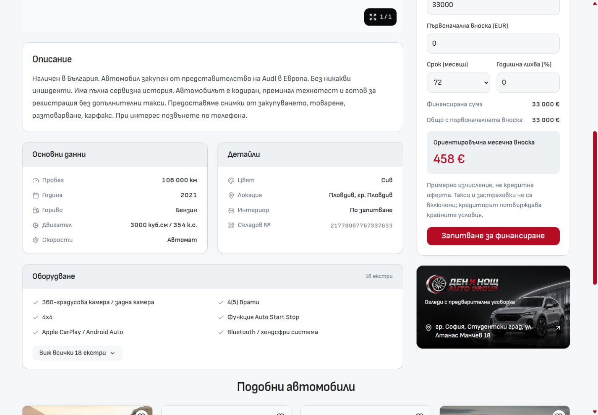
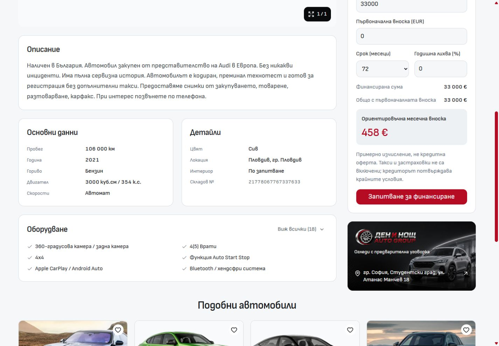

# Desktop vehicle information: lighter cards

The three information cards now use the same light frame and plain heading treatment as Description. Heavy grey header bars and decorative fact-row icons were removed. Labels and values sit closer together, with a consistent value column. Equipment keeps its six-item preview, with the full-list action beside the heading instead of a repeated count and another row below the list.

`VehicleInformationSection.svelte` owns the card frame and an optional heading action snippet. `VehicleFacts.svelte` owns field grouping and alignment. `VehicleEquipment.svelte` retains the preview and accessible disclosure. The shared Bulgarian and English interface labels are centralized in `content/vehicle-information.ts`; vehicle facts and features continue to come from the existing server data. Mobile components and shared style tokens were not changed.

## Before and after

The same Audi SQ5 route was captured at 1440 × 1000 with scrollY 808 in both views.

| Before                               | After                                                       |
| ------------------------------------ | ----------------------------------------------------------- |
|  |  |

Additional captures show [768px](after-768.jpg), [1024px](after-1024.jpg), [mobile 320px](mobile-320.jpg) and [mobile 390px](mobile-390.jpg). The two mobile screenshots have identical SHA-256 hashes to the corresponding captures from the preceding three-card change.

## Checks

- Scoped Prettier and ESLint passed for all four changed source files.
- Svelte diagnostics passed with zero errors and zero warnings.
- Architecture checks passed: 57 native routes and 214 reachable modules.
- At 768, 1024, 1440 and 1920px, the page retained three cards, all nine facts and six preview features, without horizontal overflow.
- Enter and Space expanded the equipment list to all 18 features. Mouse collapse restored the preview; `aria-controls` referenced the correct list.
- Audi-to-BMW navigation updated all facts and the finance price, rendered one PDP, and reset the preview. English headings and disclosure labels rendered correctly.
- At 320 and 390px, the existing mobile PDP rendered with zero desktop cards and no horizontal overflow.
- Browser warning/error logs were empty during these checks. Detailed observations are saved in [verification.json](verification.json).

These are local development checks. The stopped dev server was restarted with Node 24.21.0 on port 6790 and left running. No production build, template release, dealer refresh or deployment was performed.
