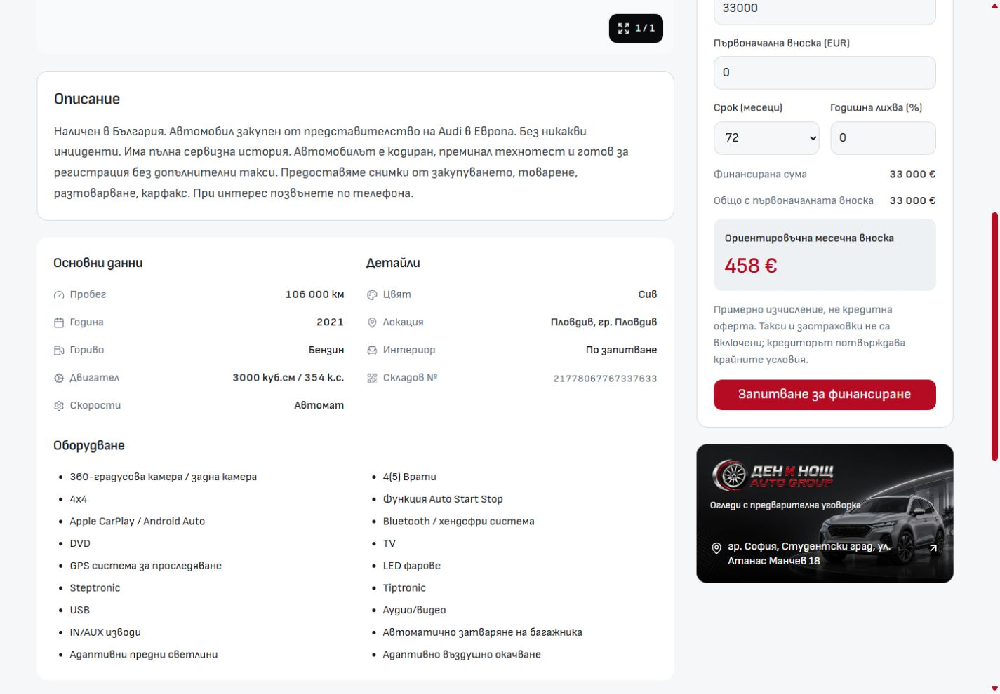
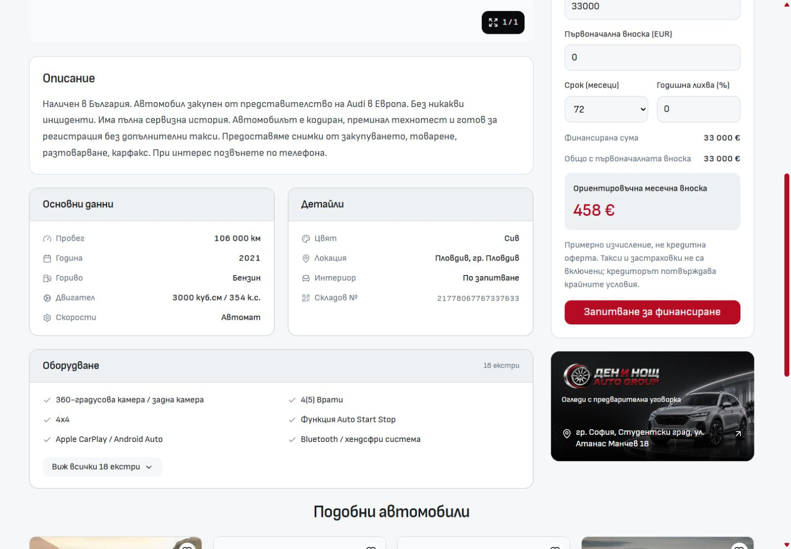

# Desktop vehicle information: three cards

The previous shared white panel made specifications, details and equipment read as one uninterrupted block. The desktop PDP now renders three visibly separate cards with grey headers and outlines. The two facts cards have equal height when sharing a row; narrower desktop containers stack them. Equipment occupies its own card below with the same 24px gap.

`VehicleInformationSection.svelte` owns the reusable frame and heading treatment. `VehicleEquipment.svelte` owns the equipment count, six-item preview and full-list disclosure. All supplied equipment remains available; nothing was removed from vehicle data. The disclosure exposes `aria-expanded` and `aria-controls`, supports native button keyboard interaction, and resets when navigating to another vehicle. `VehicleDetailPage.svelte` composes those owners only in its existing desktop branch.

## Visual evidence

The Audi SQ5 Bulgarian PDP was captured before and after at 1440 × 1000, with scrollY 808 in both captures.

| Before                                       | After                                               |
| -------------------------------------------- | --------------------------------------------------- |
|  |  |

Additional screenshots cover [768px](after-768.jpg), [1024px](after-1024.jpg), [1920px](after-1920.jpg), [expanded equipment](expanded-1440.jpg), and the unchanged mobile composition at [320px](mobile-320.jpg) and [390px](mobile-390.jpg).

## Verification

- Retained Node 24.21.0 and the existing Vite listener on port 6790.
- Scoped Prettier and ESLint checks passed for the four changed Svelte components.
- Svelte diagnostics passed with zero errors and zero warnings.
- Architecture checks passed: 57 native routes and 213 reachable modules.
- Browser checks at 768, 1024, 1440 and 1920px confirmed three cards, all nine facts, six preview features and no horizontal overflow. See [observations](verification.json).
- Mouse expansion revealed all 18 Audi features. Enter collapsed the list; Space expanded the English list. The disclosure referenced the correct list ID.
- Audi-to-BMW navigation rendered a single PDP, changed all vehicle facts and finance price correctly, and reset the equipment preview to six items.
- English headings, count and disclosure copy rendered correctly. Browser error/warning logs were empty during these checks.
- At 320 and 390px the existing mobile PDP rendered with zero desktop information cards and no horizontal overflow. Mobile components, shared tokens and server data were not edited.

These are local development checks. No production build, template release, dealer refresh or deployment was performed; the running Vite process retains ownership of the shared build output.
