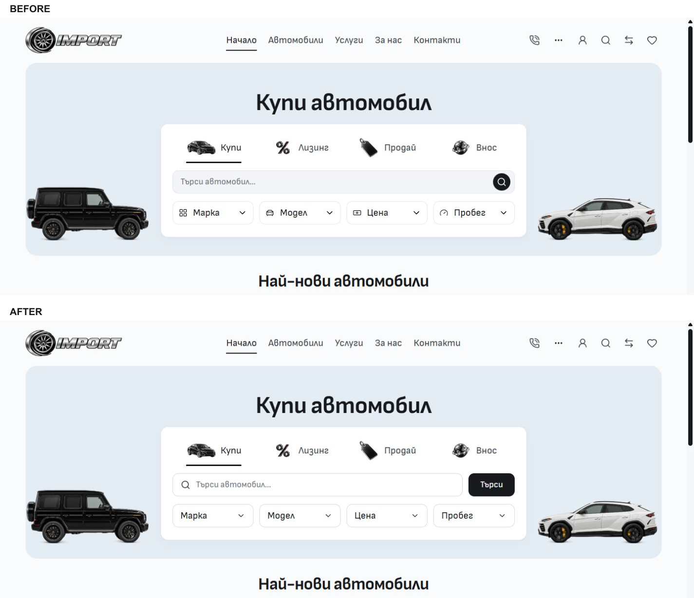
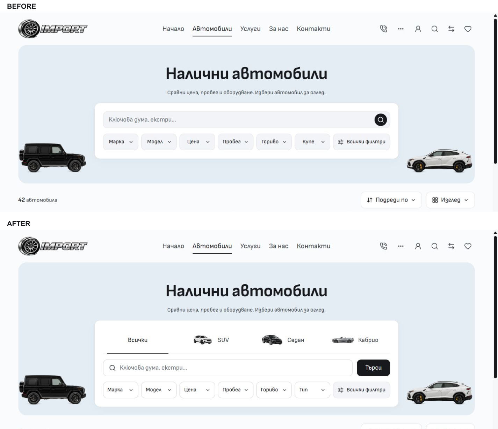

# Desktop search and vehicle types — 4 October 2026

Home and Inventory now use a white outlined search field with a leading search glyph and a separate, aligned 48px black action. Home's four empty filter fields use text and chevrons; Inventory's quick filters use white outlined fields with text aligned to the start. Selected states and the existing dialogs retain their owners.

Inventory adds native artwork shortcuts for All cars, SUV, Sedan and Cabriolet, derived from the actual body-filter options. The Type pill opens the existing body picker for full or multiple selection. Shortcuts replace only the body filter through the canonical query serializer and preserve keyword, make/model, price, sort, view, layout, locale and unrelated parameters. Trucks and bikes are absent from the current inventory and are not presented as stock categories.

Artwork reuses existing Import assets: the Home graphite car, the retained Home SUV cutout and the Cabriolet category image. No artwork was generated or edited. Sources pass through `assetHref` and activate from 768px. Mobile pages retain their independent compositions.

## Before and after

The main comparisons use the original task baseline and final production captures at the same 1440×1000 viewport, Bulgarian locale, route and default selection. Both viewport images export at 1425×990; the comparisons use the same top 570px crop with explicit labels. Intermediate captures of the rejected inset search button are also preserved as `home-before.jpg` and `inventory-before.jpg`.

Original complete captures are retained in [the first iteration](../desktop-controls-2026-10-04/README.md), and copied here as `home-original-before.jpg` and `inventory-original-before.jpg`. Final complete captures are `home-after.jpg` and `inventory-after.jpg`. Additional captures show the 768px desktop view, English labels and the existing Type dialog.

## Verification

- Node 24.21.0 and retained npm lockfile, SHA-256 `aa596db7046c3f226ce50b488e283e30121eb49122d5006c60035ef57a952e1c`; no dependency changes.
- Svelte check: **0 errors, 0 warnings**. Scoped ESLint, Prettier and Git whitespace checks passed. Architecture: **57 native routes, 231 reachable modules**. Asset signatures: **976 images passed**.
- Production build passed with the existing Vercel/public-asset adapter. Existing `@reference` minifier warnings remain. The final immutable QA snapshot is `C:/Users/radev/.codex/tmp/cars-import-search-types-2026-10-04-qa`. Build/check evidence, nine task source/test hashes and complete source digest `efe3ac3ba1a9fa8a6e4f60ef0b8c3f96dd6c33f807dc9d0935abce15228f304f` are retained under ignored `runtime/desktop-search-types-2026-10-04/`.
- `desktop-search.e2e.ts`, `style-parity.e2e.ts` and `storefront-controls.e2e.ts`: **18 passed** against production at port 6791. The added functional case verifies type selection, canonical aliases, preserved query context, native search, clearing only type and Escape focus restoration in the existing picker.
- Actual browser widths **768/1024/1440/1920px** show no horizontal overflow and keep the artwork row inside the hero. Measurements are in [desktop-metrics.json](desktop-metrics.json). English Inventory also fits at 768px. Production browser inspection reported no console errors.
- BG Home, Inventory and Services at **320/390px** show no horizontal overflow or visible desktop controls. **5/6** viewport images match the original baseline exactly. Inventory at 390px differs only in the partly covered next-card image/badge at x=8–167, y=768–791; all other pixels match. [mobile-comparison.json](mobile-comparison.json) records the counts and bounds. The earlier BG/EN twelve-pair comparison is retained with the original iteration.

The first packaging attempt ran out of C-drive space. Only task-owned generated build folders were moved to the verified ignored runtime; existing source, dependency installations and user data were preserved. An alternate build exposed the Vercel adapter's cross-drive dependency tracing limitation. After capacity recovered, the original same-drive frozen snapshot produced the successful build. Failed attempt logs remain in runtime for diagnosis.

## Scope and integration

Cars `main` is the working branch. The workspace doctor fetched tracking refs before integration. Only task-owned components, desktop copy, the focused test, authoritative style/architecture notes and the two evidence directories are included. Existing Import ignore edits, earlier untracked assets/evidence and other templates/dealers remain outside this change.

This is local template source polish. The live source preview remains at `http://127.0.0.1:6790/bg`. Template promotion and dealer publication retain their separate workflows.
