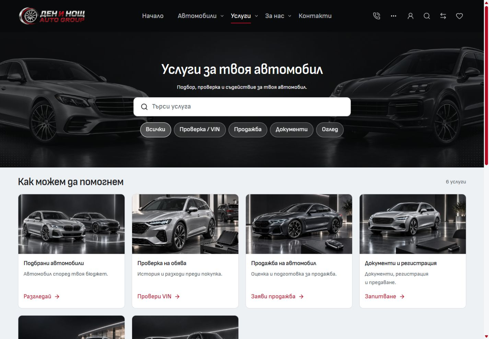
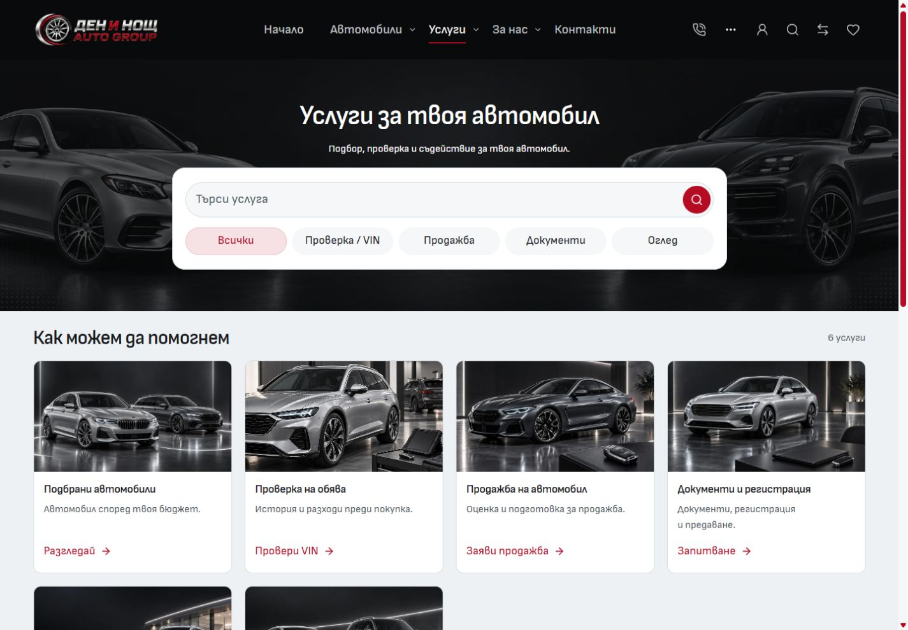
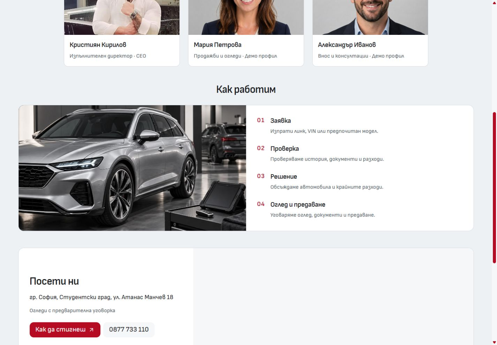
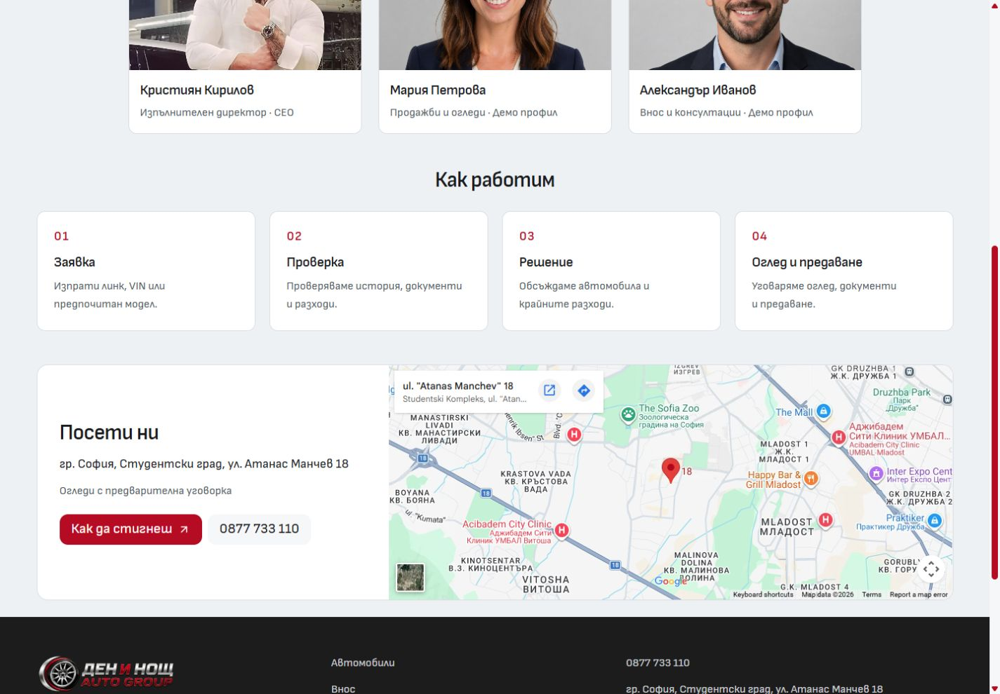

# Services search panel and About process

Desktop refinement on 2 October 2026. Preview: [Services](http://127.0.0.1:6790/bg/services) and [About](http://127.0.0.1:6790/bg/about).

Services now uses the shared white `DesktopDiscoveryPanel` from Home and Inventory. Its search field uses `DesktopSearchControl`, including the circular inset submit action and an accessible association with the results. Search and all five quick filters sit inside one panel. Pills fill the available row evenly, with a quiet accent tint for the active choice. Native GET submission keeps the existing `q` contract.

About's desktop process is now four compact, equal-height numbered cards. Each has a short title and one concise explanation. The grid uses the existing card surfaces, typography, 20px gap and responsive two-column layout below 1024px. The oversized image/list panel is removed from this section; its artwork remains in use by Services. Mobile continues using its original process composition.

## Before and after

Both comparisons use a 1440 × 1000 viewport. About is captured at a 700px scroll position.

| Page          | Before                                  | After                                 |
| ------------- | --------------------------------------- | ------------------------------------- |
| Services      |  |  |
| About process |        |        |

## Verification

- Scoped ESLint and Prettier passed for the three changed Svelte files and documentation.
- Svelte-check found zero errors and zero warnings.
- Architecture: 57 native routes and 219 reachable modules passed.
- Vitest: 18 files and 124 tests passed.
- Production build passed in the retained frozen QA copy at `C:/Users/radev/AppData/Local/Temp/cars-import-desktop-contact-about-services-2026-10-02`. The three changed source files were copied and SHA-256 matched before checking/building; the retained runtime configuration and npm lockfile also matched. Build output stayed separate from the live port-6790 server. The source hash manifest and build log remain under the ignored task runtime folder.
- Bulgarian desktop checks at 768, 1024, 1440 and 1920px show no horizontal overflow or clipped pills. Services retains two cards below 1024px and four above. The search panel measures 880px at wider desktop sizes, matching Home and Inventory. About cards have equal heights within each row.
- English Services and About were checked at 768, 1024 and 1440px with no clipped pills or horizontal overflow.
- The VIN quick filter returns one service. Clicking the circular Search action with `документи` preserves `q` in the URL and returns three matching services. The results association points to `service-results`.
- At 320 × 900 and 390 × 900, both affected pages retain the same visible text, selected image sources and image dimensions, with no horizontal overflow.
- Home and Inventory retain their existing search composition and 880px panel width. The optional results association adds no attribute for existing callers.

Measurements: [desktop widths](desktop-widths.json), [English pages](english-pages.json), [mobile preservation](mobile-preservation.json), [shared panels](shared-panels.json).

The existing dirty ignore files, older screenshots and unrelated repository work are preserved. This change does not promote a template release or deploy a dealer. Browser checks cover the local dev preview; hosted and native-device verification are separate.
