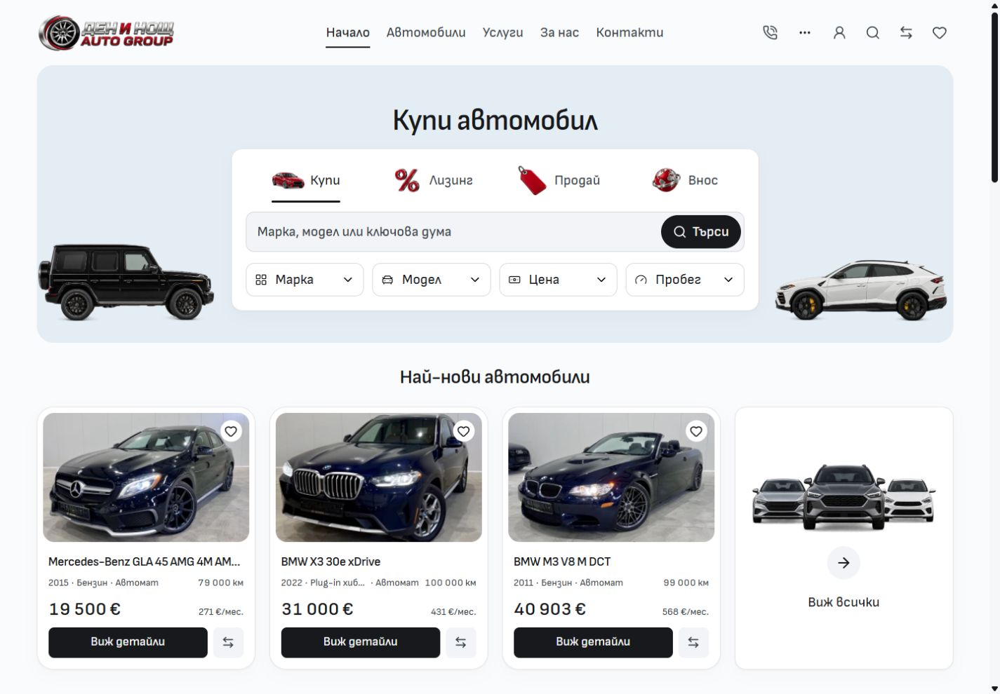
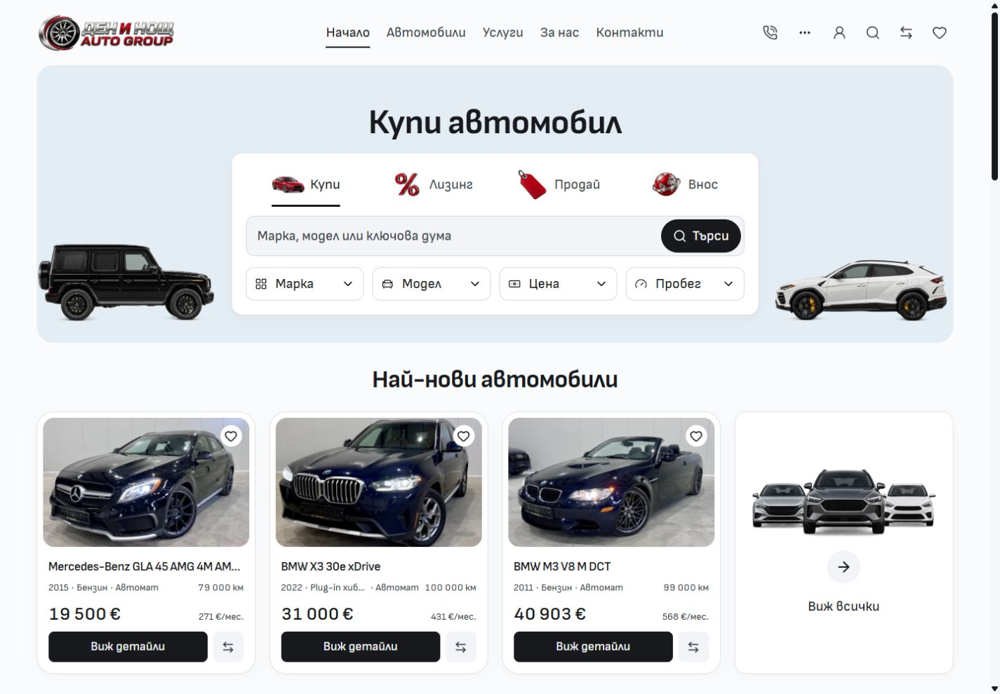
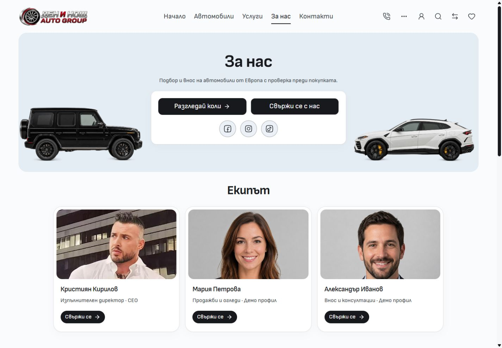

# Desktop title hierarchy

The owner called out undersized section headings and weak desktop typography. The previous 28px/600 section role sat close to 20px regular controls. Desktop section headings now use full-width Sofia Sans at 32–36px/700 with 1.2 leading. Hero and article titles use the same face at 40–52px/700, with the existing H1 leading and 56px hero anchor. Font files, body copy, card titles, control weights, canvas, frames and artwork remain under their existing owners. All style changes apply from 768px.

The live [Carwow Home](https://www.carwow.co.uk/) was inspected at 1440px: ordinary section headings used GT Walsheim at 32px/700, and prominent promotional headings used South East CN at 56px/700. This provided a hierarchy reference. No Carwow font files, branding or assets were copied.

Before:

After:

About:

[Verification](verification.json) records the nine source/test hashes, frozen QA inputs and matched browser evidence. Svelte checking reported zero errors and warnings; scoped ESLint/Prettier, architecture and 955 local image signatures passed. The production build passed in isolated frozen QA output with the retained dashboard `@reference` minifier warning.

Five focused existing browser checks passed initially, including both localized hero-frame tests across eight routes at 768/1440/1920px. The action-size check initially expected the superseded 18px/44px rule for About's previously approved small team CTAs. It now recognizes their explicit 16px/36px compact role while retaining ordinary action checks; the failed test was rerun and passed. Font delivery, filter selection weight, control wrapping and all hero frames passed.

Actual browser observations covered Home/About in both languages at 768/1440/1920px, Inventory/Services/Contact in both languages at 1440px and a vehicle detail page: 19 observations without heading clipping or horizontal overflow. The vehicle detail title consumes the section-size token at 32–36px and retains its separate 600 weight. The mobile Home/About comparison covered all visible headings, paragraphs, buttons, inputs and links across the complete DOM at 320/390px in both languages; their computed type, copy and geometry matched after waiting for hydration and responsive Home labels. Viewport screenshot pixel differences are separately recorded and are not treated as complete-page pixel proof.

This is reusable master source work and local verification. Existing ignore-file edits, draft assets/screenshots and other Cars work remain preserved. Commit/push results are recorded in the task handoff; this does not promote a template release or deploy dealers.
