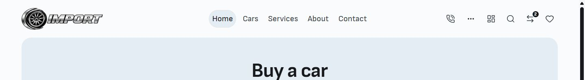
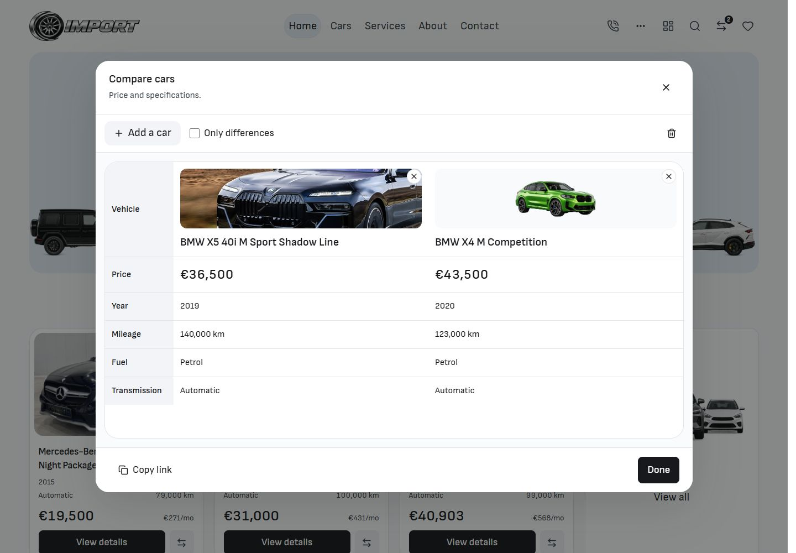
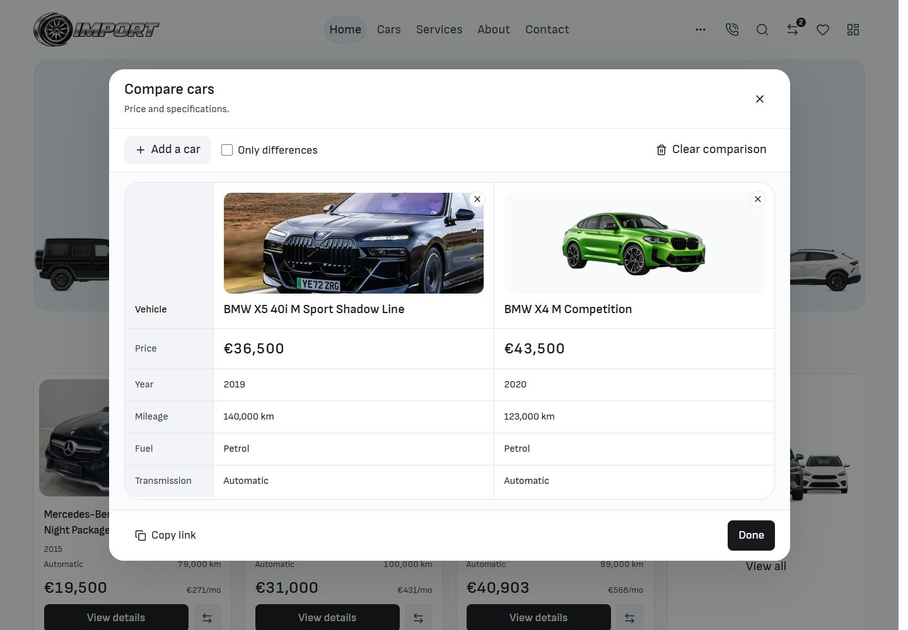
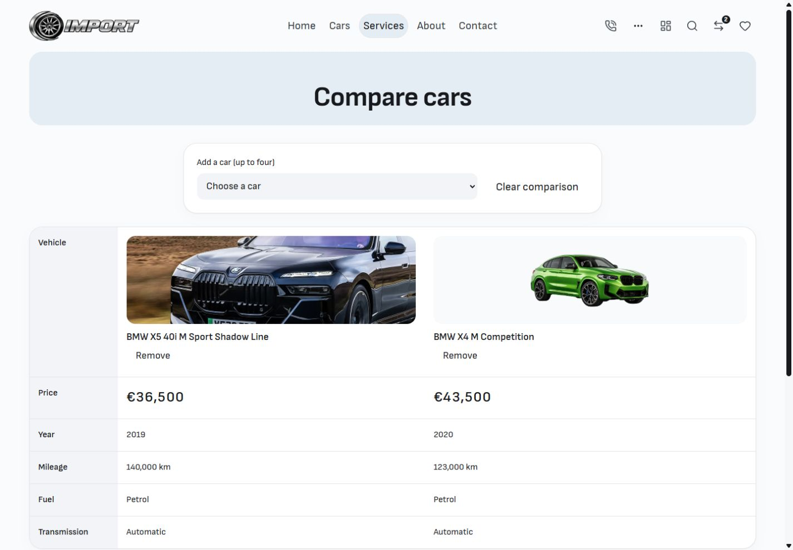
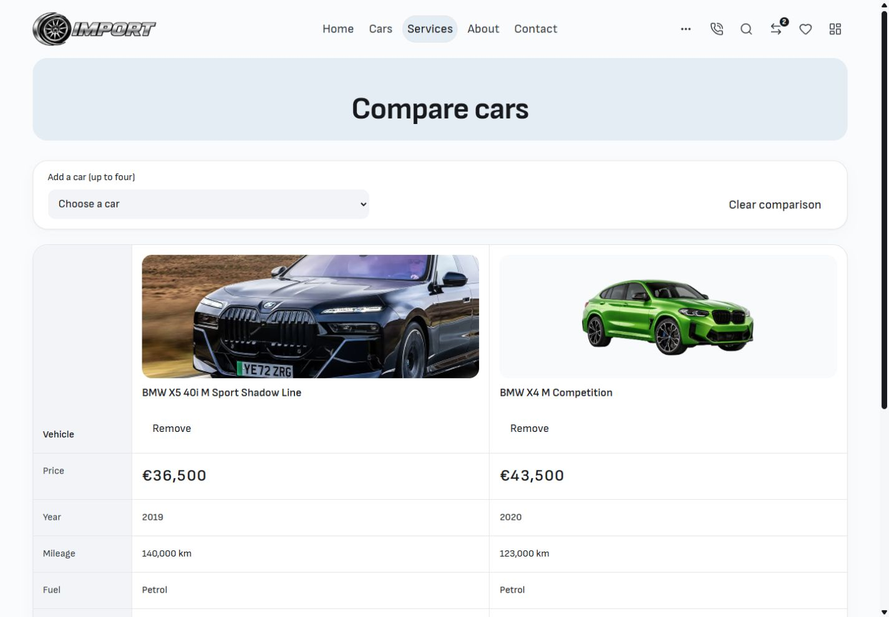

# Header and desktop Compare polish — 8 October 2026

The desktop actions now run left to right: Menu/More, Call, Search, Compare, Saved cars, Admin dashboard. Dashboard is at the far right. DOM and keyboard order match, and the existing shared admin destination, count badges, search dialog and localized links remain intact.

Compare keeps the existing palette, typography family, rounded shell and selection flow. Desktop photographs have more useful proportions, cutouts have more space, vehicle columns have quiet dividers, labels have less weight, and Clear comparison has a visible desktop label. The direct page's picker aligns with its table. Short desktop screens use compact vehicle headers so the facts remain readable while scrolling. Mobile styling is preserved.

## Before and after

The header and dialog use matched 1440 × 1000 browser viewports and the same two selected vehicles. Header captures show the top 200px. The before state comes from the preserved pre-task files; the final files were restored with hash checks and no concurrent drift.

| Before                                                 | After                                                |
| ------------------------------------------------------ | ---------------------------------------------------- |
|                |                |
|              |              |
|  |  |

Additional views: [four cars at 1024px](after-compare-four-1024.jpg), [768 × 540 desktop](after-compare-768-short.jpg), [320px mobile](after-compare-mobile-320.jpg), [390px mobile](after-compare-mobile-390.jpg).

## Task changes

- `src/lib/components/layout/PublicHeader.svelte`: reorder desktop action markup only.
- `src/lib/components/compare/CompareDialog.svelte`: desktop heading, aligned insets and a labelled Clear action.
- `src/lib/components/compare/CompareTable.svelte`: desktop image proportions, column dividers, label treatment and compact headers at short desktop heights.
- `src/routes/(site)/compare/+page.svelte`: align the desktop picker with the table.
- `tests/compare-overlay.e2e.ts`: count vehicle headers consistently across desktop/mobile, retain the current 42px chip contract, and ensure the Price row is fully visible on short desktop screens.

All pre-existing modified and untracked Compare work was retained, including the overlay, picker, selection logic, native route and customer/account paths. The task adds presentation refinements to that work. Main HEAD remains `1d144370f5bafaf8451120b9a6270f711a8a121a`; no commit, template promotion or deployment was performed.

## Verification

- Svelte check: 0 errors, 0 warnings on the final isolated source capture.
- Scoped ESLint, Prettier and whitespace checks passed. Svelte autofixer reviewed the changed components; its existing URL-helper and attachment suggestions do not concern these presentation changes.
- All 16 Compare tests passed across desktop and touch-emulated mobile projects, including BG/EN selection, four-car limit, removal, differences, accessibility, clipboard/page fallback, navigation and dismissal. After the final desktop inset adjustment, both short-screen/mobile-containment tests passed again.
- Native browser review covered the two-car dialog at 1440px, four cars at 1024px, and contained scrolling at 768 × 540. At 1440px all five specifications fit without a table scrollbar. Menu opening, Search opening and keyboard order were verified; the original two-car selection was restored.
- Matched 320px/390px mobile captures have zero changed pixels outside the second vehicle cutout image at a 16/255 channel threshold. Image-only differences cover 697/270,080 pixels at 320px and 407/329,160 at 390px. See [mobile-preservation.json](mobile-preservation.json) and [browser-verification.json](browser-verification.json).
- Final production build passed in the isolated current-source capture (exit 0, including the configured adapter). Task-owned source hashes match the build capture.

This receipt covers the local header/Compare changes. It does not establish full-template release, hosted or dealer acceptance. Earlier audit findings remain documented in the [final audit](../final-audit-2026-10-08/README.md).
