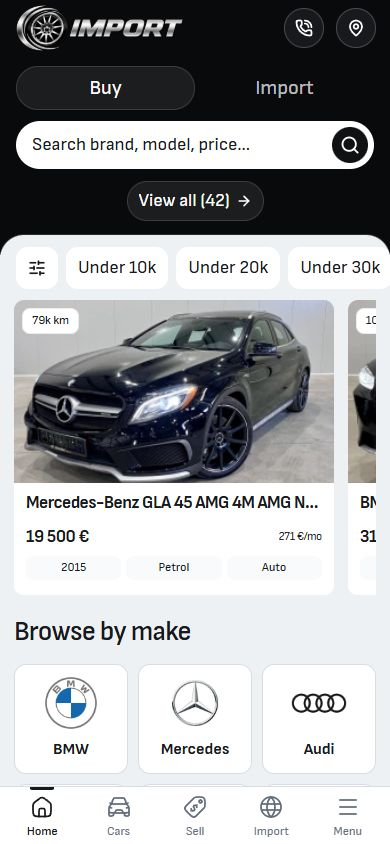
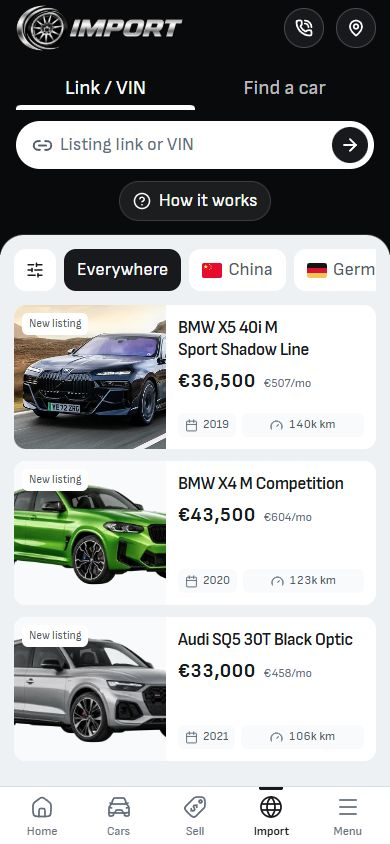
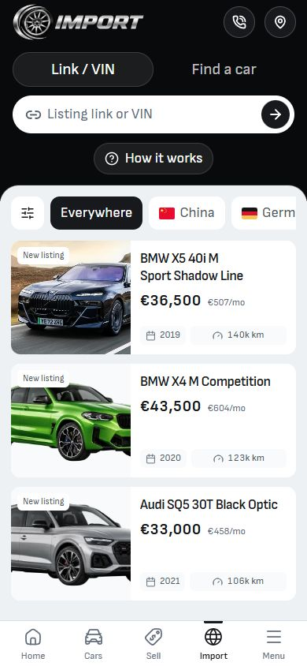
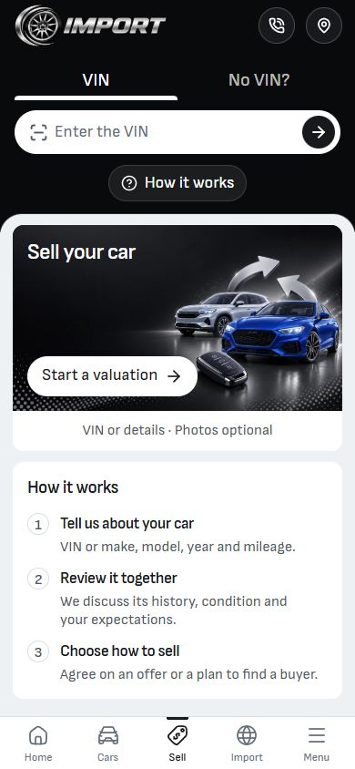
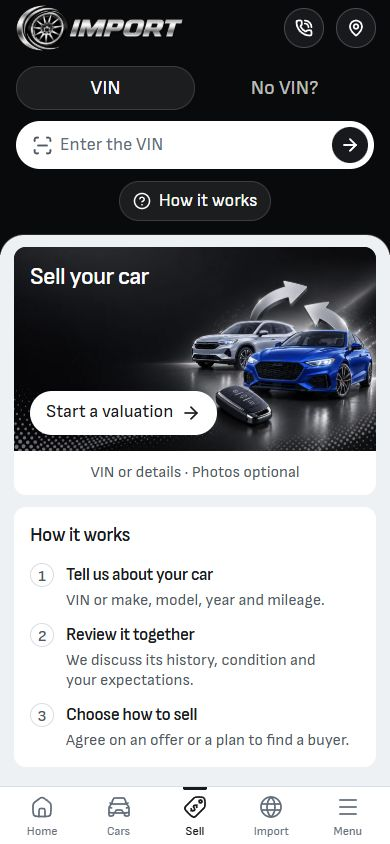

# Hero active treatment — 8 October 2026

**Superseded:** The owner clarified that the request concerned desktop. The mobile `soft` appearance and its three opt-ins were reverted on 8 October. The screenshots and checks below are retained as historical evidence of that reverted trial. Desktop was inspected for a recommendation; no new desktop styling was applied in this correction.

The mobile hero selection now uses a soft charcoal pill with a faint inset border, replacing the white underline on Home, Import and Sell. The existing label sizes, hit targets, rail geometry, keyboard behavior and desktop composition are preserved.

## Changed source

- `src/lib/components/common/MobileModeTabs.svelte`: adds an explicit `soft` appearance, styled only below 768px; selected background uses 8% white, inset border 14% white, existing pill radius. The active underline is hidden.
- `src/lib/components/home/HomeFiveHero.svelte`: opts Home's mobile Buy/Import rail into `soft`.
- `src/lib/components/services/ImportRequestMobilePage.svelte`: opts Import's mobile Link/VIN and sourcing rail into `soft`.
- `src/lib/components/sell-your-car/SellYourCarMobilePage.svelte`: opts Sell's mobile VIN/manual rail into `soft`.

Existing work was preserved. Concurrent overlay-height edits in Home and Import are separate from this change. No commit, release promotion or deployment was performed.

## Matched 390 × 844 screenshots

| Page   | Before                                  | After                                 |
| ------ | --------------------------------------- | ------------------------------------- |
| Home   |      |      |
| Import |  |  |
| Sell   |      |      |

## Verification

- Live browser at `http://localhost:6794`: Home, Import and Sell checked in EN/BG at 320px and 390px; no page overflow. Selected underline computed as `display: none` in every recorded state. See [browser-verification.json](browser-verification.json).
- Keyboard ArrowRight, Home and End selection checked across the three hero rails. Focus outline remains visible; Import and Sell entry panels follow the selected tab.
- Home's 390px rail remains at x=16, y=66, width=358, height=45. The search row retains its anchor.
- Home desktop compared at a 1440 × 1000 viewport. Browser raster is 1425 × 990. The hero frame has zero differing pixels above a 16/255 channel threshold; the captured mobile region below y=118 also has zero differing pixels for all three matched pairs. See [preservation.json](preservation.json).
- Svelte check on the isolated QA source capture: 0 errors, 0 warnings. Scoped ESLint, Prettier and `git diff --check` passed.
- Svelte autofixer run for all four components. Existing custom URL-helper and browser-effect suggestions were reviewed; this visual change introduces no new navigation or effect behavior.

Screenshots and source checks establish this local visual change. This receipt is not full release or hosted acceptance.
