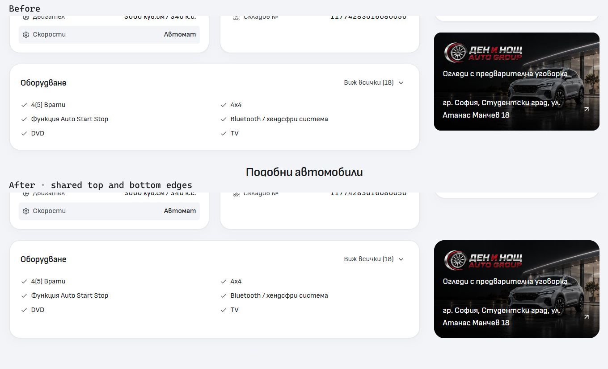

# Sofia banner alignment and desktop hero study

The desktop PDP now places equipment and the Sofia dealer banner in a shared grid row from 1024px. Both containers stretch to the same top and bottom edges; the banner uses the shared 24px desktop card radius. Expanded equipment grows the row naturally. At 768–1023px, equipment and the banner follow the facts as stacked panels. Vehicles without equipment retain their banner in the purchase/finance summary.

The source change belongs to `src/lib/components/detail/VehicleDetailPage.svelte`. Dealer identity, address, map destination, artwork, finance behavior and the independent mobile PDP retain their existing owners.

## Focused verification

- Node 24.21.0 and the retained npm lockfile were used. Svelte check: **0 errors, 0 warnings**. Scoped ESLint and Prettier pass.
- The production Vercel-adapter build passes in the isolated QA directory. The previous QA PDP source was preserved before replacing that one input; no active canonical build output was overwritten.
- BG and EN PDP layouts were checked at **768, 1024, 1440 and 1920px**. Both row edges match exactly from 1024px; no horizontal overflow occurred. At 768px the panels stack in reading order.
- The BG full-equipment disclosure was exercised at 1440px: all **18 items** appear, and both containers grow to **386px** with equal edges. Collapse restores the preview.
- Matched **320/390px** mobile captures retain the independent mobile composition, text, controls and layout, with no horizontal overflow. They are visually unchanged. Raw pixel differences are confined to vehicle-photo rasterization (3,186 pixels at 320px and 368 at 390px); this follow-up does not claim exact pixel equality. Both input captures and their metrics are retained.

Source hashes and focused results are in [verification.json](verification.json). Complete before/after captures, desktop measurements, the preceding QA source and the build log remain under ignored `runtime/hero-alignment-2026-10-04/`.

## Hero direction

The interactive comparison is a proposal, not an application palette change. It compares the current continuous grey composition with a soft tinted inset hero and a white hero band. Page selection follows across the three variants and includes Home, Inventory, Contact and FAQ. The recommended tinted frame gives the hero a distinct boundary above the grey page; task controls keep their own white discovery panel, while simpler pages need no empty inner box.

Current [Carwow Home](https://www.carwow.co.uk/), [Sell My Car](https://www.carwow.co.uk/sell-my-car) and [About](https://www.carwow.co.uk/about-us) were inspected on 4 October 2026. Home uses a dark campaign hero and a contained search panel; Sell uses an inset gradient hero and a contained valuation form; About uses a plain white heading/navigation area. Their page treatments vary with purpose. No Carwow assets or branding were copied.

## Integration

The initial capture used the canonical Cars checkout on main at `6c92fdc2758d5d5b985a9c8a9004c7bb969d313a`, while the existing shared Git lock blocked integration. The lock later cleared independently. The subsequent [tinted hero implementation](../tinted-heroes-2026-10-04/README.md) implements the proposed direction, and [service card follow-up](../service-cards-2026-10-04/README.md) standardizes its card copy/actions. Source integration uses a scoped Import commit on main. The owned integration manifest and recovery patch include these follow-ups. Unrelated Cars changes, inherited ignore edits and older evidence remain untouched. No template promotion, dealer deployment or outreach was performed.
