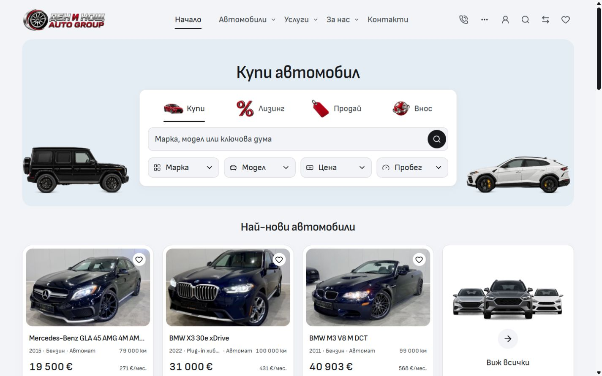
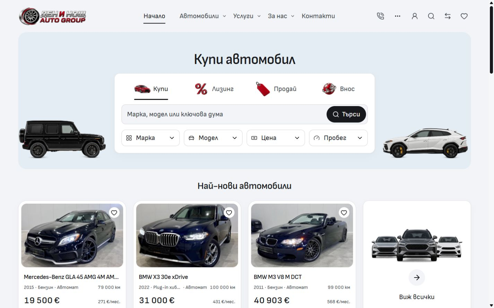
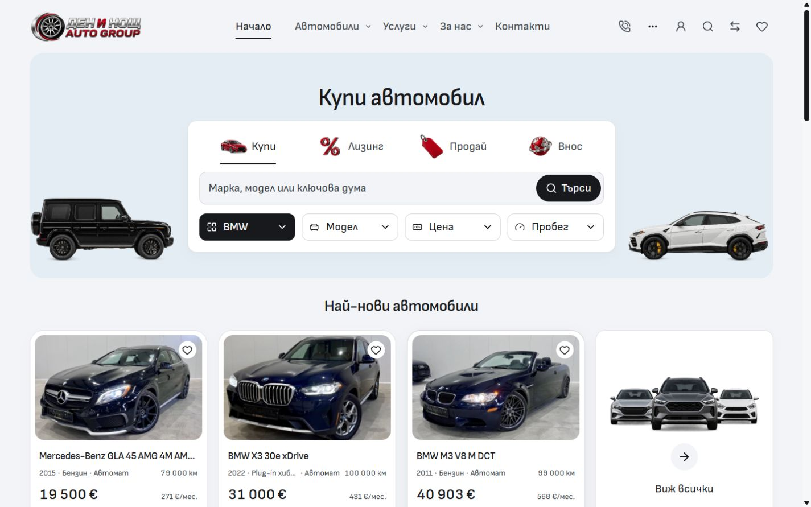

# Home buying box

Home's desktop search and filters previously used the same grey surface and weight. The search now has a visible localized label inside its black action. Make, Model, Price and Mileage use white outlined surfaces; selected filters use black fill with white labels, icons and chevrons. Hover is charcoal for a selected filter and quiet grey for an empty one. The existing 48px filter targets, pickers, dependent models and native inventory queries retain their owners.

The approved artwork files are unchanged. The finance cutout renders at 86% within the same 48px slot, balancing its larger silhouette against the car, tag and globe. The optional scale belongs to `content/home-discovery.ts`; the panel appearance in `MobileModeTabs` consumes it from 768px. The labeled search action is an explicit `DesktopSearchControl` opt-in used only by Home.

Before:

After:

Selected Make:

[Verification](verification.json) records the five source hashes, matched in-app browser captures, responsive checks and focused tests. BG/EN desktop was checked at 768/1024/1440/1920px; fields retain 48px height and there is no horizontal overflow. The existing six desktop search tests passed, including nested pickers, keyboard focus restoration, empty/unavailable search previews, canonical query submission and the stock inventory link. A live BMW selection opened `/bg/inventory?brand=BMW` and showed BMW results.

Mobile captures cover Home at 320/390px in both languages. Both 320px captures match exactly. The 390px captures have small paint differences recorded in the receipt; they are not claimed as identical. This comparison covers the visible viewport, rather than claiming a complete-page comparison. The source changes are desktop appearances and an opt-in action; existing mobile compositions stay independent. Svelte checking, scoped formatting/ESLint, architecture and local image signatures passed. The production build passed in the isolated QA workspace; its five changed source inputs match the recorded hashes. The existing retained dashboard CSS produces the same `@reference` minifier warning; the build exited successfully.

This is reusable master source work and local browser verification. It does not promote a release or deploy dealers. Existing ignore-file edits, draft assets/screenshots and other Cars tasks remain preserved.

These changes are grouped with the subsequent [light canvas and direct header](../light-canvas-header-2026-10-04/README.md) follow-up for scoped integration on canonical `main`. The shared index lock that previously deferred this change has cleared. That receipt verifies all ten final source/test inputs against the frozen QA build; the commit and push result is recorded in the task handoff.
