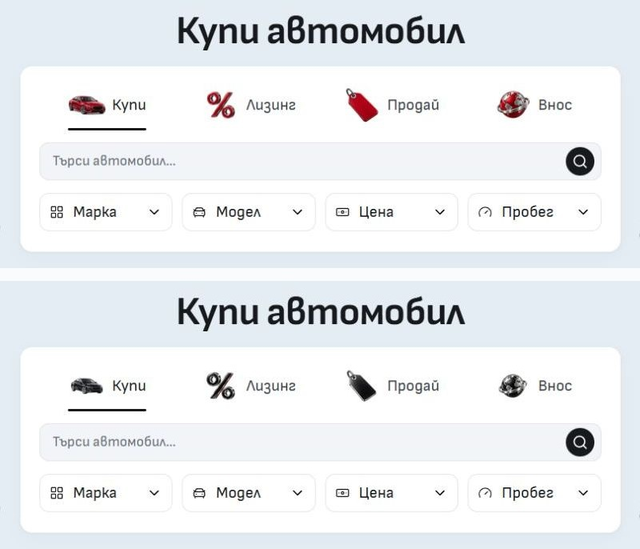

# Home graphite artwork — 4 October 2026

The original v2 generation and verification are recorded below. [The subsequent sizing correction](../home-mode-sizing-2026-10-04/README.md) keeps this artwork but gives Buy a wider 64×48px footprint and reduces the Leasing symbol. Home now uses their v3 variants; Sell and Import retain v2.

Home's four desktop mode illustrations now use graphite and polished silver. Buy keeps its complete sedan, Sell its blank tag and Import its globe/orbit. Leasing is mostly graphite with a thin red side edge on its diagonal percent bar. All four retain the established 3D composition and lighting.

The assets share a 48px CSS slot. Transparent bounds and visible alpha area are normalized during export, preserving aspect ratio and keeping the open percent symbol balanced against the car and globe. The former Leasing-only CSS scale is removed.

Built-in imagegen generated the edits, one call per object, with transparent backgrounds. [Exact prompts and references](prompts.json), [the Buy framing correction](buy-reframe.json) and [selected source paths, hashes and final asset paths](assets.json) record provenance. Original selected PNGs are retained in `runtime/home-mode-graphite-2026-10-04/originals/` as well as at their recorded generated-images paths.

Final files live at `static/assets/daynight/home-modes/{buy,finance,sell,import}-graphite-v2-{48,96,144}.webp`. Each is a square WebP with genuine alpha. Sharp only trims transparent margins, normalizes optical sizing, resamples and encodes at quality 90 / alphaQuality 100; it does not recolor or synthesize artwork.

| Device density | File dimensions | All four transferred bytes |
| -------------- | --------------- | -------------------------- |
| 1×             | 48 × 48         | 6,440                      |
| 2×             | 96 × 96         | 14,222                     |
| 3×             | 144 × 144       | 22,790                     |

The previous four 192px files totaled 43,676 bytes. Standard-density loading is 85.3% smaller. Higher-density displays can choose sharper files without loading the original PNGs.

This is the existing SvelteKit image pipeline: native picture/source density candidates, static WebP delivery and per-candidate `assetHref` mapping for mounted deployments. `src/lib/content/home-discovery.ts` owns the family; `MobileModeTabs.svelte` renders it. The media gate stays at 768px and mobile continues selecting the transparent fallback. Header, promotional banners, real listing photography and business identity retain their existing owners.

Verification used pinned Node 24.21.0 and the existing isolated QA workspace, preserving the live 6790 development server. Svelte check passed with zero errors/warnings; 124 unit tests, scoped ESLint/format, 970 local image signatures, architecture checks and the production build passed. Existing production-preview browser cases passed: one desktop artwork/mode test covering 768/1024/1440/1920px and four BG/EN mobile commerce/menu cases at 320/390px. Native keyboard checks covered ArrowRight, Home and End focus/selection.

[Browser observations](browser.json), [source/check evidence](verification.json) and [matched screenshot comparison](screenshot-comparison.json) retain the evidence. BG/EN mobile selects the empty fallback with zero artwork layout width and no horizontal overflow. English desktop labels and all four decoded illustrations also fit their targets.

Before is above; after is below. These are crops of the actual matched 1440 × 1000 browser captures; no generated UI is used.

The uncropped [before](before-home-1440.jpg) and [after](after-home-1440.jpg) Home screens, English desktop and BG/EN 320/390px captures are saved beside this receipt. This is a source-master refinement; template release selection and dealer publication remain separate.
