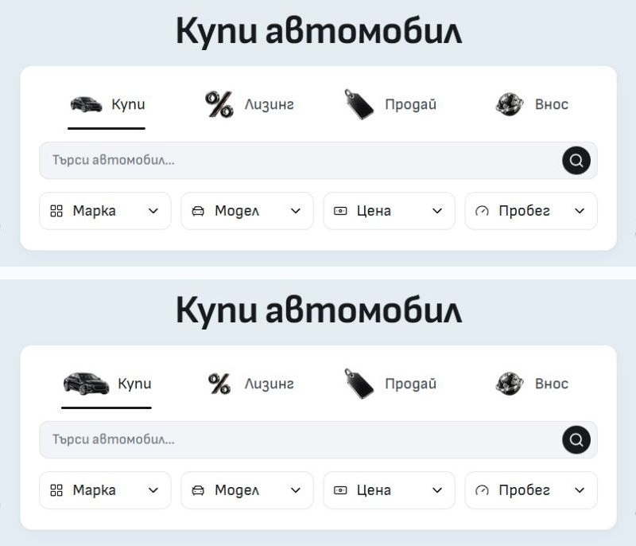

# Home artwork sizing correction — 4 October 2026

The wide car was visibly too short beside the tall percent symbol. Matching square canvases and alpha area did not produce a balanced result.

Buy now uses a 64×48px canvas, with a complete visible car approximately 58×29px. Leasing keeps a 48×48px canvas but its visible symbol is approximately 28×27px. The artwork row retains its 48px height. Sell and Import keep their existing composition, files and size.

`MobileModeTabs.svelte` derives each artwork width from its intrinsic aspect ratio and the shared height token. The car remains proportionate and contained inside its tab. All three density variants pass through `assetHref`; the 768px media gate and transparent mobile fallback remain intact.

These are mechanical exports of the existing [imagegen originals and prompts](../home-mode-graphite-2026-10-04/README.md), preserving subjects, black/silver materials and Leasing's thin red edge. New files are `static/assets/daynight/home-modes/buy-graphite-v3-{64,128,192}.webp` (64×48, 128×96, 192×144px) and `finance-graphite-v3-{48,96,144}.webp` (square). [Asset metadata and hashes](assets.json) records the source and final saved paths. Existing v2 files and their receipts remain preserved.

[Browser observations](browser.json) cover 768/1024/1440/1920px with decoded, fully contained images and no horizontal overflow. BG/EN at 320/390px still select the empty fallback with zero artwork layout width. [Verification](verification.json) records the checks against the changed source.

Before is above; the corrected car and Leasing sizes are below. Both are crops of actual matched 1440×1000 browser captures.

