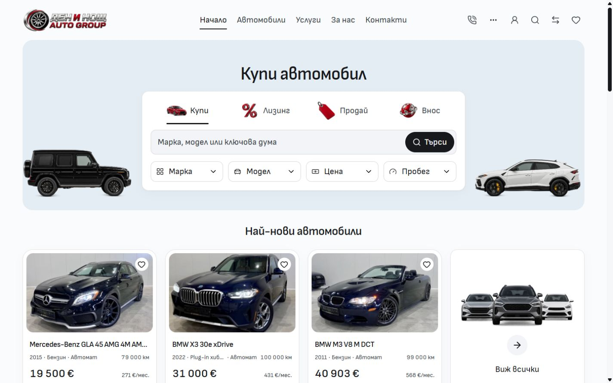
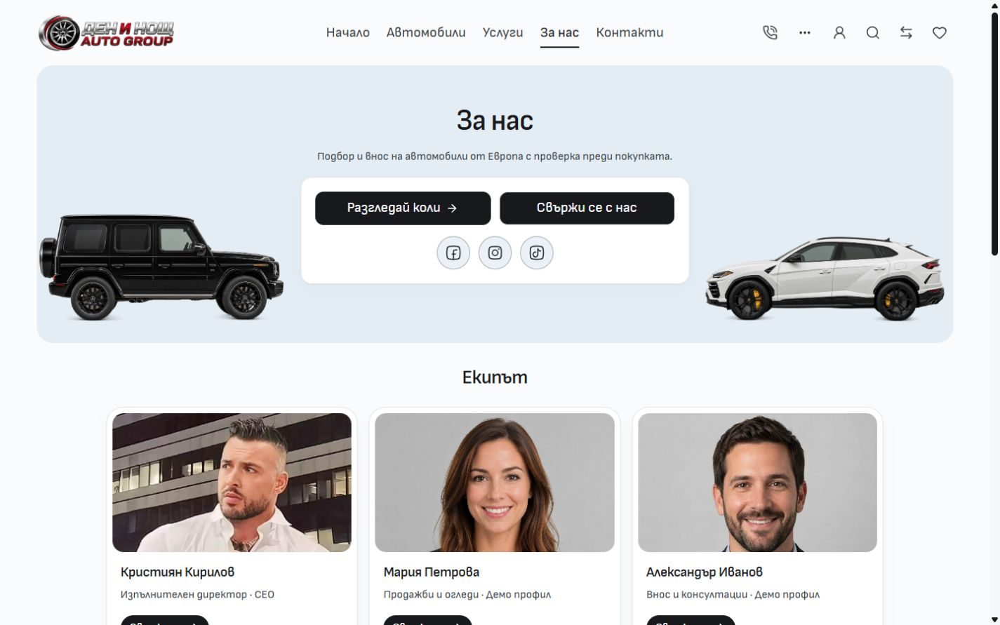

# Lighter desktop canvas and direct header

The owner requested a page background closer to white and removal of obsolete header dropdown arrows. The Mobile desktop reference at `http://127.0.0.1:6474/` was inspected as a reference: it uses one central white page panel with grey outer gutters. Import retains its wider composition and existing hero/card/form frames. The desktop canvas is now near-white `#fafbfc`; field fills remain `#f2f4f7`, cards remain white and the accepted hero stays `#e5edf4`. These roles remain in `tokens.css` and apply from 768px.

`PublicHeader` now supplies only the five direct primary destinations. Removing the old groups removes the corresponding submenu triggers and popovers. `NavigationMenu` no longer renders a blank 28px arrow slot when it has no submenu. The header uses 24px gaps, retains centered links, active underlines and native localized destinations. Mobile navigation keeps its independent owner.

Before:

After:

About:

[Verification](verification.json) records source hashes, actual browser observations, mobile viewport comparisons and checks. This follows the [Home box refinement](../home-buy-box-2026-10-04/README.md); its previously uncommitted source is included in this scoped integration. No dealer deployment or template release promotion is requested. Inherited ignore changes, earlier draft artwork/screenshots and unrelated Cars work remain preserved.

Four existing focused browser tests passed: direct localized header navigation by keyboard, navigation fit without arrow slots, native page actions, and buying-panel contrast. The header fits at 768/1024/1200/1280/1440/1920px; centered navigation and localized Enter behavior passed in BG/EN. Actual browser checks covered Home, About, Services and Inventory in both languages at 1440px, plus Home at 768/1024/1920px. There is no horizontal overflow on those observations.

Svelte checking reported zero errors and warnings; scoped ESLint/Prettier, architecture and 955 local image signatures passed. The production build passed in isolated frozen QA output, with all ten changed source/test inputs matching the recorded hashes. The retained dashboard `@reference` minifier warning remains. Mobile Home/About viewport captures at 320/390px are visually consistent but contain pixel differences recorded in the receipt; no exact or complete-page mobile match is claimed. The actual preview is left on BG Home with its viewport override reset.
