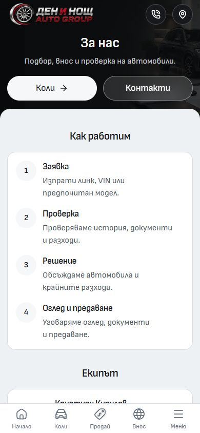
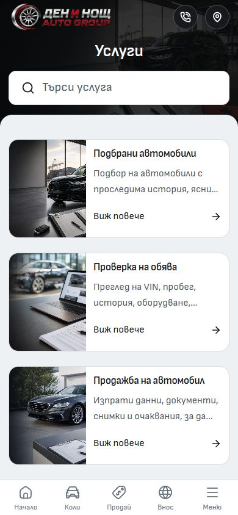
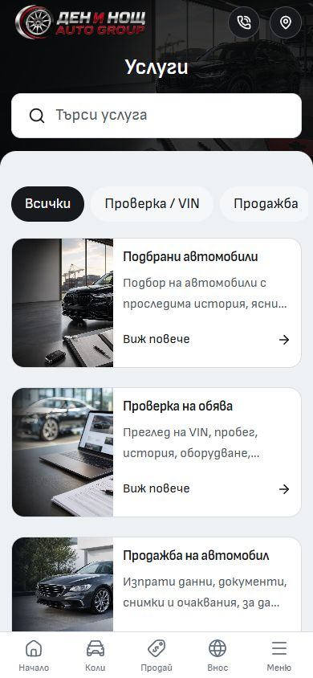

# About and Services mobile refinement — 1 October 2026

Services keeps its existing hero and cards, with a horizontal quick-filter rail below the hero. All, Check / VIN, Selling, Documents and Viewing reuse the existing service queries and Action component. The active pill follows the search case-insensitively; All clears it. The result announcement uses the correct singular or plural, and the scroll rail leaves room for keyboard focus rings.

About keeps its centered hero and gains Cars and Contact actions. On mobile, its process comes before the team in one white panel, with concise descriptions drawn from the existing content boundary. Team rows use smaller card titles and round portraits. Social links sit beside the visit details, and the visit banner uses the standard mobile text sizes. Desktop retains its original section order, full descriptions and appearance. The mobile variants are opt-in; the main-page compositions remain unchanged.

## Verification

- In-app Browser: both pages in Bulgarian and English at 320×844 and 390×844. No document overflow; centered hero titles; process before team; correctly translated short descriptions; locale-preserving Cars/Contact destinations; five 44px filter targets.
- Services: VIN and Viewing return the matching service, All restores six results, search and pills share state, and the first pill's keyboard focus ring fits inside the rail.
- Existing Chromium regression: six final tests passed. Four cover 14 secondary routes in both languages at 320×568 and 390×568; two cover quick filters, service destinations and empty-search recovery. The English About process also rejects untranslated Cyrillic copy. Tests use the canonical development server on port 6790.
- Svelte/TypeScript: zero errors and warnings. Changed-file ESLint and Prettier passed. Production build passed in the isolated QA copy with Node 24.21.0 and the retained npm lockfile, preserving the live preview's build directory.
- Desktop inspection used a configured 1440×1000 viewport. The About before/after pixels are identical. Services retains its layout; its baseline screenshot captured the sixth card image before loading completed. The encoded desktop captures are 1425×990.
- No browser warning/error was observed. Physical-device and hosted verification were not performed in this local pass.

Frozen runtime digest: `0db1daaefdb75eb058bcec343b5d67b0c7af482685fb34c7bd4c85538c8fc995`. Logs and source manifest: `runtime/mobile-about-services-2026-10-01/`. The translation check found that `mobileDescription` was missing from the explicit editorial-field allowlist; this was corrected and the final browser matrix rerun successfully.

## Before / after

Unedited in-app Browser screenshots, matching 390×844 viewports.

| Page     | Before                                      | After                                     |
| -------- | ------------------------------------------- | ----------------------------------------- |
| About    |        |        |
| Services |  |  |

Additional views: [compact team and visit details](after-about-team-390.jpg), [VIN filter](after-services-vin-390.jpg), and the desktop captures plus `desktop-preservation.json` in this folder.

The canonical main checkout is retained. Existing ignore-file edits, desktop work, other audits and assets are excluded from the scoped change. No template promotion, dealer refresh, deployment or outreach is included.
