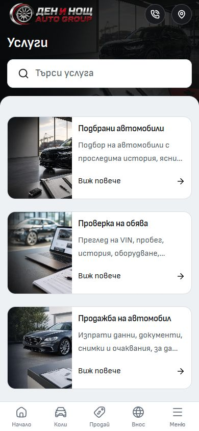

# About and Services mobile heading alignment — 1 October 2026

About and Services now center their mobile hero titles. About also centers its short introductory sentence. Centering suits these short introductions; search fields, service cards and team details retain their readable left alignment. The inline app bar, spacing, typography, imagery, bottom navigation and desktop composition remain unchanged by this adjustment.

`MobilePageHero` has an opt-in alignment setting, forwarded through `PageIntro` as `mobileAlign`. Only About and Services enable it. The default for other pages is unchanged.

## Verification

- In-app Browser: About and Services in Bulgarian and English at 320×844 and 390×844. All eight views have centered 28px titles and no document overflow; Services search remains left aligned. English search for VIN returns one service, and clearing restores six.
- Desktop: both pages at 1440×1000 keep their existing centered desktop hero and hide the mobile hero. No overflow or browser warning/error was observed.
- Existing mobile secondary regression: four tests passed, covering 14 routes in both languages at 320×568 and 390×568 (56 route visits). These checks use the canonical development preview on port 6790.
- Changed Svelte files: ESLint and Prettier passed.
- Svelte/TypeScript: zero errors and warnings. Production build passed in the task's isolated frozen QA copy, preserving the live preview's build output. The retained lockfile matches the QA dependencies.

Frozen runtime digest: `14322eae26e944e7a1683cb9f518ed8b89db83ac6cacaf873b07ba8d6645b09f`. Manifest and logs: `runtime/mobile-alignment-2026-10-01/`. This is local Chromium/browser evidence; physical-device and hosted verification were not performed in this adjustment.

## Secondary-page coverage

The [previous secondary-page pass](../mobile-secondary-2026-10-01/QA.md) updated About, Services, Contact, Compare and its car picker, Financing, Calculator, Blog and article pages, FAQ, Reviews, Privacy, Terms, Cookies, Favorites and language settings. It also updated the shared account shell, profile, messages, listings and car-form navigation/hydration. This does not establish that every legacy preview, admin route or account submission state was audited.

This follow-up changes only the two secondary mobile hero alignments. Existing unrelated changes and the latest desktop refinement are preserved. No template promotion, dealer refresh or deployment is included.

## Before / after

Unedited browser screenshots, matching 390×844 viewports. The baseline includes the latest desktop refinement already present before this adjustment.

| Page     | Before                                      | After                                     |
| -------- | ------------------------------------------- | ----------------------------------------- |
| About    |        |        |
| Services |  |  |
