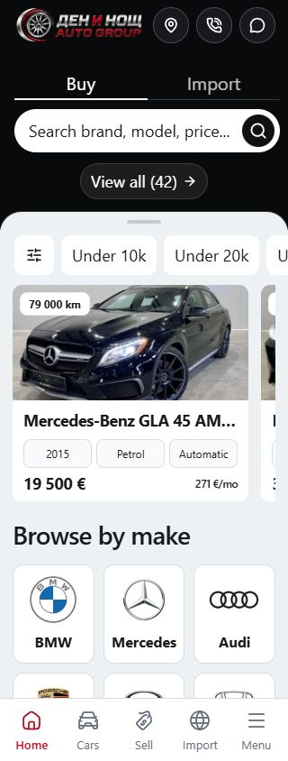
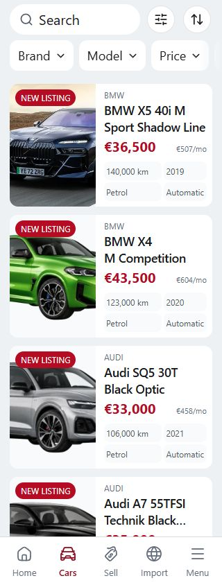

# Import mobile QA — 30 September 2026

The mobile interaction and accessibility pass is complete for the tested native storefront. The development site is running at <http://127.0.0.1:5174/en>. Slow-mobile loading remains below the desired level on several routes; this is recorded below rather than treated as a performance pass.

## Verified source and checks

The canonical source is `L:/CODEX/cars/templates/import` on Cars `main`. Production verification used a frozen copy under `C:/Users/radev/AppData/Local/Temp/import-mobile-final-20260930/source`, with the retained lockfile, Node 24.21.0 and npm 11.19.0. The copy excludes local secrets, deployment bindings and CMS data. Its preview uses synthetic fixtures, database/AI credentials cleared, and admin/AI features disabled.

The tested runtime digest is `2012941df31bcd07e789931010bca9d61a30339d6117e8b09429424e6cd1b753`. [The source manifest](runtime-source.json) records all 1,446 runtime files and their hashes; they matched the canonical runtime after verification. Documentation updates do not change that digest.

| Check                               | Result                                                                                                |
| ----------------------------------- | ----------------------------------------------------------------------------------------------------- |
| `npm run verify`                    | Passed: Svelte 0 errors/0 warnings, formatting, ESLint, architecture, image signatures and unit tests |
| Unit tests                          | 117 passed in 16 files                                                                                |
| Architecture                        | 57 native route modules, 188 reachable modules, one Tailwind generation entry                         |
| Local images                        | 824 signatures checked                                                                                |
| `npm run build`                     | Passed with the retained Vercel adapter and Node 24 runtime                                           |
| Full mobile Chromium suite          | 136 passed, 43 intentional viewport skips, no failures or flaky results                               |
| Selected desktop Chromium suites    | 19 passed                                                                                             |
| Additional desktop inventory reflow | 1 passed at 768, 1024 and 1920 pixels                                                                 |

The latest mobile run is clean. An earlier run encountered two disk-full screenshot failures; both passed when retried, and the complete suite subsequently passed on the final build. Build logs retain existing legacy `@reference` and plugin-timing notices; these did not fail the build.

## Routes and interactions

English routes checked for automated WCAG 2.2 AA rules and 320-pixel reflow:

`/en`, `/en/inventory`, `/en/inventory/11774283016080050`, `/en/contact`, `/en/import`, `/en/sell-your-car`, `/en/financing`, `/en/calculator`, `/en/about`, `/en/services`, `/en/blog`, `/en/blog/vnos-ot-kanada-proverka`, `/en/reviews`, `/en/faqs`, `/en/privacy`, `/en/terms`, `/en/cookies`, `/en/account/favorites`, `/en/compare`, `/en/locale-settings`.

The wider suite covers English/Bulgarian journeys at 320, 390 and 1440 pixels; sheets additionally run at 320/390 × 568/844. Desktop hero geometry runs at 768, 1440 and 1920 pixels. The audited English routes had no automated violations or horizontal page overflow. Explicit visible-label/name checks also passed for both languages on Home, Inventory and Import, including the experimental rule that is not counted in Lighthouse's accessibility score.

Checked flows include:

- Home Buy/Import tabs, search, make/model selection, quick filters, sorting and return navigation.
- Inventory search/filter persistence, dependent options, pagination, details, saved cars and comparison add/remove/clear.
- Vehicle photo opening, thumbnails, previous/next, keyboard activation, focus trapping, Escape, browser Back and trigger-focus restoration; specifications, features and inquiry validation.
- Import listing/source paths and their fields, country/fuel/transmission/timeframe choices, validation, step Back, closing and truthful demo receipts.
- Sell VIN/manual paths; contact and trade-in inputs; financing and import-cost calculations.
- Mobile menus, About/Services destinations, service search, FAQs, editorial pages, reviews and YouTube posters.
- Locale dialogs/settings, supported language changes, no-JavaScript preferences, blocked-storage/cookie handling and request isolation.

Manual browser checks used the canonical development site. Automated production journeys used isolated fixtures. Phone, Viber, map and social destinations were inspected; no calls or messages were sent. Forms remain demonstrations and do not claim real delivery or approval.

## Fixes made

- Kept sheet headers and actions in view when inputs receive focus; the sheet body now owns scrolling, including short mobile viewports.
- Used the shared mobile sheet for the photo viewer, retaining keyboard focus, dismissal and browser Back behavior.
- Hid covered bottom navigation from assistive technology while a shared sheet is open.
- Gave each Import wizard instance unique field IDs, so labels address the visible inputs; centered the receipt and kept its controls within 320-pixel gutters.
- Routed consultant actions to Contact and aligned the English import helper with the existing European-source copy.
- Made locale, YouTube and vehicle-card accessible names include their visible labels.
- Bundled the font stylesheet through the root layout and generated Latin/Cyrillic delivery subsets with unchanged glyph metrics. Original fonts and the SIL OFL license remain available.
- Added responsive delivery copies for seven existing vehicle images; preserved the source artwork, transparency and crop. Prioritized visible mobile photos and Contact's banner; hidden desktop inventory artwork now waits until it is visible.
- Grouped small icon modules to reduce the initial request queue while preserving route behavior.

Maintenance commands are `python scripts/subset-fonts.py` with FontTools 4.66.1/Brotli 1.2.0, and `node scripts/prepare-vehicle-images.mjs` with the retained npm dependencies. Python is not required to run or build the application. Unknown dealer image URLs retain their existing delivery behavior.

## Loading measurements and remaining work

Lighthouse 13.5.0 tested a local production preview at 390 × 844, DPR 1, with default slow-4G/4× CPU settings. The home page was repeated three times. Separate runs applied throttling through DevTools. All saved audits completed without a Lighthouse runtime error and scored 100 for accessibility and best practices.

| Route                 | Simulated performance |    LCP |    TBT |
| --------------------- | --------------------: | -----: | -----: |
| Home, median of three |                    75 | 5.66 s | 180 ms |
| Inventory             |                    79 | 4.64 s | 189 ms |
| Vehicle detail        |                    73 | 4.89 s | 345 ms |
| Import                |                    77 | 5.58 s | 181 ms |
| Sell                  |                    80 | 5.02 s | 156 ms |
| Contact               |                    78 | 4.96 s | 198 ms |
| Financing             |                    84 | 4.18 s | 164 ms |
| Calculator            |                   100 | 1.36 s |  74 ms |

Home scores ranged from 67 to 76. Applied-throttling runs were weaker: Home scored 64/69 with 1.86/2.98-second LCP and 4.25/4.92-second TBT; Inventory scored 43 with 9.39-second LCP; Contact scored 44 with 8.43-second LCP. These results include substantial script/layout work and demonstrate remaining loading and responsiveness concerns. The local preview uses HTTP/1.1 on a shared workstation, so these are laboratory observations rather than field Core Web Vitals. TBT is not an INP measurement.

Repeatable delivery savings are clearer than score changes: home font transfer fell from 348,376 to 177,844 bytes (49%). Inventory's observed request count fell from 88 to 63, script requests from 65 to 42, and image transfer from 344,168 to 196,330 bytes (43%). Layout shift stayed small; the final simulated routes recorded CLS below 0.004.

Further performance work should profile initial hydration/layout, reduce the remaining shared-script queue, and test image scheduling on the actual HTTPS host and a physical mobile device. The [Core Web Vitals thresholds](https://web.dev/articles/vitals) require field measurements; this pass does not establish them. Automated checks also do not certify full [WCAG conformance](https://www.w3.org/TR/WCAG22/) or replace screen-reader and physical-keyboard testing.

## Preservation and evidence

The tested working source includes six pre-existing Import drafts: `AGENTS.md`, `ArticleCard.svelte`, `YouTubeSection.svelte`, `HomeFiveFeaturedVehicles.svelte`, `HomePage.svelte` and `native.ts`. They remain outside this task's scoped commit, apart from the reviewed YouTube accessible-name hunk. The owner's existing YouTube spacing edit is preserved. Nine unrelated staged paths and work in other templates/clients are preserved.

This is working-source QA, not immutable-release or public-alias acceptance. No template pin, mounted variant, dealer deployment, CRM integration or outreach was changed. The earlier production-release entries in the localization handoff remain historical evidence.

[audit.json](audit.json) contains individual test outcomes, complete performance summaries and configurations. Text logs and the runtime manifest sit beside this report. Raw Lighthouse reports, Playwright JSON/attachments, fixtures, frozen build and retained generated packaging are under `C:/Users/radev/AppData/Local/Temp/import-mobile-final-20260930`. Generated output was retained when cleanup policy blocked deletion. Temporary production servers are stopped after verification; the canonical dev server is left running.

The Home and Inventory screenshots show the canonical English development site at 320 pixels. Receipt screenshots come from the earlier passing frozen run of the same receipt layout; the final suite rechecked its geometry and behavior.

