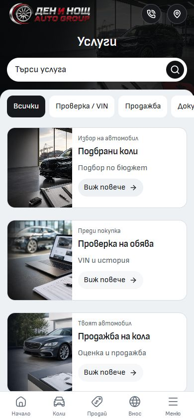
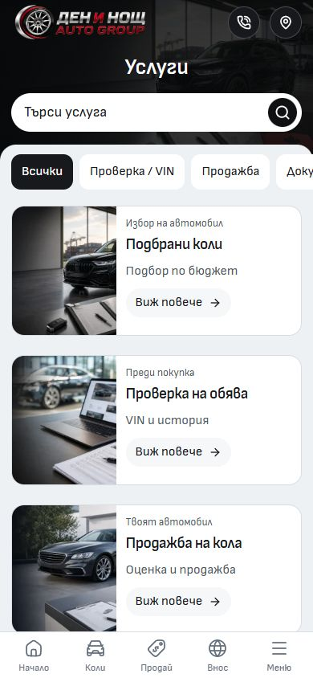

# Import mobile audit — 2 October 2026

The public mobile flows are close to finished. This audit preserves the settled heroes, centered headings, one-row quick filters with 12px corners, rounded search, single-line car titles and compact PDP actions. It fixes image delivery and two interaction defects. The draft listing editor and cold-load performance still need work before calling the entire template flawless.

## Implemented

- Added 400/800/1200px delivery copies of the seven retained service/contact images. The originals, artwork, object-fit rules and desktop images remain available. `scripts/prepare-service-images.mjs` reproduces the copies.
- Reused one image-delivery helper for vehicles and services, preserving unknown dealer image URLs and the existing vehicle helper API.
- Matched Contact's responsive preload to its actual mobile hero. The map remains in place.
- Prevented the hidden desktop PageIntro image from downloading its full image on mobile.
- Explicitly focused the Menu and comparison-picker buttons before opening their sheets. WebKit pointer activation otherwise left focus on the document, so Back could not restore the correct trigger.
- Mounted the existing language dialog on account pages. The account Menu previously closed without showing language preferences because those routes did not mount the public layout's dialog.
- Added image-delivery and account language regressions. Updated stale desktop-only navigation, duplicate-heading and compact-label assumptions in existing tests without relaxing target-size or readable-weight checks.

The account language dialog is also shown in [the verified 320px capture](after/account-language-320.jpg).

## Browser coverage

Manual checks used the user's In-app Browser at 320×568 and 390×844, with a 1440×1000 desktop comparison. Production regression checks used an isolated, frozen production preview on port 6795; the existing development server on 6790 was preserved.

| Area               | Exercised behavior                                                                                                                                       |
| ------------------ | -------------------------------------------------------------------------------------------------------------------------------------------------------- |
| Home/inventory     | Search, no-results recovery, sorting, make/model/price/year filters, long filter scroll, pinned actions, closing and browser Back                        |
| Import             | Country/type/brand/model selection, how-it-works scroll, three request steps, prefilling, contact validation and preserved requirements on Back          |
| Sell               | VIN/manual entry, vehicle/contact steps, long form scroll, validation, location sheet and contact/map destinations                                       |
| Services           | All six photos, horizontal quick filters, live search, zero-results recovery, lower cards and compact CTA                                                |
| Contact            | Retained interactive map, contact form opening, scrolling to Submit, native validation and closing                                                       |
| Comparison         | Picker search, long list scroll, adding/removing/clearing, bounded horizontal table scrolling and opening a selected PDP                                 |
| PDP                | Tabs, equipment-list bottom, gallery, enquiry form, focus/Back, toolbar access, expanded and resting drawer positions                                    |
| Account            | Overview, profile top/bottom, listings search/sort, opening draft edit, message preview and language controls                                            |
| Other public pages | EN/BG mobile headers, reflow and automated checks for About, financing, calculator, blog/article, reviews, FAQs, policies, favorites and locale settings |

The PDP gesture probe recorded drawer top positions of about 193px resting and 45px expanded at 320×568. It waits for Vaul's 500ms opening/settling gesture guard rather than starting a new gesture during the animation. The scroll-lock probe also verified that mouse-wheel scrolling cannot move inventory beneath its full-screen search sheet.

Original screenshots and measured geometry are retained in this folder and `runtime/mobile-full-audit-2026-10-02`. Browser coverage metadata is in [browser-coverage.json](browser-coverage.json). An intermediate native screenshot named `pdp-gallery-320` was an unsuccessful click attempt; the later `pdp-gallery-open-320` capture verifies the actual viewer.

## Loading measurements

Three cold Chromium loads per route: 390×844, cache disabled, 4× CPU slowdown, 150ms network latency, 200,000 download bytes/second (1.6Mbps). Language prompt already acknowledged. Measurements settle for five seconds after hydration and font readiness, without scrolling or input. External image/map requests are included in timings. These are local lab medians, not field Core Web Vitals or real mobile-device results.

| Route            | Before LCP | After LCP | After CLS |
| ---------------- | ---------: | --------: | --------: |
| Home             |      1.72s |     1.90s |   0.00009 |
| Inventory        |      3.41s |     3.36s |   0.02584 |
| Services         |      4.46s |     2.86s |   0.00035 |
| Contact          |      3.78s |     3.05s |   0.00023 |
| PDP              |    0.75s\* |   0.58s\* |   0.00006 |
| Account listings |      1.47s |     1.88s |   0.00050 |

Services' same-origin image transfer fell from **1,036,949 to 157,426 bytes (85% less)**. Contact's fell from **144,620 to 62,372 bytes (57% less)**. This is the reliable image-delivery improvement; timings on unchanged routes vary between runs and are not claimed as wins. All observed visible images completed successfully, with no root horizontal overflow.

\* PDP's LCP is its server-rendered fallback description, before the interactive mobile drawer replaces it. Median hydration and mobile drawer mounting were about 4.08s under this throttle. Across the six routes, median hydration ranged from 2.74s to 5.65s. The early LCP should not be read as sub-second interactive readiness. Hydration is not an INP or TTI measurement.

Services, Contact and inventory remain above the 2.5s good-LCP threshold under this profile. Field assessment needs real-user 75th-percentile data. No Lighthouse score, INP measurement, CPU trace or physical-device claim is made. Definitions: [Web Vitals](https://web.dev/articles/vitals), [CLS session windows](https://web.dev/articles/cls). Reduced, non-sensitive samples are in [loading-results.json](loading-results.json); raw network observations remain local in ignored runtime storage.

## Before and after

Matched 390×844 screenshots. The visual composition is intentionally retained; smaller images are selected for mobile delivery.

| Services before                             | Services after                            |
| ------------------------------------------- | ----------------------------------------- |
|  |  |

| Contact before                            | Contact after                           |
| ----------------------------------------- | --------------------------------------- |
|  |  |

Lower-page captures: [Services before](before/services-lower-390.jpg), [Services after](after/services-lower-390.jpg).

## Verification inputs and remaining findings

The initial full Chromium mobile suite passed **190 tests**, with **51 explicit desktop-only skips**. After the account/focus fixes, **70 affected mobile regressions passed**, including the new account-language cases. **Six WebKit focus/account/EN-BG comparison cases passed**. The first exploratory WebKit run exposed the focus defects, then stalled during failure teardown and was stopped; its incomplete run is not counted as a pass. All **17 affected desktop checks passed** after updating stale catalogue-wrapper and 16px-filter-label assumptions; the six-filter count and 48px target checks remain enforced.

Type checking found zero errors or warnings. Build and complete code lint passed. Architecture checked 57 native routes and 215 reachable modules; asset validation checked 912 local images. All **124 unit tests across 18 files passed**. These checks use the frozen source described by [source-snapshot.json](source-snapshot.json). Separate formatting and code-lint checks passed for all owned files.

The combined `npm run verify` stopped at repository-wide formatting: **46 existing files outside this task's edited source**, mostly earlier audit artifacts plus asset-policy/configuration files. They were preserved. The remaining checks were run separately; this report does not label the combined command successful. Paths are in [existing-formatting-findings.txt](existing-formatting-findings.txt).

Loading baseline input: HEAD `832aea00d5134f035f09ba8b8b846f9f2b54d883`, runtime digest `64f4f9da47e2375d125d595dccf9ee9b1dfa28c91200f6dc30772bc351d2b59a`. The first full mobile suite used HEAD `8a3d40643daf4b02e29067d3474ca7fc7369da97`, runtime digest `05b999582d5483184362681a3b4f7dd859360c3a625f6d3d9b2c27ed4d4dbd90`. Final checks and the repeated final loading run used HEAD `6fd81a468f76b1fc1d577bd5f1cf6f758d4001dd`, runtime digest `69b7051f39d8b5bc1070cdf2db1c6add11e5c9652d3077579f6b12d854d35125`, including the account-dialog and focus fixes. These dirty frozen inputs include preserved concurrent work; they are local QA evidence, not an immutable template release or dealer deployment. [Verified files](verified-files.json) records the owned source/test/assets hashes.

Recommended remaining work, without changing the settled public design:

1. **Draft listing editor:** at 320×568 it is roughly 6,769px long and still uses retained English/Bulgarian labels and many fields. Group the fields, localize their exact labels and improve the save-action placement in a dedicated editor pass. The local draft/save semantics must stay intact. This audit inspected it without saving or uploading to the user's draft.
2. **Cold loading:** inventory's fourth visible vehicle image paints late under this throttle; public/account hydration also takes several seconds. Profile the remaining request/bundle order before changing priority or splitting code. Keep the Contact map.
3. **PDP first paint:** the SSR fallback differs from the hydrated mobile layout. Audit its rendering contract before changing the media-query fallback, preserving desktop and no-JavaScript content.
4. **Device acceptance:** Windows Chromium/WebKit emulation does not establish physical iOS/Android behavior, on-screen keyboard handling or real-user loading. Those remain acceptance checks.

No messages were delivered, no real finance/sell request was sent, no dealer was deployed and no template release was promoted. Demo submissions in automated tests used the isolated local fixture directory. Existing artwork, configuration, lockfile, runtime, unrelated changes and the live 6790 server were preserved.

Concurrent edits to `VehicleDealerBanner.svelte`, `VehicleFacts.svelte` and `FinanceEstimator.svelte` appeared after the final source freeze. They are preserved outside this audit's commit and were not part of its frozen runtime. The owned source, tests and image assets match their validated frozen files. A combined source release needs its own exact-commit checks.
