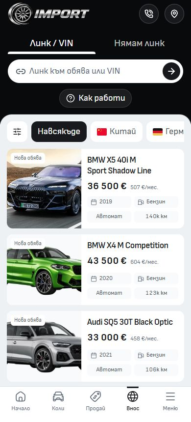

# Import card specification badges

The Import page now uses the same four badges as Cars: year and fuel on the
first row, transmission and mileage on the second. The previous Import variant
rendered only year and mileage. All values come from the existing vehicle data;
compact labels keep the complete value in the accessible label and title.

Only `src/lib/components/common/MobileVehicleCard.svelte` changes application
behavior. Its shared two-column grid now applies to Import too. The Inventory
markup and styles retain their original output; desktop uses its existing card
composition. The Import variant class and native localized detail link remain.

Matched before/after captures cover Import and Cars at 320px, 390px and 1440px.
Browser measurements confirm four badges in exactly two rows on the first three
mobile cards, single-line labels and no horizontal page overflow. English was
also checked at 320px and 390px, including a native detail link and Back.

Verification uses Node 24.21.0 and the existing isolated QA copy, preserving the
live dev server's build output. Svelte check reports zero errors and warnings;
the changed component passes ESLint and Prettier. The Svelte autofixer flags the
existing `linkHref as resolve` wrapper because it expects the framework import;
the wrapper already preserves the application base and locale, and native
navigation was verified. That diagnostic does not require a link rewrite.

The production build passed, and the existing mobile discovery/service suites
finished with 16 passes and one desktop-only skip. The built Import page was
also inspected at 390px. Build and focused browser logs are beside this receipt.
The earlier
[Astra integration review](../astra-integration-2026-10-08/README.md) records the
broader source checks and existing unrelated workflow/lint failures.

The owner authorized commit and push after this correction. The earlier Astra
integration and this badge change are committed separately to Cars main; the
live preview remains at `http://127.0.0.1:6794/bg/import`. No dealer publication
or template release selection is part of these source commits.
