# Import secondary-page mobile audit — 1 October 2026

The secondary pages now reuse the established Import mobile composition: the inline logo/contact header, a compact dark hero, a rounded light content area and the existing bottom navigation. Sofia Sans, the logo, colors, vehicle data and desktop composition are retained.

## Changes

- `MobilePageHero` provides the shared mobile header and hero. `PageIntro` adopts it for About, Services, Compare, Financing, Calculator, Blog, FAQ, Reviews and Favorites. Policy and language-settings pages use the same component directly.
- Compare uses the existing sheet and search-field primitives for its car picker. Search, empty recovery, browser Back, keyboard focus, four-car limits, removal, clearing and shareable URLs work. At 320px, readable columns scroll horizontally with sticky specification labels and an explicit swipe hint.
- Services and blog cards become compact mobile rows. About uses portrait rows and a short mobile introduction while retaining the full desktop and metadata copy. Contact shares the hero while preserving its existing contact/form flow.
- Financing and import calculations show the live result before the fields on mobile. Their formulas, validation and detailed assumptions remain unchanged.
- Policies use native mobile accordions, keep their full text and open linked sections. Desktop retains the expanded document layout.
- Account pages share the mobile hero and account links instead of the desktop sidebar. Long vehicle identifiers wrap, card captions reuse the actual table headers, and actions have standard mobile control heights.
- Six account routes previously disabled client rendering. Enabling hydration restores the shared Menu, Contact and mobile message controls. Legacy card wrappers now belong to Svelte rather than straddling raw HTML slots, and the car-submission shell preserves its additional `style-3` class. This removes hydration recovery without changing the intended layout. Messages retain their scrollable thread and visible composer at 320×568, and clearly identify local previews as demo messages with no delivery.
- Navigation renders the existing Hugeicons SVG paths declaratively, making the icons available in server-rendered HTML and after navigation.
- The profile map uses the configured Sofia address instead of the donor map location. Vite ignores audit documentation/runtime folders, preventing Windows screenshot file locks from crashing the live preview.

## Verification

Testing used a complete frozen copy with its own dependencies and build output, leaving the live preview's build directory alone. Runtime: Node 24.21.0, the existing npm lockfile. Frozen source manifest: `runtime/mobile-secondary-2026-10-01/snapshot.json`; digest `142aae9241794e767083fa107510b808aa6925200b1d9697b0e06ea8eac568de`.

| Check                      | Result                                                                                 |
| -------------------------- | -------------------------------------------------------------------------------------- |
| Svelte/TypeScript          | Passed, zero errors and warnings                                                       |
| Code lint                  | Passed; changed files also checked after final fixes                                   |
| Changed-file formatting    | Passed                                                                                 |
| Architecture               | Passed: 57 native route modules, 202 reachable modules, one Tailwind entry             |
| Image signatures           | Passed: 886 local images                                                               |
| Unit tests                 | 124 passed in 18 files                                                                 |
| Production build           | Passed                                                                                 |
| Browser tests              | 123 unique passed: 106 mobile-project cases and 17 desktop cases                       |
| Project-specific skips     | Three desktop-only cases skipped in mobile; seven mobile-only cases skipped in desktop |
| Full repository formatting | Fails on three preserved, unrelated audit artifacts listed below                       |

Browser coverage includes Bulgarian and English secondary pages at 320px and 390px, account menus and focus restoration, comparison URL/reload persistence, picker accessibility, service search, calculations, policy deep links, typography, contact forms, main-page navigation and sheet regressions. Some localization cases intentionally exercise 1440px within the mobile project. Browser testing used Chromium with touch emulation, and the provided in-app Browser was used for visual inspection. This is local browser evidence; physical iOS/Safari and hosted acceptance were not performed.

The first browser run found the picker history race and stale selectors that matched hidden desktop markup. The behavior was fixed, selectors were scoped to the visible output/heading or native summary, and the affected cases were rerun successfully. A final development-console check exposed legacy account wrappers crossing hydration boundaries. The added account hydration regression passes on both development and production previews, at mobile and desktop widths, across six routes. These development checks only load pages; they do not submit account forms. Test totals merge the final result for each unique case; they do not double-count retries.

The aggregate formatting command still flags these unrelated files, which were preserved:

- `docs/desktop-polish-2026-10-01/assets.json`
- `docs/desktop-refinement-2026-10-01/index.html`
- `docs/mobile-service-cards-2026-09-30/metrics.json`

## Preservation and delivery

Work stays in the canonical master on `main`. Existing dirty changes in `.gitignore`, `.prettierignore`, `HomePage.svelte`, `VehicleCard.svelte` and `service-directory.ts` were compared with the initial diff and remain unchanged. Other desktop notes, generated assets, dealer work and unrelated staged files are excluded from this task's scoped commit.

No template promotion, dealer refresh, deployment or outreach is included. Forms and messages remain demos until real delivery is configured. Production browser submissions use an isolated fixture directory. The repaired development preview remains available at `http://127.0.0.1:6790/bg/`; the temporary production QA listener is stopped after verification.

## Before / after

These are unedited browser screenshots. Main pairs use the same 390×844 viewport. Baselines were saved before this secondary-page pass; after views were captured from the canonical live preview or its frozen production build.

| Page              | Before                                          | After                                         |
| ----------------- | ----------------------------------------------- | --------------------------------------------- |
| Compare           | 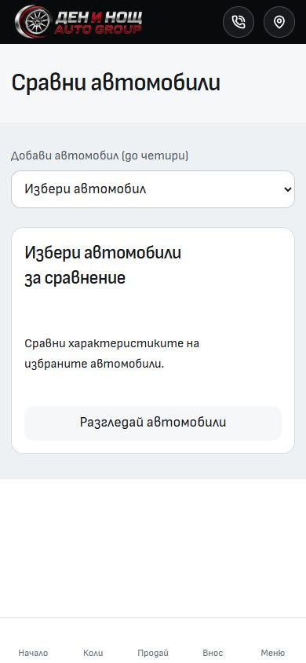       |        |
| About             |            |            |
| Services          | 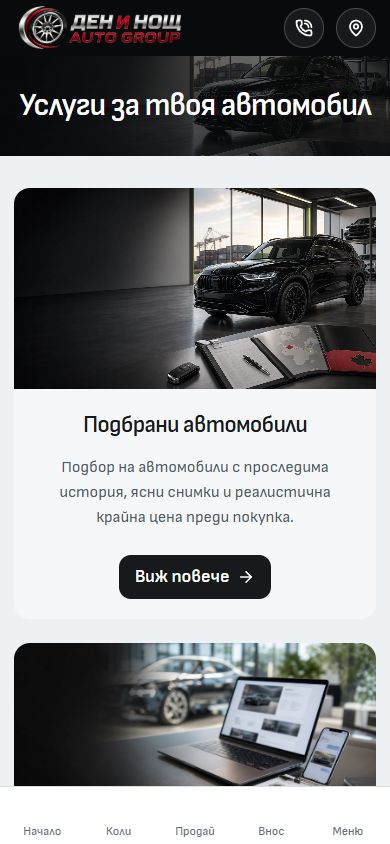     | 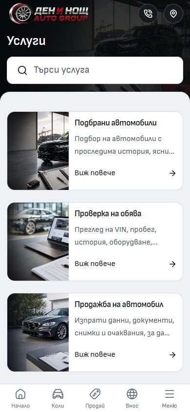     |
| Contact           | 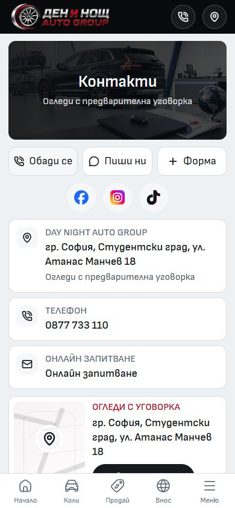       | 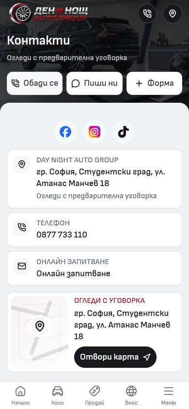       |
| Financing         | 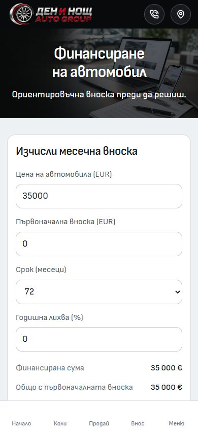   | 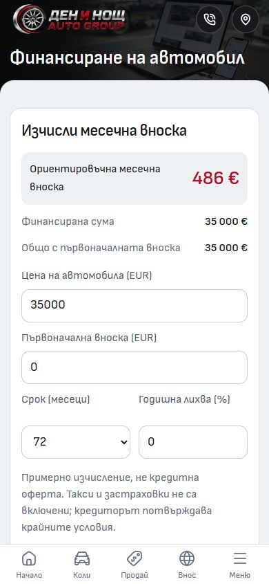   |
| Import calculator | 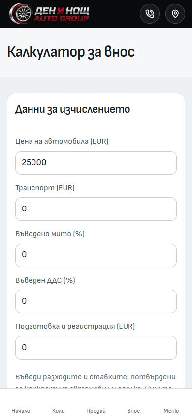 | 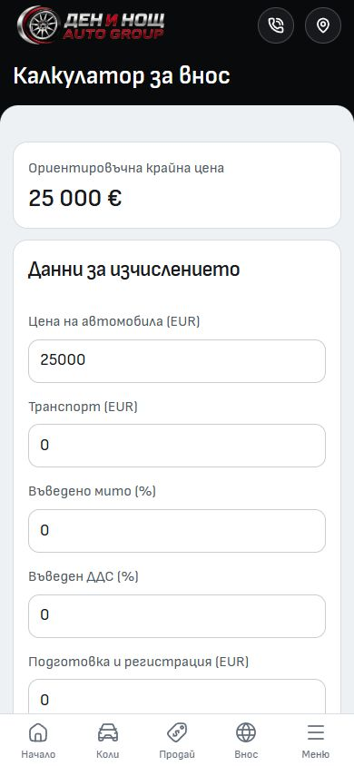 |
| FAQ               |               |               |
| Blog              |              | 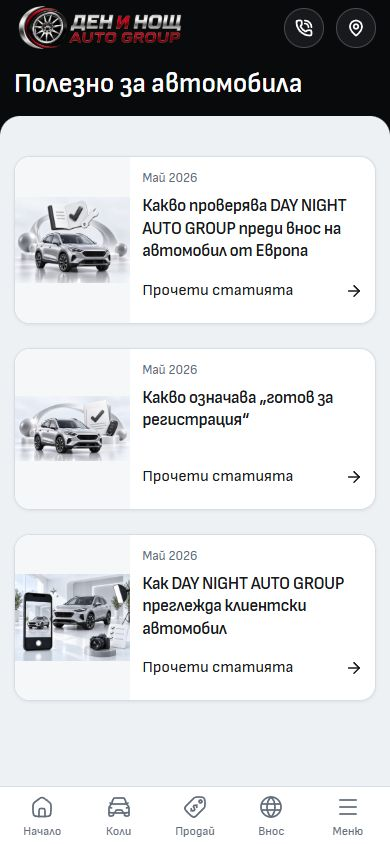             |
| Privacy           |        | 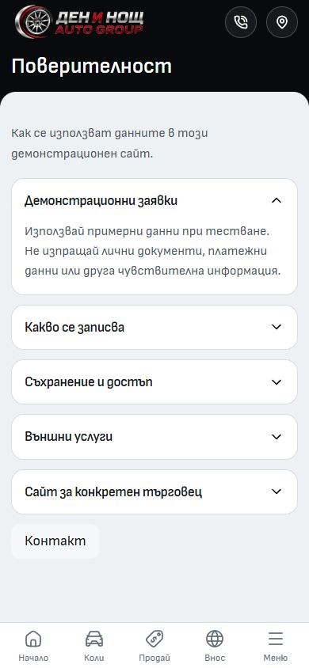       |
| Account           | 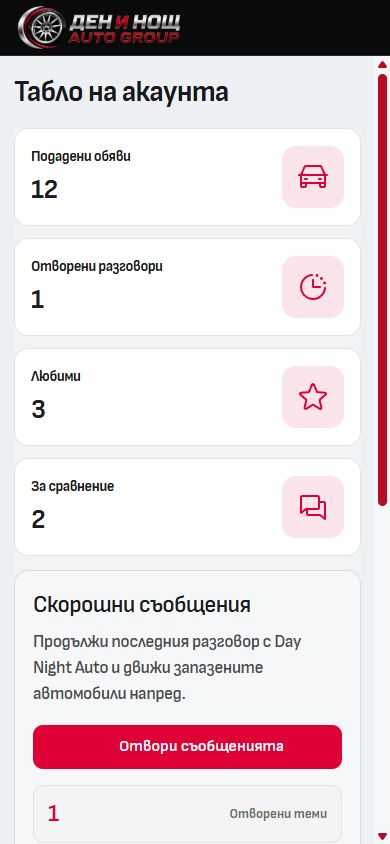       | 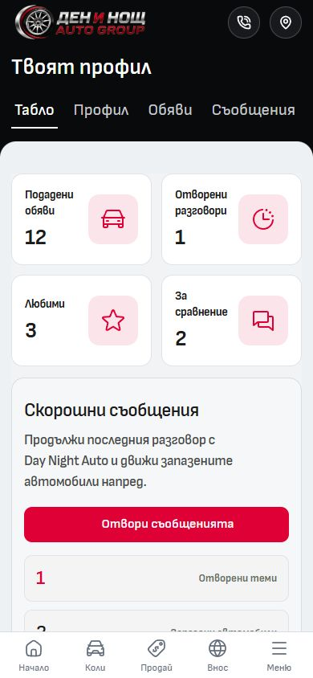       |
| Profile           | 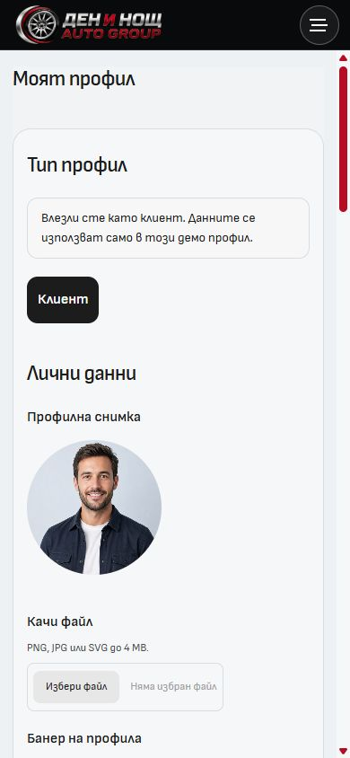       |        |
| Your cars         | 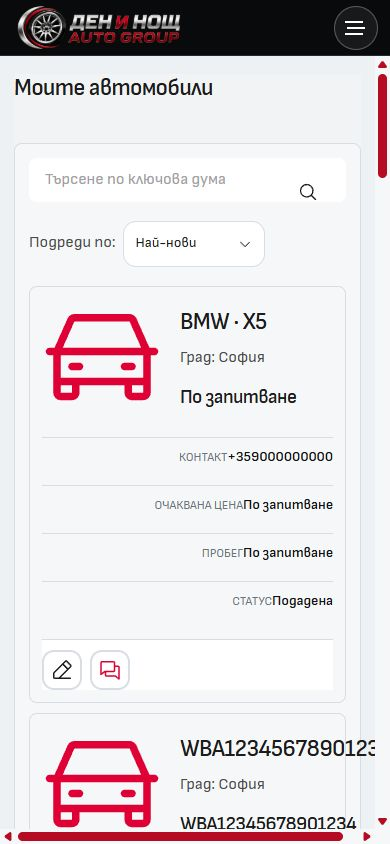    | 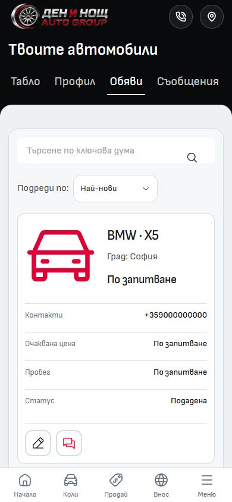    |
| Messages          | 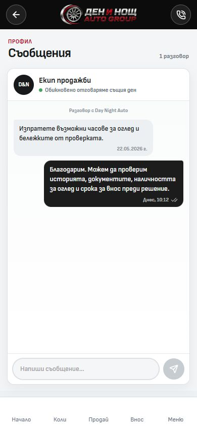     |      |

Supplemental states: [searchable car picker](after-picker-390.jpg) and [selected cars at 320×568](after-compare-320.jpg). The [320px baseline](before-compare-320.jpg) shows the former empty-state selector rather than selected vehicles.

Remaining launch work is environment-specific: replace clearly marked demo staff/content where needed and configure/verify enquiry delivery before selling this as a live dealership workflow. No further visual restyle is proposed.
