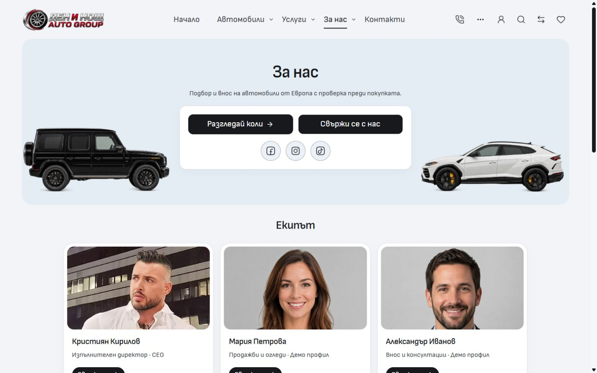
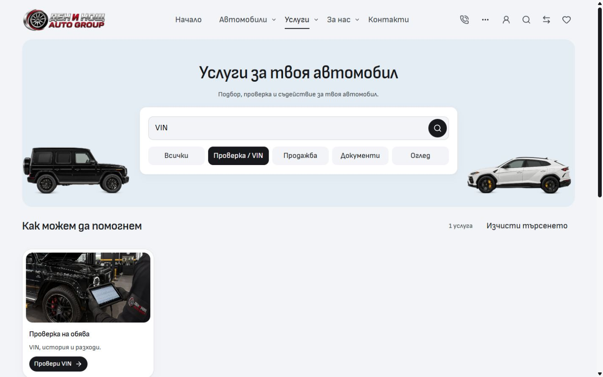

# Neutral Import controls

The reusable template now defaults to black CTAs and neutral selection/focus colors. Dealer palette values remain in `config/dealer.ts`; fallback colors, derived tints and rings remain in `tokens.css`. The browser theme color follows the configured accent.

Selected service pills, applied inventory triggers, filter category tabs and intake choices use black fill with white text. Navigation and Home mode tabs use black underlines. Larger choice rows retain a light grey surface with a black border or checkmark. Hover and keyboard focus stay distinct. Hardcoded red mobile enquiry states, Home highlights, video play controls and focus halos were replaced with theme roles. The selected tinted hero frame and existing content/card surfaces are preserved.

[Verification](verification.json) records 55 route/state checks: all 20 native public page types at 1440px in English and 320px in Bulgarian, with additional BG/EN checks at 320/390/768/1440px. There are no red computed control colors, page errors or horizontal overflow in the checked states. The actual in-app browser was refreshed, its selected VIN pill filtered to one service and showed black fill/white text, and its viewport override was reset before returning to About. These are current implementation captures, not a matched production before/after comparison.

Eight existing service/filter/accessibility browser checks passed. Scoped formatting and ESLint passed; Svelte reported zero errors and warnings. The production build passed in frozen isolated output, and all 13 changed source inputs match the recorded hashes. This receipt does not establish template promotion, hosted acceptance or dealer deployment. Unrelated dirty work was preserved.
